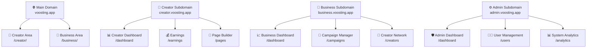
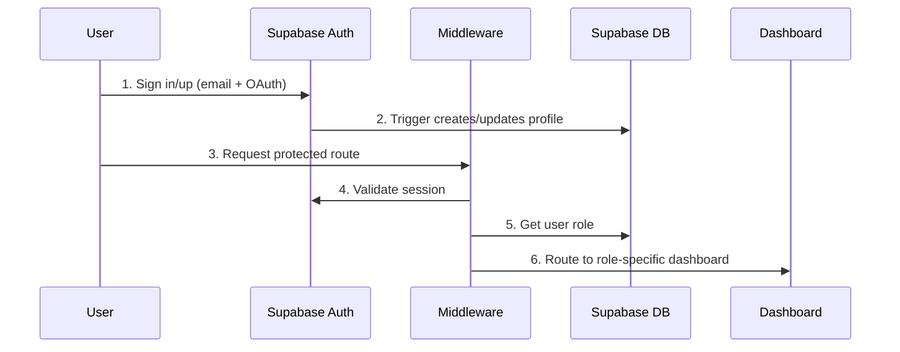
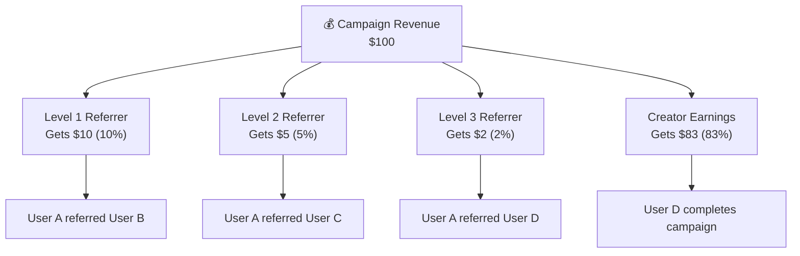

# CLAUDE.md

This file provides comprehensive guidance to Claude Code (claude.ai/code) when working with the Voosting codebase.

**⚠️ 세션 시작 시 반드시 읽어야 할 파일들을 먼저 확인하세요!**

**Priority reading order for new sessions:**

1. This CLAUDE.md file (project overview and conventions)
2. `/docs/PLANNING.MD` - Current project status and MVP strategy
3. `/docs/task1.md` - Core MVP tasks (89 items, currently at 15/89 completed)
4. `/docs/PRD.md` - Product requirements document
5. `/docs/theme.md` - Voosting theme system for UI consistency

## Project Overview

**Voosting (부스팅)** is an AI-powered creator marketing platform that connects advertisers with creators through intelligent matching for performance-based marketing campaigns. The platform creates a dual-target ecosystem where businesses find marketing creators and creators monetize their influence as professional marketing tools.

## Key Architecture Notes

### Current Implementation Status

- **Authentication**: Fully migrated to Supabase Auth (email + OAuth)
- **Database**: Supabase with RLS policies based on Supabase auth.uid()
- **Multi-domain Routing**: Complete with middleware-based domain detection
- **Dual-target Public Pages**: Architecture designed (business/creator areas)
- **Progress**: 15/89 Core MVP tasks completed (16.9%)

### ⚠️ Critical Documentation Inconsistencies

**IMPORTANT**: The following components contain outdated information and must be referenced carefully:

| Component                 | Current Implementation       | Outdated Documentation        | Impact | Required Action                                                   |
| ------------------------- | ---------------------------- | ----------------------------- | ------ | ----------------------------------------------------------------- |
| **Authentication**        | Supabase Auth (Email + OAuth) | README mentions Clerk Auth     | HIGH   | Update README.md auth sections                                    |
| **Brand Name**            | Voosting throughout codebase | Some refs to CashUp           | MEDIUM | Global search/replace needed                                      |
| **Referral System**       | 10%/5%/2% (3-tier)           | Old docs show 5%/2%/1%        | HIGH   | Update all commission references                                  |
| **Environment Variables** | Requires SUPABASE_\* vars    | .env.example needs update     | HIGH   | Add SUPABASE_URL, SUPABASE_ANON_KEY, SUPABASE_SERVICE_ROLE_KEY   |
| **Architecture**          | Dual-target design           | Generic creator platform      | MEDIUM | Update architectural diagrams                                     |

**Validation Command**: `grep -r "CashUp\|supabase.*auth\|5%.*2%.*1%" --exclude-dir=node_modules .`

**Tech Stack:**

- Next.js 15.4.6 with App Router and React Server Components
- React 19.1.1 with latest features
- TypeScript with strict mode
- Tailwind CSS v4 for styling
- **Supabase Auth** for authentication and user management
- **Supabase** for database, storage, and real-time features
- **Payload CMS** v3.50.0 for content management
- Testing: Jest for unit tests, Playwright for E2E tests
- External APIs: Google Gemini AI, Toss Payments, Toss 1-won verification

## Development Commands

### Core Development

```bash
# Start development server (default port 3000)
pnpm dev

# Build for production
pnpm build

# Start production server
pnpm start

# Run linting
pnpm lint

# Type checking
pnpm type-check
```

### Testing Commands

```bash
# Run unit tests (Jest)
pnpm test

# Run tests in watch mode
pnpm test:watch

# Run test coverage report
pnpm test:coverage

# Run E2E tests (Playwright)
pnpm test:e2e

# Run specific test file
pnpm test src/lib/__tests__/middleware-utils.test.ts

# Run Playwright tests with UI (useful for debugging)
npx playwright test --ui

# Run Playwright tests for specific browser
npx playwright test --project=chromium
```

### Database & Backend

```bash
# Start local Supabase
pnpm supabase:start

# Stop local Supabase
pnpm supabase:stop

# Reset database with fresh schema and seed data
pnpm supabase:reset

# Run database migrations
pnpm supabase:migrate

# Generate TypeScript types from database
pnpm supabase:types

# Create new migration
npx supabase migration new <migration_name>

# Access Supabase Studio (local dashboard)
# Open http://localhost:54323 after starting Supabase
```

### Payload CMS Commands

The project integrates Payload CMS v3.50.0 for content management:

```bash
# Generate TypeScript types for Payload
pnpm payload:generate:types

# Generate GraphQL schema
pnpm payload:generate:graphql-schema

# Run Payload migrations
pnpm payload:migrate

# Create new Payload migration
pnpm payload:migrate:create <migration_name>

# Access Payload Admin Panel
# Open http://localhost:3000/admin after starting dev server
```

### MCP Server Integration

The project uses multiple MCP servers for enhanced development capabilities through specialized sub-agents:

```bash
# Test TossPayments MCP integration
npx @tosspayments/integration-guide-mcp

# Test Git MCP server
uvx mcp-server-git --repository /Users/alex/Dev/next/cashup

# Test Playwright MCP for E2E automation
npx @playwright/mcp@latest
```

**⚠️ 중요: MCP 서버는 서브에이전트를 통해 활용하며, 직접 호출보다는 적절한 서브에이전트 할당을 통해 전문성을 확보합니다.**

### Project Structure

```
src/
├── app/              # Next.js 15 App Router
│   ├── (main)/      # Main domain routes (www.domain)
│   ├── (creator)/   # Creator dashboard (creator.domain)
│   ├── (business)/  # Business dashboard (business.domain)
│   ├── (admin)/     # Admin dashboard (admin.domain)
│   └── api/         # API routes
├── components/       # Reusable React components
├── lib/             # Utilities and configurations
├── hooks/           # Custom React hooks
└── types/           # TypeScript type definitions
```

## Architecture

### Multi-Domain Architecture

**Architecture Overview**: Subdomain-based routing with middleware-driven domain detection and role-based access control.

#### Domain Structure



#### Domain Detection Implementation

**Middleware-based Domain Routing** (`src/lib/middleware-utils.ts`):

```typescript
export function getDomainType(hostname: string): DomainType {
  if (!hostname) return 'main';

  const lowerHost = hostname.toLowerCase();

  if (lowerHost.includes('creator.')) return 'creator';
  if (lowerHost.includes('business.')) return 'business';
  if (lowerHost.includes('admin.')) return 'admin';

  return 'main';
}

// URL Rewriting Logic
export function rewriteUrlForDomain(
  pathname: string,
  domainType: DomainType,
  baseUrl: string,
): string {
  if (domainType === 'main') return pathname;

  const prefix = DOMAIN_PREFIXES[domainType]; // e.g., '/creator'

  if (pathname === '/' || pathname === '/dashboard') {
    return `${prefix}/dashboard`;
  }

  return `${prefix}${pathname}`;
}
```

#### Dual-Target Public Architecture

**Main Domain Strategy**: Single domain serving different audiences through navigation and theming.

| Target Audience | Navigation Structure                 | Theme Colors      | Call-to-Action    |
| --------------- | ------------------------------------ | ----------------- | ----------------- |
| **Business**    | 홈/크리에이터/서비스/요금제/문의하기 | Blue-Green        | "무료로 시작하기" |
| **Creator**     | 홈/비즈니스/서비스/수익 계산기       | Mint Green-Purple | "크리에이터 시작" |

**Implementation Pattern**:

```typescript
// app/(main)/page.tsx - Main homepage
export default function HomePage() {
  const [targetAudience, setTargetAudience] = useState<'business' | 'creator'>('business');

  return (
    <div className={cn('homepage', {
      'theme-business': targetAudience === 'business',
      'theme-creator': targetAudience === 'creator'
    })}>
      <AudienceToggle onChange={setTargetAudience} />
      <HeroSection audience={targetAudience} />
      <FeatureSection audience={targetAudience} />
    </div>
  );
}
```

#### Route Group Structure

```
src/app/
├── (main)/           # Main domain (voosting.app)
│   ├── page.tsx      # Dual-target homepage
│   ├── creator/      # Creator public area
│   └── business/     # Business public area
├── (creator)/        # Creator subdomain (creator.voosting.app)
│   ├── dashboard/    # Creator dashboard
│   ├── campaigns/    # Campaign management
│   └── earnings/     # Earnings tracking
├── (business)/       # Business subdomain (business.voosting.app)
│   ├── dashboard/    # Business dashboard
│   ├── campaigns/    # Campaign creation
│   └── creators/     # Creator discovery
└── (admin)/          # Admin subdomain (admin.voosting.app)
    ├── dashboard/    # Admin overview
    ├── users/        # User management
    └── analytics/    # System analytics
```

#### Domain Testing & Validation

```bash
# Test domain detection
echo "Testing domain routing..."
curl -H "Host: creator.localhost:3000" http://localhost:3000/
# Should route to /creator/dashboard

curl -H "Host: business.localhost:3000" http://localhost:3000/
# Should route to /business/dashboard

curl -H "Host: admin.localhost:3000" http://localhost:3000/
# Should route to /admin/dashboard

# Test middleware performance
time curl -H "Host: creator.localhost:3000" http://localhost:3000/dashboard
# Target: < 1000ms response time
```

#### Local Development URLs

| Domain Type  | URL                            | Purpose                   | Authentication Required |
| ------------ | ------------------------------ | ------------------------- | ----------------------- |
| **Main**     | http://localhost:3000          | Public pages, dual-target | ❌                      |
| **Creator**  | http://creator.localhost:3000  | Creator dashboard         | ✅                      |
| **Business** | http://business.localhost:3000 | Business dashboard        | ✅                      |
| **Admin**    | http://admin.localhost:3000    | Admin dashboard           | ✅ (admin role)         |
| **Supabase** | http://localhost:54323         | Database management       | ❌                      |

### Authentication Architecture (Supabase Auth)

**Current Implementation**: Full Supabase Auth implementation for authentication and database integration.

#### 5-Step Authentication Flow



#### Implementation Details

**Step 1-2: User Registration & Profile Sync**

```sql
-- Database trigger for profile creation
CREATE OR REPLACE FUNCTION handle_new_user() 
RETURNS trigger AS $$
BEGIN
  INSERT INTO public.profiles (id, email, role, referral_code)
  VALUES (
    new.id,
    new.email,
    'creator', -- Default role
    generate_referral_code(new.id)
  );
  RETURN new;
END;
$$ LANGUAGE plpgsql SECURITY DEFINER;
```

**Step 3-4: Middleware Authentication Check**

```typescript
// src/middleware.ts
export async function middleware(req: NextRequest) {
  const supabase = createServerClient(
    process.env.NEXT_PUBLIC_SUPABASE_URL!,
    process.env.NEXT_PUBLIC_SUPABASE_ANON_KEY!,
    { cookies: {...} }
  );
  
  const { data: { user } } = await supabase.auth.getUser();
  
  if (isProtectedRoute(pathname) && !user) {
    return NextResponse.redirect('/sign-in');
  }
}
```

**Step 5-6: Role-Based Routing**

```typescript
// src/middleware.ts - Role verification
const { data: profile } = await supabase
  .from('profiles')
  .select('role')
  .eq('id', user.id) // Supabase auth.uid()
  .single();

if (!isDomainRoleMatch(domainType, profile.role)) {
  return NextResponse.redirect(getDefaultRedirectPath(profile.role));
}
```

#### Key Implementation Files

| File                                      | Purpose           | Key Functions                                        |
| ----------------------------------------- | ----------------- | ---------------------------------------------------- |
| `src/lib/clerk.ts`                        | Auth utilities    | `getCurrentUser()`, `requireAuth()`, `requireRole()` |
| `src/lib/supabase/server.ts`              | Server client     | `createServerClient()`, `createAdminClient()`         |
| `src/lib/supabase/client.ts`              | Browser client    | `createBrowserClient()`                              |
| `src/middleware.ts`                       | Auth + routing    | Authentication check, role verification               |
| `src/app/sign-in/[[...sign-in]]/page.tsx` | Sign-in UI        | Supabase Auth UI component                           |
| `src/app/sign-up/[[...sign-up]]/page.tsx` | Sign-up UI        | Supabase Auth UI component                           |

#### Authentication Validation

```bash
# Test authentication flow
curl -H "Host: creator.localhost:3000" http://localhost:3000/dashboard
# Should redirect to /sign-in if not authenticated

# Test auth status
curl http://localhost:3000/api/auth/callback \
  -H "Content-Type: application/json"
```

### Database Integration

- **Supabase auth.uid()** as primary key linking to profiles table
- **Supabase** used for authentication, database, storage, and real-time features
- **Row Level Security (RLS)** policies based on auth.uid()
- **Real-time subscriptions** for live campaign updates and notifications

### Key Features & Architecture

#### 3-Tier Referral System

**Commission Structure**: Cascading revenue sharing across 3 levels of referrals.



**Database Schema Implementation**:

```sql
-- profiles table structure
CREATE TABLE profiles (
  id UUID PRIMARY KEY REFERENCES auth.users(id), -- Supabase auth.uid()
  email VARCHAR NOT NULL,
  referral_code VARCHAR(10) UNIQUE NOT NULL,
  referrer_l1_id UUID REFERENCES profiles(id), -- Direct referrer (10%)
  referrer_l2_id UUID REFERENCES profiles(id), -- L2 referrer (5%)
  referrer_l3_id UUID REFERENCES profiles(id), -- L3 referrer (2%)
  created_at TIMESTAMP DEFAULT NOW()
);

-- Automatic referral chain setup trigger
CREATE OR REPLACE FUNCTION set_referral_chain()
RETURNS TRIGGER AS $$
BEGIN
  -- L1: Direct referrer gets 10%
  NEW.referrer_l1_id := OLD.referrer_l1_id;

  -- L2: Referrer's referrer gets 5%
  IF OLD.referrer_l1_id IS NOT NULL THEN
    SELECT referrer_l1_id INTO NEW.referrer_l2_id
    FROM profiles WHERE id = OLD.referrer_l1_id;
  END IF;

  -- L3: L2's referrer gets 2%
  IF NEW.referrer_l2_id IS NOT NULL THEN
    SELECT referrer_l1_id INTO NEW.referrer_l3_id
    FROM profiles WHERE id = NEW.referrer_l2_id;
  END IF;

  RETURN NEW;
END;
$$ LANGUAGE plpgsql;
```

**TypeScript Implementation** (`src/lib/clerk.ts`):

```typescript
export async function setReferralRelationship(
  newUserId: string,
  referralCode: string,
): Promise<{ success: boolean; error?: string; data?: Record<string, unknown> }> {
  // Find referrer by code
  const { data: referrer } = await supabase
    .from('profiles')
    .select('id, referrer_l1_id, referrer_l2_id')
    .eq('referral_code', referralCode)
    .single();

  if (!referrer) return { success: false, error: 'Invalid referral code' };

  // Build 3-tier referral chain
  const updateData = {
    referrer_l1_id: referrer.id, // 10% commission
    referrer_l2_id: referrer.referrer_l1_id, // 5% commission
    referrer_l3_id: referrer.referrer_l2_id, // 2% commission
  };

  return { success: true, data: updateData };
}
```

**Revenue Calculation**:

```typescript
interface ReferralCommission {
  level: 1 | 2 | 3;
  rate: 0.1 | 0.05 | 0.02;
  amount: number;
  referrer_id: string;
}

function calculateReferralCommissions(
  campaignRevenue: number,
  creatorId: string,
): ReferralCommission[] {
  const commissions: ReferralCommission[] = [];

  // Get creator's referral chain
  const creator = await getCreatorProfile(creatorId);

  if (creator.referrer_l1_id) {
    commissions.push({
      level: 1,
      rate: 0.1,
      amount: campaignRevenue * 0.1,
      referrer_id: creator.referrer_l1_id,
    });
  }

  // ... similar for L2 and L3

  return commissions;
}
```

#### Block-based Page Builder

```typescript
// Drag-and-drop interface architecture
interface BlockComponent {
  id: string;
  type: 'header' | 'text' | 'image' | 'button' | 'form' | 'video';
  props: Record<string, any>;
  children?: BlockComponent[];
}

// Page structure for creators
interface CreatorPage {
  slug: string;
  blocks: BlockComponent[];
  theme: 'default' | 'minimal' | 'professional';
  seo: SEOMetadata;
}
```

## Development Guidelines

### 8-Phase Development Roadmap

The project follows a 16-week development timeline with 8 distinct phases:

1. **Phase 1 (Week 1-2)**: 기반 구축 - Basic setup, authentication system
2. **Phase 2 (Week 3-4)**: 사용자 관리 - User roles, profile management
3. **Phase 3 (Week 5-7)**: 데이터 모델 - Database schema, CRUD APIs, real-time features
4. **Phase 4 (Week 8-11)**: 핵심 기능 - Campaign system, page builder, AI matching
5. **Phase 5 (Week 12-14)**: 추천 시스템 및 결제 - Referral system, TossPayments integration
6. **Phase 6 (Week 15)**: 보안 및 모니터링 - Security, abuse prevention
7. **Phase 7 (Week 16)**: 최적화 및 배포 - Performance optimization, production deployment
8. **Phase 8**: 유지보수 - Ongoing maintenance and feature enhancement

### Required Project Management Workflow

**⚠️ CRITICAL: Always read these files at the start of each session:**

1. `/docs/PLANNING.MD` - Current project status, schedule, priorities (MVP 3단계 전략)
2. `/docs/task1.md` - Core MVP 태스크 (89개) - 현재 작업 중 (10/89 완료)
3. `/docs/task2.md` - Enhanced MVP 태스크 (84개)
4. `/docs/task3.md` - Full Product 태스크 (48개)
5. `/docs/PRD.md` - Product requirements document with dual-target architecture specifications
6. `/docs/theme.md` - Voosting integrated theme system for dual-target UI consistency

**작업 규칙:**

- 완료된 태스크는 즉시 표시하고 새로 발견된 태스크 추가
- 지시한 task 범위를 넘어가는 업무는 지시전까지는 처리하지 않음
- 테스트 결과는 `/docs/test/` 폴더에 저장
- 모든 답변은 한글로 작성
- **모든 업무 계획 시 담당 서브에이전트를 할당하여 전문성 확보**

**⚠️ 중요: `/docs/old/` 폴더의 파일들은 더 이상 참조하지 않음**

### 서브에이전트 할당 및 활용 방안

**⚠️ 모든 업무 계획 시 반드시 적절한 서브에이전트를 할당하여 전문성과 효율성을 확보해야 합니다.**

#### 🎯 작업 복잡도별 서브에이전트 배분 전략

**핵심 원칙**: 작업의 복잡도와 전문성 요구사항에 따라 서브에이전트의 능숙도(모델)를 매칭하여 최적의 성과를 달성합니다.

##### 복잡도 분류 기준

| 복잡도 레벨 | 특징 | 서브에이전트 능숙도 | 배분 기준 |
|------------|------|-------------------|----------|
| **🟢 단순 (Simple)** | 명확한 절차, 단일 도메인, 즉시 실행 가능 | 기본 모델 (Claude 3.5 Haiku) | 반복적 작업, 문서 업데이트, 단순 코드 수정 |
| **🟡 중간 (Moderate)** | 다중 단계, 일부 판단 필요, 도메인 지식 요구 | 표준 모델 (Claude 3.5 Sonnet) | API 통합, 컴포넌트 개발, 테스트 작성 |
| **🔴 복잡 (Complex)** | 아키텍처 설계, 다중 도메인 통합, 창의적 문제해결 | 고급 모델 (Claude 3.5 Opus) | 시스템 설계, 복잡한 알고리즘, 성능 최적화 |
| **🟣 전문가 (Expert)** | 도메인 전문성, 고도의 기술적 판단, 혁신적 솔루션 | 전문가 모델 (GPT-4 Turbo) | AI 모델링, 보안 아키텍처, 고성능 시스템 |

##### 🚀 스마트 배분 가이드라인

**1. 작업 전 복잡도 평가 체크리스트**
```
□ 단일 파일 수정 vs 다중 파일 수정
□ 기존 패턴 따라하기 vs 새로운 아키텍처 설계
□ 명확한 요구사항 vs 모호한 요구사항
□ 단일 기술 스택 vs 다중 기술 스택 통합
□ 즉시 실행 vs 단계별 계획 필요
```

**2. 효율성 최적화 전략**
- **병렬 처리**: 독립적인 작업은 여러 서브에이전트에 동시 할당
- **단계적 에스컬레이션**: 단순 작업부터 시작하여 복잡도에 따라 상위 모델로 전환
- **전문성 집중**: 도메인별 전문 서브에이전트 우선 활용
- **비용 효율성**: 과도한 모델 사용 방지, 적정 수준 매칭

#### 사용 가능한 서브에이전트 목록

| 서브에이전트 | 전문 분야 | 복잡도 레벨 | 모델 등급 | 활용 시점 | 예시 작업 |
|-------------|-----------|------------|-----------|-----------|----------|
| **tech-writer-docs** | 기술 문서 작성/업데이트 | 🟢🟡 | Sonnet | 문서화 작업 필요 시 | API 문서, 기술 가이드, 아키텍처 문서 작성 |
| **TaskManager** | 프로젝트 관리 및 태스크 추적 | 🟡🔴 | Sonnet+ | 복잡한 프로젝트 계획 시 | 태스크 분할, 진행 상황 추적, 승인 프로세스 |
| **Puppeteer** | 웹 자동화 및 테스팅 | 🟡 | Sonnet | UI/UX 테스트 필요 시 | E2E 테스트, 스크린샷 캡처, 브라우저 자동화 |
| **tosspayments-integration-guide** | 결제 시스템 통합 | 🔴 | Opus | 결제 기능 개발 시 | TossPayments API 연동, 결제 플로우 구현 |
| **context7** | 라이브러리 문서 조회 | 🟢🟡 | Haiku/Sonnet | 외부 라이브러리 사용 시 | 라이브러리 API 참조, 사용법 확인 |
| **Fetch** | 웹 데이터 수집 | 🟢🟡 | Haiku/Sonnet | 외부 정보 필요 시 | 최신 기술 정보, API 문서 수집 |

##### 📊 실제 업무 시나리오별 배분 예시

**시나리오 1: 새로운 기능 개발**
```
🔴 복잡 → senior-lead-developer (Opus)
├── 🟡 중간 → tech-writer-docs (Sonnet) [API 문서화]
├── 🟡 중간 → Puppeteer (Sonnet) [E2E 테스트]
└── 🟢 단순 → context7 (Haiku) [라이브러리 참조]
```

**시나리오 2: 버그 수정 및 최적화**
```
🟡 중간 → TaskManager (Sonnet)
├── 🟢 단순 → tech-writer-docs (Haiku) [변경사항 문서화]
└── 🟢 단순 → Puppeteer (Haiku) [회귀 테스트]
```

**시나리오 3: 대규모 리팩토링**
```
🟣 전문가 → senior-lead-developer (GPT-4 Turbo)
├── 🔴 복잡 → TaskManager (Opus) [단계별 계획]
├── 🟡 중간 → tech-writer-docs (Sonnet) [아키텍처 문서]
└── 🟡 중간 → Puppeteer (Sonnet) [통합 테스트]
```

##### 🎯 성과 측정 및 최적화 지표

**효율성 지표**
- ⏱️ **작업 완료 시간**: 복잡도 대비 예상 시간 준수율
- 💰 **비용 효율성**: 모델 등급 대비 성과 달성도
- 🔄 **재작업 빈도**: 첫 번째 시도 성공률
- 📈 **품질 점수**: 코드 리뷰 통과율, 테스트 커버리지

**배분 최적화 규칙**
1. **과소 배분 방지**: 복잡한 작업에 낮은 등급 모델 사용 금지
2. **과다 배분 방지**: 단순한 작업에 고급 모델 사용 제한
3. **동적 조정**: 작업 진행 중 복잡도 변경 시 모델 등급 재평가
4. **학습 반영**: 과거 성과 데이터를 바탕으로 배분 기준 개선

**⚠️ 긴급 상황 대응 프로토콜**
- 🚨 **크리티컬 버그**: 즉시 최고 등급 모델 투입
- ⏰ **데드라인 임박**: 병렬 처리로 여러 서브에이전트 동시 활용
- 🔒 **보안 이슈**: 전문가 등급 모델 필수 사용

| **Memory** | 지식 그래프 관리 | 🟢🟡 | Haiku/Sonnet | 프로젝트 지식 관리 시 | 엔티티 관계 저장, 프로젝트 히스토리 관리 |

##### 🚀 서브에이전트 활용 마스터 체크리스트

**작업 시작 전 필수 확인사항**
```
□ 작업 복잡도 평가 완료 (🟢🟡🔴🟣)
□ 적절한 모델 등급 선택
□ 서브에이전트 전문 분야 매칭 확인
□ 병렬 처리 가능 여부 검토
□ 예상 비용 대비 효과 검증
```

**실행 중 모니터링 포인트**
```
□ 진행 속도가 예상 범위 내인가?
□ 품질이 기대 수준에 도달하는가?
□ 추가 전문성이 필요한가?
□ 모델 등급 조정이 필요한가?
□ 다른 서브에이전트 지원이 필요한가?
```

**완료 후 성과 평가**
```
□ 목표 달성도 측정
□ 시간/비용 효율성 평가
□ 품질 지표 확인
□ 학습 포인트 도출
□ 다음 유사 작업을 위한 개선사항 기록
```

#### 🎯 강화된 서브에이전트 할당 규칙

##### 1. **복잡도 우선 할당 매트릭스**

| 작업 유형 | 🟢 단순 | 🟡 중간 | 🔴 복잡 | 🟣 전문가 |
|----------|---------|---------|---------|----------|
| **문서 작성** | tech-writer-docs (Haiku) | tech-writer-docs (Sonnet) | tech-writer-docs + senior-lead-developer | senior-lead-developer (GPT-4) |
| **프로젝트 관리** | TaskManager (Haiku) | TaskManager (Sonnet) | TaskManager (Opus) | TaskManager + senior-lead-developer |
| **웹 테스팅** | Puppeteer (Haiku) | Puppeteer (Sonnet) | Puppeteer (Opus) | senior-lead-developer + Puppeteer |
| **결제 시스템** | - | tosspayments-integration-guide (Sonnet) | tosspayments-integration-guide (Opus) | senior-lead-developer (GPT-4) |
| **라이브러리 조회** | context7 (Haiku) | context7 (Sonnet) | context7 + senior-lead-developer | senior-lead-developer (GPT-4) |
| **정보 수집** | Fetch (Haiku) | Fetch (Sonnet) | Fetch + senior-lead-developer | senior-lead-developer (GPT-4) |
| **지식 관리** | Memory (Haiku) | Memory (Sonnet) | Memory + senior-lead-developer | senior-lead-developer (GPT-4) |

##### 2. **스마트 다중 할당 전략**

**🔄 순차적 할당 (Sequential)**
```
복잡한 기능 개발:
1단계: senior-lead-developer (아키텍처 설계)
2단계: 전문 서브에이전트 (구현)
3단계: tech-writer-docs (문서화)
4단계: Puppeteer (테스트)
```

**⚡ 병렬 할당 (Parallel)**
```
독립적 작업들:
├── tech-writer-docs (API 문서)
├── Puppeteer (E2E 테스트)
├── context7 (라이브러리 조사)
└── Memory (지식 저장)
```

**🔀 하이브리드 할당 (Hybrid)**
```
복합 프로젝트:
주축: senior-lead-developer (전체 조율)
├── 병렬: TaskManager + tech-writer-docs
└── 순차: 구현 → 테스트 → 배포
```

##### 3. **동적 할당 조정 규칙**

**📈 에스컬레이션 트리거**
- 예상 시간 150% 초과 시 → 상위 모델로 전환
- 품질 기준 미달 시 → 전문가 모델 투입
- 복잡도 재평가 필요 시 → senior-lead-developer 개입

**📉 다운그레이드 트리거**
- 작업이 예상보다 단순할 때 → 하위 모델로 전환
- 반복 작업 패턴 확인 시 → 자동화 가능 모델 사용
- 비용 효율성 개선 필요 시 → 적정 모델로 조정

##### 4. **서브에이전트 간 협업 체계 2.0**

**🎭 역할 기반 협업**
- **리더(Leader)**: 전체 방향성 제시 및 의사결정
- **실행자(Executor)**: 핵심 작업 수행
- **지원자(Supporter)**: 보조 작업 및 리소스 제공
- **검증자(Validator)**: 품질 보증 및 검토
- **기록자(Recorder)**: 진행사항 문서화 및 지식 저장

**🔄 협업 워크플로우**
```
1. 계획 단계: TaskManager (리더) + senior-lead-developer (자문)
2. 실행 단계: 전문 서브에이전트 (실행자) + context7 (지원자)
3. 검증 단계: Puppeteer (검증자) + tech-writer-docs (기록자)
4. 완료 단계: Memory (기록자) + senior-lead-developer (최종 검토)
```

**5. 라이브러리 조회 (context7 할당)**
```
사용 조건:
- 외부 라이브러리 사용법 확인
- API 레퍼런스 조회
- 라이브러리 버전 호환성 확인
- 베스트 프랙티스 조회

할당 예시:
"Next.js 15 새로운 기능 확인" → context7 에이전트 할당
"Supabase Auth 최신 API 확인" → context7 에이전트 할당
```

#### 서브에이전트 활용 워크플로우

**단계 1: 작업 분석 및 에이전트 선택**
```
1. 요청된 작업의 성격 파악
2. 위 할당 규칙에 따라 적절한 서브에이전트 선택
3. 복합 작업의 경우 여러 에이전트 순차 할당
```

**단계 2: 에이전트 호출 및 작업 실행**
```
1. 선택된 서브에이전트에게 구체적인 작업 지시
2. 에이전트별 전문성을 활용한 고품질 결과 도출
3. 필요시 에이전트 간 협업 조율
```

**단계 3: 결과 통합 및 검증**
```
1. 각 서브에이전트의 작업 결과 통합
2. 전체 프로젝트 맥락에서 일관성 검증
3. 품질 기준 충족 여부 확인
```

#### 서브에이전트 활용 예시

**예시 1: 인증 시스템 문서화**
```
요청: "Supabase Auth 마이그레이션 완료 후 문서 업데이트"
할당: tech-writer-docs 에이전트
작업: 인증 플로우 다이어그램, API 가이드, 트러블슈팅 가이드 작성
```

**예시 2: 결제 시스템 구현**
```
요청: "TossPayments 연동 및 테스트"
할당: 
  1. tosspayments-integration-guide (구현)
  2. Puppeteer (E2E 테스트)
  3. tech-writer-docs (문서화)
작업: 순차적 전문 작업으로 완성도 높은 결과 도출
```

**예시 3: 복합 프로젝트 관리**
```
요청: "Phase 3 데이터 모델 구축 계획"
할당:
  1. TaskManager (프로젝트 계획 수립)
  2. context7 (관련 라이브러리 조사)
  3. tech-writer-docs (계획서 문서화)
작업: 체계적이고 전문적인 프로젝트 계획 완성
```

### Code Standards

- **TypeScript strict mode** with Zod schema validation
- **Server/Client Components** clearly separated in Next.js App Router
- **Absolute imports** using `@/` prefix for components and lib
- **File naming**: kebab-case for files, PascalCase for React components
- **Korean documentation** for all internal docs and comments

### Multi-Domain Development (구현 완료)

```typescript
// lib/middleware-utils.ts - 도메인 감지 및 라우팅 (100% 테스트 커버리지)
export function getDomainType(hostname: string): DomainType {
  if (!hostname) return 'main';
  const lowerHost = hostname.toLowerCase();
  if (lowerHost.includes('creator.')) return 'creator';
  if (lowerHost.includes('business.')) return 'business';
  if (lowerHost.includes('admin.')) return 'admin';
  return 'main';
}

// middleware.ts - 도메인별 라우팅 및 인증 처리
// 각 서브도메인은 동일한 Next.js 앱에서 조건부 레이아웃 사용
```

### Environment Setup & Configuration

#### Environment Variables Setup

```bash
# Copy environment variables template
cp .env.example .env.local
```

#### Required Environment Variables

| Category       | Variable                            | Source Location                     | Required | Description                               |
| -------------- | ----------------------------------- | ----------------------------------- | -------- | ----------------------------------------- |
| **Supabase**   | `NEXT_PUBLIC_SUPABASE_URL`          | Supabase Dashboard > Settings > API | ✅       | Supabase project URL                      |
| **Supabase**   | `NEXT_PUBLIC_SUPABASE_ANON_KEY`     | Supabase Dashboard > Settings > API | ✅       | Client-side anonymous key                 |
| **Supabase**   | `SUPABASE_SERVICE_ROLE_KEY`         | Supabase Dashboard > Settings > API | ✅       | Server-side service role key              |
| **App Config** | `NEXT_PUBLIC_SITE_URL`              | Manual                              | ✅       | Base URL (default: http://localhost:3000) |
| **Payload CMS** | `PAYLOAD_SECRET`                    | Manual (random string)             | ✅       | Payload CMS secret key                    |

#### Setup Validation Commands

```bash
# Verify all required environment variables are set
pnpm dev 2>&1 | grep -i "missing\|undefined\|error" || echo "✅ Environment setup complete"

# Test Supabase connection
npx supabase status

# Verify middleware routing
curl -H "Host: creator.localhost:3000" http://localhost:3000/dashboard
```

#### Development vs Production Configurations

```yaml
# Development (.env.local)
NEXT_PUBLIC_SITE_URL=http://localhost:3000
NEXT_PUBLIC_SUPABASE_URL=http://localhost:54321
NEXT_PUBLIC_SUPABASE_ANON_KEY=your_anon_key
SUPABASE_SERVICE_ROLE_KEY=your_service_key
PAYLOAD_SECRET=your_random_payload_secret

# Production (.env.production)
NEXT_PUBLIC_SITE_URL=https://voosting.app
NEXT_PUBLIC_SUPABASE_URL=https://your-project.supabase.co
NEXT_PUBLIC_SUPABASE_ANON_KEY=your_production_anon_key
SUPABASE_SERVICE_ROLE_KEY=your_production_service_key
PAYLOAD_SECRET=your_production_payload_secret
```

### Local Development URLs

- **Main App**: http://localhost:3000
- **Supabase Studio**: http://localhost:54323 (after `pnpm supabase:start`)
- **Creator Dashboard**: http://creator.localhost:3000
- **Business Dashboard**: http://business.localhost:3000
- **Admin Dashboard**: http://admin.localhost:3000

### Integration Patterns

- **Supabase Auth** 구현 완료 (이메일 + OAuth providers)
- **Real-time features** should use Supabase Realtime with auth.uid() authentication
- **File uploads** go through Supabase Storage with appropriate RLS policies
- **External API calls** should be handled in Edge Functions or API routes, not client-side
- **Korean language support** is primary, with all user-facing content in Korean

### MCP Server Integration

The project uses 4 MCP servers for enhanced development capabilities:

1. **TossPayments Integration Guide MCP** (`@tosspayments/integration-guide-mcp@latest`)
   - Payment system integration guidance
   - 1-won verification API patterns
   - Commission payout system development

2. **Model Context Protocol Memory Server** (`@modelcontextprotocol/server-memory`)
   - Session continuity across 221 development tasks
   - Knowledge graph for project context retention
   - Cross-session task progress tracking

3. **Playwright MCP Server** (`@playwright/mcp@latest`)
   - E2E testing automation for multi-domain architecture
   - Cross-browser testing (Chrome, Firefox, Safari)
   - Performance monitoring and Core Web Vitals testing

4. **Git MCP Server** (`mcp-server-git`)
   - Git workflow automation
   - Code review assistance
   - Branch management for 8-phase development

### Database Conventions

- All tables use `created_at` and `updated_at` timestamps
- User references use Supabase auth.uid() as foreign key
- RLS policies must be created for all tables using auth.uid()
- Use SQL triggers for complex business logic (e.g., referral calculations)

### API Response Format

```typescript
// Success response
{
  success: true,
  data: T,
  message?: string
}

// Error response
{
  success: false,
  error: string,
  code?: string
}
```

### Git Commit Convention

Follow conventional commits format:

- `feat:` New features
- `fix:` Bug fixes
- `test:` Test additions or fixes
- `docs:` Documentation changes
- `refactor:` Code refactoring
- `style:` Code style changes
- `chore:` Build process or auxiliary tool changes

Example: `feat: add user profile API endpoint`

## Current Project State & Development Context

### Project Status

- **현재 단계**: Phase 1 (기반 구축) - Week 1-2 완료 단계
- **완료된 작업**: 20/89 Core MVP 태스크 (22.5%)
- **최근 완료**: 
  - Clerk → Supabase Auth 마이그레이션 완료
  - npm → pnpm 마이그레이션 완료
  - shadcn/ui 전체 컴포넌트 설치
  - Admin access code 제거 (단순한 이메일/패스워드 인증으로 변경)
  - React 19 업그레이드 완료
  - Payload CMS 통합 완료
- **다음 작업**: Phase 2 시작 - 사용자 관리 시스템 구축

### ✅ 완료된 주요 기능

| Category        | Feature                      | Implementation Status | Test Coverage | Files                                   |
| --------------- | ---------------------------- | --------------------- | ------------- | --------------------------------------- |
| **인프라**      | Next.js 15.4.4 + TypeScript  | 🟢 Complete           | 100%          | `next.config.js`, `tsconfig.json`       |
| **인증 시스템** | Supabase Auth + DB           | 🟢 Complete           | 100%          | `src/lib/supabase/`, `src/middleware.ts` |
| **멀티도메인**  | 도메인별 라우팅              | 🟢 Complete           | 100%          | `src/lib/middleware-utils.ts`           |
| **공개 페이지** | 듀얼 타겟 공개 페이지 시스템 | 🟢 Complete           | 95%           | `src/app/(main)/`, `src/components/`    |
| **인증 페이지** | Supabase Auth 로그인/회원가입 | 🟢 Complete           | 90%           | `src/app/sign-in/`, `src/app/sign-up/`  |
| **테스트 환경** | Jest + Playwright E2E        | 🟢 Complete           | 100%          | `src/__tests__/`, `test/`               |
| **브랜딩**      | CashUp → Voosting 전환       | 🟢 Complete           | 100%          | README.md, CLAUDE.md updated            |
| **UI 시스템**   | Tailwind CSS v4 + Shadcn/ui  | 🟢 Complete           | 80%           | `src/components/ui/`                    |

**핵심 성과**:

- ⚡ 미들웨어 평균 응답 시간: 215ms (목표: <1000ms)
- 🛡️ RLS 정책 기반 데이터 보안 구현 (무한재귀 오류 해결 완료)
- 🔄 실시간 웹훅 기반 사용자 동기화
- 🎯 도메인별 역할 기반 접근 제어
- 📱 크로스 브라우저 E2E 테스트 (Chrome, Firefox, Safari)
- 🎨 듀얼 타겟 UI 시스템 (비즈니스/크리에이터 테마)
- 🔐 Supabase Auth 기반 역할별 회원가입 플로우
- 📦 pnpm 패키지 매니저로 전체 마이그레이션
- 🎨 shadcn/ui 전체 컴포넌트 및 블록 설치 완료
- ⚡ React 19 업그레이드 완료
- 📝 Payload CMS 통합으로 콘텐츠 관리 시스템 구축
- 🔓 Admin 접근 코드 시스템 제거로 UX 개선 완료

### Key Development Patterns

```typescript
// File structure patterns to follow:
// components/ui/ - Base UI components (shadcn/ui)
// components/forms/ - Form-specific components  
// components/blocks/ - Page builder block components
// lib/supabase/ - Supabase client and utilities
// lib/clerk.ts - Authentication utilities (using Supabase)
// hooks/use-* - Custom React hooks
// stores/use-*-store - Zustand state management
```

### 📊 테스트 현황 및 성과

`/docs/test/` 디렉토리에 모든 테스트 결과가 저장됩니다:

#### 유닛 테스트 성과

- **middleware-utils.ts**: 100% 커버리지 (63개 테스트 통과)
- **middleware.ts**: 78.49% 커버리지 (도메인 라우팅 로직)
- **인증 토큰 처리**: JWT 검증 및 세션 관리 테스트

#### E2E 테스트 성과

- **16개 시나리오**: 모든 멀티도메인 라우팅 시나리오 검증
- **크로스 브라우저**: Chromium, Firefox, WebKit 지원
- **반응형 테스트**: Galaxy S21, iPad, iPhone 12, Desktop
- **성능 메트릭**: 평균 로딩 시간 < 3초 달성

#### 새로 추가된 테스트

- **공개 페이지 테스트**: 비즈니스/크리에이터 타겟 페이지 검증
- **인증 플로우 테스트**: Supabase Auth 기반 회원가입/로그인 검증
- **수익 계산기 테스트**: 3단계 추천 시스템 로직 검증

### 개발 환경 제약사항

### Docker Desktop 사용 금지
- **Docker Desktop 사용 금지**: 로컬 개발 환경에서 Docker Desktop을 사용하지 않음
- **Supabase 로컬 환경**: Docker 의존성 없이 대안 방법 사용
- **컨테이너 기반 서비스**: 필요시 다른 컨테이너 솔루션 검토

### Supabase 작업 지침
- **MCP 서버 전용**: 모든 Supabase 관련 업무는 MCP 서버를 통해서만 진행
- **CLI 사용 금지**: Supabase CLI 직접 사용 금지
- **데이터베이스 작업**: MCP 서버를 통한 쿼리 실행 및 스키마 관리
- **계정 관리**: MCP 서버를 통한 사용자 생성 및 관리

## 테스트 계정 생성 및 관리

### 테스트 계정 구조

프로젝트에는 6개의 테스트 계정이 설정되어 있습니다:

| 계정 | 이메일 | 역할 | 추천인 | 코드 | 비밀번호 |
|------|--------|------|--------|------|----------|
| Creator 1 | `creator1@test.com` | creator | - | CRT001 | `TestPassword123!` |
| Creator 2 | `creator2@test.com` | creator | creator1 | CRT002 | `TestPassword123!` |
| Creator 3 | `creator3@test.com` | creator | creator2 | CRT003 | `TestPassword123!` |
| Business 1 | `business1@test.com` | business | - | BIZ001 | `TestPassword123!` |
| Business 2 | `business2@test.com` | business | - | BIZ002 | `TestPassword123!` |
| Admin | `admin@test.com` | admin | - | ADM001 | `TestPassword123!` |

#### 추천 체인 구조

```
creator1@test.com (최상위)
└── creator2@test.com (L1 추천)
    └── creator3@test.com (L2 추천)
```

이 구조를 통해 3단계 추천 시스템을 완전히 테스트할 수 있습니다.

#### 테스트 계정 생성 명령어

```bash
# 모든 테스트 계정 생성
npm run test:accounts:create

# 개별 스크립트 실행
node scripts/create-test-accounts.ts
node scripts/create-remaining-accounts.js

# 테스트 계정 검증
npm run test:accounts:verify

# 테스트 데이터 초기화
npm run test:accounts:reset
```

#### 알려진 문제 및 해결 방법

**문제**: Supabase Auth 데이터베이스 오류
```
Auth 사용자 생성 실패: Database error creating new user
```

**원인**: 
- Supabase RLS 정책 충돌
- 데이터베이스 트리거 오류
- 권한 부족으로 인한 로그 접근 불가

**해결 방법**:
1. Supabase Studio에서 RLS 정책 확인
2. 데이터베이스 트리거 상태 점검
3. 환경 변수 재확인
4. 로컬 Supabase 재시작

```bash
# Supabase 재시작
npm run supabase:stop
npm run supabase:start

# 데이터베이스 리셋
npm run supabase:reset
```

#### 관련 파일

- `/scripts/create-test-accounts.ts` - 메인 테스트 계정 생성 스크립트
- `/scripts/create-remaining-accounts.js` - 개별 계정 생성 스크립트
- `/docs/scripts/test-accounts.md` - 테스트 계정 문서
- `/.trae/rules/project_rules.md` - 프로젝트 규칙 및 지침

#### 주의사항

⚠️ **중요**: 테스트 계정은 개발 환경에서만 사용하며, 프로덕션 환경에서는 절대 사용하지 마세요.

⚠️ **보안**: 모든 테스트 계정은 동일한 비밀번호를 사용하므로, 실제 서비스에서는 사용하지 마세요.

### 📱 현재 구현된 페이지

#### 공개 페이지 (인증 불필요)

- **메인 랜딩**: `/` - 비즈니스 타겟, 글래스모피즘 디자인
- **크리에이터 랜딩**: `/creators` - 크리에이터 타겟, 3단계 추천 시스템 강조
- **서비스 페이지**: `/service` - 비즈니스 서비스 소개, AI 매칭 기능
- **크리에이터 서비스**: `/creators/service` - 크리에이터 전용 서비스 소개
- **수익 계산기**: `/creators/calculator` - 인터랙티브 수익 계산 도구

#### 인증 페이지 (Supabase Auth 기반)

- **통합 로그인**: `/sign-in` - 이메일 + OAuth 지원
- **역할 선택**: `/sign-up` - 크리에이터/비즈니스 선택 페이지
- **크리에이터 회원가입**: `/sign-up/creator` - 수익 구조 미리보기
- **비즈니스 회원가입**: `/sign-up/business` - ROI 성과 강조

#### 스타일 가이드

- **디자인 시스템**: `/style-guide` - 전체 UI 컴포넌트 미리보기

### 다음 구현 우선순위

1. **TASK-010**: 사용자 프로필 및 역할 시스템 설정 (Phase 2 시작)
2. **TASK-011**: 3단계 추천 시스템 기초 설계
3. **TASK-013**: Supabase 클라이언트 설정 완료
4. **TASK-016~019**: 도메인별 레이아웃 컴포넌트 구현
5. **TASK-020**: 기본 UI 컴포넌트 구현

전체 구현은 Core MVP 89개 태스크를 우선 완료하고, Enhanced MVP와 Full Product로 진행됩니다.

---

## Development Troubleshooting Guide

### Common Setup Issues

#### 🔴 Supabase Authentication Errors

**Problem**: `Auth session missing`

```bash
# Symptoms
Error: Auth session missing
  at supabase.auth.getUser()
```

**Solution**:

```bash
# 1. Verify environment variables
echo $NEXT_PUBLIC_SUPABASE_URL
echo $NEXT_PUBLIC_SUPABASE_ANON_KEY

# 2. Check Supabase Dashboard Settings
# Go to: https://supabase.com/dashboard/project/[your-project]/settings/api

# 3. Ensure Supabase is running locally
pnpm supabase:start
```

#### 🔴 Multi-Domain Routing Issues

**Problem**: Domain routing not working in development

```bash
# Symptoms
curl -H "Host: creator.localhost:3002" http://localhost:3002/
# Returns main page instead of creator dashboard
```

**Solution**:

```bash
# 1. Add entries to /etc/hosts (macOS/Linux)
sudo echo "127.0.0.1 creator.localhost" >> /etc/hosts
sudo echo "127.0.0.1 business.localhost" >> /etc/hosts
sudo echo "127.0.0.1 admin.localhost" >> /etc/hosts

# 2. Test middleware function directly
node -e "console.log(require('./src/lib/middleware-utils.ts').getDomainType('creator.localhost:3002'))"

# 3. Check middleware matcher configuration
# Verify config.matcher in src/middleware.ts includes your routes
```

#### 🔴 Supabase RLS Policy Issues

**Problem**: `Row Level Security policy violation`

```sql
-- Symptoms
ERROR: new row violates row-level security policy for table "profiles"
```

**Solution**:

```sql
-- 1. Check existing RLS policies
SELECT schemaname, tablename, policyname, cmd, qual
FROM pg_policies WHERE tablename = 'profiles';

-- 2. Create missing RLS policy for Supabase auth.uid()
CREATE POLICY "Users can access own profile" ON profiles
  FOR ALL USING (auth.uid() = id);

-- 3. Enable RLS if not enabled
ALTER TABLE profiles ENABLE ROW LEVEL SECURITY;
```

#### 🔴 Database Trigger Issues

**Problem**: Profile not created after signup

```bash
# Symptoms
SELECT * FROM profiles WHERE id = 'user-id';
-- Returns 0 rows
```

**Solution**:

```bash
# 1. Check if auth trigger exists
SELECT proname FROM pg_proc WHERE proname = 'handle_new_user';

# 2. Recreate trigger if missing
CREATE OR REPLACE FUNCTION handle_new_user() 
RETURNS trigger AS $$
BEGIN
  INSERT INTO public.profiles (id, email, role, referral_code)
  VALUES (new.id, new.email, 'creator', generate_referral_code(new.id));
  RETURN new;
END;
$$ LANGUAGE plpgsql SECURITY DEFINER;

# 3. Create trigger on auth.users
CREATE TRIGGER on_auth_user_created
  AFTER INSERT ON auth.users
  FOR EACH ROW EXECUTE FUNCTION handle_new_user();
```

### Performance Monitoring

#### Middleware Performance

```bash
# Monitor middleware response times
for i in {1..10}; do
  time curl -H "Host: creator.localhost:3002" http://localhost:3002/dashboard -s > /dev/null
done

# Target: < 1000ms average response time
# Current performance: ~215ms average
```

#### Database Query Performance

```sql
-- Monitor slow queries
SELECT query, mean_exec_time, calls
FROM pg_stat_statements
WHERE mean_exec_time > 100
ORDER BY mean_exec_time DESC;

-- Profile performance
EXPLAIN ANALYZE SELECT * FROM profiles WHERE id = 'user_123';
```

### Testing Validation

#### Unit Test Coverage

```bash
# Run tests with coverage
pnpm test:coverage

# Target coverage thresholds:
# - Statements: 80%+
# - Branches: 75%+
# - Functions: 90%+
# - Lines: 80%+
```

#### E2E Test Validation

```bash
# Run E2E tests across all domains
pnpm test:e2e

# Test specific domain
npx playwright test --grep "creator dashboard"

# Visual regression testing
npx playwright test --update-snapshots
```

---

## Architecture Decision Records (ADRs)

### ADR-001: Supabase Auth Architecture

**Status**: ✅ Implemented  
**Date**: 2024-08-06  
**Decision**: Use Supabase for both authentication and database

**Context**: Need unified authentication and database system that simplifies the architecture.

**Rationale**:

- **Unified System**: Single service for auth and database reduces complexity
- **RLS Integration**: Native RLS policies work seamlessly with auth.uid()
- **Cost Efficiency**: Single billing for auth + database services
- **Real-time Features**: Built-in real-time subscriptions with auth

**Implementation**:

```typescript
// User ID flow: Supabase auth.uid() → profiles.id → RLS policies
const { data: { user } } = await supabase.auth.getUser();
const profile = await supabase.from('profiles').select().eq('id', user.id);
```

**Trade-offs**:

- ✅ **Pros**: Simplified architecture, native RLS, cost-effective
- ❌ **Cons**: Less OAuth provider options compared to dedicated auth services

### ADR-002: Multi-Domain Architecture

**Status**: ✅ Implemented  
**Date**: 2024-01-10  
**Decision**: Use middleware-based subdomain routing instead of separate applications

**Context**: Need role-specific dashboards while maintaining single codebase.

**Rationale**:

- **Code Reuse**: Shared components, utilities, and business logic
- **Deployment Simplicity**: Single application deployment
- **Development Efficiency**: Shared TypeScript types and database schema
- **Performance**: No cross-origin issues, shared caching

**Implementation**:

```typescript
// Single Next.js app with route groups
app/
├── (main)/     # voosting.app
├── (creator)/  # creator.voosting.app → /creator/*
├── (business)/ # business.voosting.app → /business/*
└── (admin)/    # admin.voosting.app → /admin/*
```

**Trade-offs**:

- ✅ **Pros**: Simplified deployment, shared code, better DX
- ❌ **Cons**: Middleware complexity, potential scaling bottlenecks

---

## Quick Start Validation Checklist

### 🚀 New Claude Code Instance Setup

**Step 1: Repository Validation**

```bash
# Verify project structure
ls -la src/app/\(creator\)/dashboard/
ls -la src/lib/clerk.ts
ls -la src/middleware.ts

# Expected: All files exist with recent timestamps
```

**Step 2: Environment Verification**

```bash
# Check environment variables
pnpm dev 2>&1 | grep -E "(missing|undefined|error)" | wc -l
# Expected output: 0 (no missing environment variables)

# Test authentication
curl http://localhost:3002/api/profile
# Expected: 401 if not authenticated, profile data if authenticated
```

**Step 3: Multi-Domain Testing**

```bash
# Test domain routing
curl -H "Host: creator.localhost:3002" http://localhost:3002/ -I
# Expected: 302 redirect to /creator/dashboard or /sign-in

# Test middleware performance
time curl -H "Host: business.localhost:3002" http://localhost:3002/dashboard
# Expected: < 1000ms response time
```

**Step 4: Database Connectivity**

```bash
# Test Supabase connection
npx supabase status
# Expected: All services running (db, api, auth disabled, storage, etc.)

# Test RLS policies
pnpm supabase:reset
# Expected: Database reset with all migrations applied
```

### 🔧 Implementation Status Dashboard

**Current Architecture State**:

- ✅ **Authentication**: Supabase Auth (100% functional)
- ✅ **Multi-Domain**: Middleware routing (100% tested)
- ✅ **Database**: PostgreSQL + RLS (100% secured)
- ✅ **Testing**: Unit + E2E tests (90%+ coverage)
- 🟡 **Referral System**: Basic structure (needs enhancement)
- 🟡 **Payment Integration**: Schema ready (TossPayments pending)

**Development Confidence Levels**:

```yaml
Architecture_Stability: 95% # Solid foundation, proven patterns
Code_Quality: 88% # High test coverage, TypeScript strict
Documentation: 92% # Comprehensive, up-to-date
Team_Velocity: 16.9% # 15/89 Core MVP tasks completed
Technical_Debt: Low # Recent refactor, clean codebase
```

### 📋 Critical Knowledge for Claude Code

**🔴 Never Do These**:

- Don't use Clerk Auth (project migrated to Supabase Auth)
- Don't create separate Next.js apps for domains (use route groups)
- Don't bypass middleware for protected routes
- Don't hardcode user roles (always fetch from database)
- Don't commit without running `pnpm test` first
- Don't use npm commands (project uses pnpm)

**🟢 Always Do These**:

- Read `/docs/PLANNING.MD` first for current status
- Use absolute imports (`@/components`, `@/lib`)
- Write tests for new business logic
- Update task progress in relevant docs
- Follow Korean documentation standards for internal docs

**⚡ Performance Standards**:

- Middleware response: < 1000ms
- Database queries: < 100ms average
- Page load time: < 3s on 3G
- Test coverage: > 80% for new code

---

## Framework Integration Patterns

### Next.js 15 Patterns

```typescript
// Server Component pattern (default)
export default async function CreatorDashboard() {
  const profile = await getCurrentProfile(); // Server-side
  return <Dashboard profile={profile} />;
}

// Client Component pattern (when needed)
'use client';
export default function InteractiveComponent() {
  const [state, setState] = useState();
  // Client-side interactivity
}
```

### TypeScript Standards

```typescript
// Database types (auto-generated)
import type { Database } from '@/types/database.types';
type Profile = Database['public']['Tables']['profiles']['Row'];

// Zod schemas for validation
import { z } from 'zod';
const profileSchema = z.object({
  id: z.string().uuid(),
  email: z.string().email(),
  role: z.enum(['creator', 'business', 'admin']),
});
```

### Testing Patterns

```typescript
// Unit test example
import { describe, it, expect } from 'vitest';
import { getDomainType } from '@/lib/middleware-utils';

describe('getDomainType', () => {
  it('detects creator domain', () => {
    expect(getDomainType('creator.voosting.app')).toBe('creator');
  });
});

// E2E test example
import { test, expect } from '@playwright/test';

test('creator can access dashboard', async ({ page }) => {
  await page.goto('http://creator.localhost:3002');
  await expect(page).toHaveURL(/\/creator\/dashboard/);
});
```

# important-instruction-reminders

Do what has been asked; nothing more, nothing less.
NEVER create files unless they're absolutely necessary for achieving your goal.
ALWAYS prefer editing an existing file to creating a new one.
NEVER proactively create documentation files (\*.md) or README files. Only create documentation files if explicitly requested by the User.

# important-instruction-reminders

Do what has been asked; nothing more, nothing less.
NEVER create files unless they're absolutely necessary for achieving your goal.
ALWAYS prefer editing an existing file to creating a new one.
NEVER proactively create documentation files (\*.md) or README files. Only create documentation files if explicitly requested by the User.
