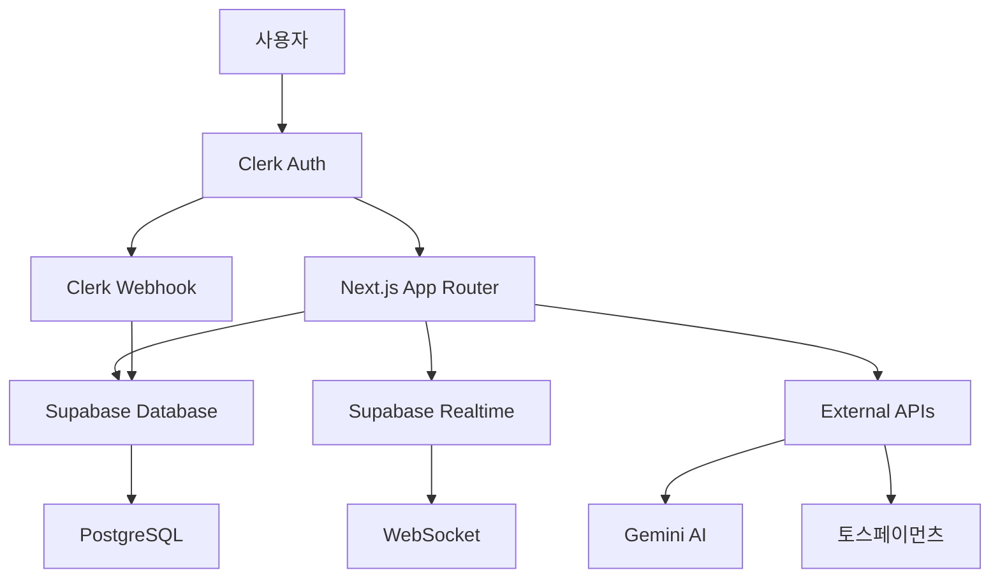

# PLANNING.MD

# 📋 부스팅 (Voosting) 개발 계획서

**🎯 MVP 우선 개발 전략 기반**

## 📖 목차
- [MVP 개발 전략](#mvp-개발-전략)
- [프로젝트 개요](#프로젝트-개요)
- [기술 스택](#기술-스택)
- [시스템 아키텍처](#시스템-아키텍처)
- [개발 일정](#개발-일정)
- [팀 구성 및 역할](#팀-구성-및-역할)
- [환경 설정](#환경-설정)
- [품질 관리](#품질-관리)
- [배포 전략](#배포-전략)
- [리스크 관리](#리스크-관리)

---

## 🚀 현재 인증 아키텍처

> **현재 상태**: **Clerk** 인증 시스템과 **Supabase** 데이터베이스 조합으로 최적화된 아키텍처 구축

### 현재 인증 아키텍처

#### 🔒 Clerk 인증 시스템
- **메인 인증**: Clerk로 모든 인증 처리 (이메일, OAuth)
- **사용자 동기화**: Clerk 웹훅을 통해 Supabase profiles 테이블에 프로필 동기화
- **유연한 권한 관리**: Clerk User ID를 기반으로 한 RLS 정책
- **비용 효율성**: 스타트업 친화적 비용 구조

#### 📋 Supabase 데이터베이스
- **데이터 전용**: 인증 기능 사용하지 않고 데이터베이스만 활용
- **RLS 정책**: Clerk User ID 기반 세밀한 데이터 접근 제어
- **실시간 기능**: Supabase Realtime으로 실시간 업데이트
- **운영 효율성**: PostgreSQL 기반 강력한 기능

#### 🎆 부스팅 특화 이점
- **이중 타겟 아키텍처**: 비즈니스/크리에이터 공개 페이지 영역 분리
- **3단계 추천 시스템**: SQL 트리거로 수익 분배 자동화 (10%→5%→2%)
- **마케팅 크리에이터**: 팔로워 영향력을 마케팅 도구로 활용하는 전문가 개념

### 현재 개발 진행 상황
```yaml
완료된 인증 시스템:
  - Clerk 인증 시스템 구축 완료
  - Supabase 데이터베이스 연동 완료
  - 웹훅 기반 사용자 동기화 완료
  - RLS 정책 기반 데이터 보안 완료
  - 멀티도메인 라우팅 완료
  
다음 단계 개발:
  - 이중 타겟 공개 페이지 구현
  - 3단계 추천 시스템 확장
  - 마케팅 크리에이터 대시보드 구현
```

### 관련 문서
- [PRD.md - 이중 타겟 아키텍처 설계](./PRD.md)
- [theme.md - 부스팅 통합 테마 시스템](./theme.md)
- [task1.md - Core MVP 진행 상황](./task1.md)

---

## 🎯 MVP 개발 전략

> **핵심 철학**: "빠른 검증, 점진적 확장" + **이중 타겟 마케팅 플랫폼** - 최소한의 기능으로 비즈니스 모델을 검증하고, 사용자 피드백을 바탕으로 단계적 확장

### 3단계 MVP 로드맵

#### 🥇 Core MVP (Week 1-8) - 🚧 진행 중
**목표**: 핵심 비즈니스 모델 검증  
**개발 기간**: 8주  
**현재 진행률**: 10/89 태스크 완료 (11.2%)

**✅ 완료된 핵심 기능**: 
- ✅ Next.js 15 프로젝트 기반 구축
- ✅ Clerk 인증 시스템 구축 (이메일 + OAuth)
- ✅ Supabase 데이터베이스 연동 및 RLS 정책
- ✅ 멀티도메인 라우팅 (main/creator/business/admin) 구현
- ✅ 기본 UI 컴포넌트 시스템 (Shadcn/ui)
- ✅ Clerk 기반 로그인/회원가입 페이지
- ✅ 이중 타겟 아키텍처 설계 (PRD 업데이트)

**🚧 진행 중인 기능**:
- 🔄 사용자 프로필 및 역할 시스템 (TASK-010)
- ⏳ 기본 캠페인 CRUD 시스템
- ⏳ 정적 공유 페이지
- ⏳ 1단계 추천 시스템 (10%)
- ⏳ 수동 수익 정산

**성공 지표**: 크리에이터 100명+, 비즈니스 20명+, 첫 수익 발생 10건+

#### 🥈 Enhanced MVP (Week 9-12) - ⏳ 대기 중
**목표**: 핵심 차별화 기능 구현  
**개발 기간**: 4주  
**현재 진행률**: 1/78 태스크 완료 (1.3%)

**✅ 완료된 기능**:
- ✅ Vitest 전환 검토 및 구현 계획 수립 (TASK-173)

**⏳ 예정된 기능**:
- 드래그앤드롭 페이지 빌더
- Google Gemini AI 캠페인 매칭
- 토스페이먼츠 자동 정산
- 실시간 알림 시스템
- PWA 모바일 최적화

**성공 지표**: 총 사용자 500명+, 월 거래액 100만원+

#### 🥉 Full Product (Week 13-16) - ⏳ 대기 중
**목표**: 완성도 높은 제품으로 시장 출시  
**개발 기간**: 4주  
**현재 진행률**: 0/54 태스크 완료 (0%)

**⏳ 예정된 완성 기능**:
- 3단계 추천 시스템 (10%→5%→2%)
- 고급 어뷰징 방지 시스템  
- 관리자 대시보드 (adm.domain)
- 고급 분석 도구
- 성능 최적화 및 SEO

**성공 지표**: 총 사용자 1,000명+, 월 거래액 500만원+

### 📊 현재 개발 현황 (2024년 12월 기준)

#### 🎯 전체 진행률
- **총 태스크**: 221개 (Core MVP: 89개, Enhanced MVP: 78개, Full Product: 54개)
- **완료된 태스크**: 10개 (4.5%)
- **현재 진행 중**: TASK-010 (사용자 프로필 및 역할 시스템)

#### ✅ 주요 완료 사항
1. **프로젝트 기반 구축** (TASK-001~003)
   - Next.js 15 프로젝트 생성 및 TypeScript 설정
   - 기본 디렉토리 구조 및 ESLint/Prettier 설정

2. **UI 시스템 구축** (TASK-004~005)
   - Tailwind CSS v4 설정 및 커스텀 테마
   - Shadcn/ui 컴포넌트 라이브러리 설치

3. **인증 시스템 구축** (TASK-006~007, 009)
   - Clerk 인증 시스템 설정 및 구성
   - 미들웨어 기반 도메인 라우팅 구현
   - 로그인/회원가입 페이지 구현

4. **인프라 설정** (TASK-011~012, 015)
   - Supabase 프로젝트 및 환경 변수 설정
   - 멀티도메인 라우팅 미들웨어 구현

5. **테스트 도구 최적화** (TASK-173)
   - Vitest 전환 검토 및 구현 계획 수립

#### 🔄 다음 우선순위 태스크
1. **TASK-010**: 사용자 프로필 및 역할 시스템 설정 (진행 중)
2. **TASK-013**: Supabase 클라이언트 설정 (데이터베이스 전용)
3. **TASK-014**: 데이터베이스 스키마 설정 (Clerk User ID 기반 RLS)
4. **TASK-016~018**: 도메인별 레이아웃 컴포넌트 구현

### MVP 관련 문서
- [MVP 로드맵](./mvp/MVP-ROADMAP.md)
- [Core MVP 상세 계획](./mvp/CORE-MVP.md) 
- [Enhanced MVP 계획](./mvp/ENHANCED-MVP.md)
- [221개 태스크 우선순위 재분류](./mvp/TASK-PRIORITY-RECLASSIFICATION.md)
- [실제 구현 진행상황](./task1.md) - Core MVP 태스크 상세
- [Enhanced MVP 진행상황](./task2.md) - Enhanced MVP 태스크 상세
- [Full Product 진행상황](./task3.md) - Full Product 태스크 상세

---

## 🎯 프로젝트 개요

### 기본 정보
| 항목 | 내용 |
|------|------|
| **프로젝트명** | 부스팅 (Voosting) |
| **개발 기간** | 16주 (약 4개월) |
| **예상 팀 크기** | 2-3명 (풀스택 개발자) |
| **배포 목표일** | 2025년 12월 |
| **MVP 버전** | Phase 4 완료 시점 |

### 프로젝트 목표
- **비즈니스 목표**: AI 기반 이중 타겟 마케팅 플랫폼 구축
- **기술 목표**: 현대적인 풀스택 웹 애플리케이션 개발
- **사용자 목표**: 비즈니스와 마케팅 크리에이터에게 최적화된 경험 제공

### 핵심 가치 제안
1. **이중 타겟 마케팅**: 비즈니스와 마케팅 크리에이터 별도 영역
2. **AI 기반 매칭**: 비즘니스와 마케팅 크리에이터의 지능적 매칭
3. **3단계 추천 시스템**: 지속가능한 수익 구조 (10%→5%→2%)
4. **노코드 페이지 빌더**: 누구나 쉽게 사용할 수 있는 에디터
5. **실시간 성과 추적**: 투명한 성과 관리

---

## 🛠 기술 스택

### 프론트엔드
```yaml
Framework: Next.js 15.1.3
- App Router (RSC 지원)
- TypeScript 5.8.3 (Strict Mode)
- Server/Client Component 분리

Styling:
- Tailwind CSS v4.2.0
- Shadcn/ui (Radix UI 기반)
- Lucide React (아이콘)

State Management:
- Zustand v5.0.2 (클라이언트 상태)
- React Hook Form v7.53.0 (폼 상태)
- SWR/TanStack Query (서버 상태)

UI/UX:
- DnD Kit (드래그 앤 드롭)
- Chart.js v4 (데이터 시각화)
- Framer Motion (애니메이션)
```

### 백엔드 & 인프라
```yaml
Authentication: Clerk v5.0+ ⭐
- 이메일 로그인 및 OAuth 지원 (Google, 카카오 등)
- JWT + Session 관리
- 웹훅 기반 사용자 동기화
- 역할 기반 권한 (Supabase RLS 연동)
- 비용 효율성: 스타트업 친화적 비용 구조
- 유지보수 효율성: 관리형 인증 서비스

Database: Supabase v2.50.0 (데이터베이스 전용)
- PostgreSQL (무제한 확장성)
- Row Level Security (RLS) - Clerk User ID 기반 접근 제어
- Real-time subscriptions
- Edge Functions (Deno 기반)
- SQL 트리거 (3단계 추천 수익 자동 분배)
- Clerk 웹훅과 완벽 연동

Storage:
- Supabase Storage (이미지/파일)
- CDN 자동 최적화
- RLS 기반 보안

Deployment:
- Vercel (Next.js 최적화)
- Vercel Edge Functions
- GitHub Actions (CI/CD)
```

### 외부 서비스
```yaml
AI/ML:
- Google Gemini API 1.5 Pro (매칭 알고리즘)

Payment:
- 토스페이먼츠 API v2
- 토스 1원 인증 API

Email Service:
- Resend API v2.0 (이메일 발송)
- React Email (템플릿 시스템)

Monitoring:
- Vercel Analytics
- Supabase Dashboard
- Sentry (에러 추적)
```

---

## 🏗 시스템 아키텍처

### 도메인 구조
```
📁 Multi-Domain Architecture
├── 🌐 domain (메인)
│   ├── 랜딩 페이지
│   ├── 공유 페이지 (domain/[slug])
│   └── 인증 시스템
├── 👨‍💻 creator.domain (크리에이터)
│   ├── 대시보드
│   ├── 캠페인 관리
│   ├── 페이지 빌더
│   └── 수익 관리
├── 🏢 biz.domain (비즈니스)
│   ├── 캠페인 생성
│   ├── 크리에이터 매칭
│   ├── 성과 분석
│   └── 결제 관리
└── ⚙️ adm.domain (관리자)
    ├── 사용자 관리
    ├── 캠페인 승인
    ├── 시스템 모니터링
    └── 어뷰징 탐지
```

### 데이터 플로우


### 보안 계층
1. **인증 계층**: Clerk JWT 토큰 검증 및 세션 관리
2. **권한 계층**: Supabase RLS 정책 (Clerk User ID 기반)
3. **네트워크 계층**: Vercel Edge 보안
4. **데이터 계층**: 암호화 및 백업
5. **동기화 계층**: Clerk 웹훅을 통한 안전한 사용자 데이터 동기화

---

## 📅 MVP 기반 개발 일정

### MVP 3단계 전략 기반 타임라인
```gantt
title Voosting MVP 개발 일정 (16주)
dateFormat YYYY-MM-DD

section Core MVP (Week 1-8): 비즈니스 모델 검증
기반구축 :active, core1, 2025-08-01, 2w
사용자관리 :core2, after core1, 2w
데이터모델 :core3, after core2, 3w
핵심기능 :core4, after core3, 1w

section Enhanced MVP (Week 9-12): 차별화 기능
페이지빌더 :enhanced1, after core4, 2w
AI매칭 :enhanced2, after enhanced1, 1w
자동정산 :enhanced3, after enhanced2, 1w

section Full Product (Week 13-16): 완성도 높은 제품
3단계추천 :full1, after enhanced3, 2w
보안강화 :full2, after full1, 1w
배포최적화 :full3, after full2, 1w
```

### MVP 단계별 기술 스택 진화

#### 🥇 Core MVP (Week 1-8) - 기본 기술 스택
```yaml
목표: 핵심 비즈니스 모델 검증
기간: 8주

기본 기술 스택:
Frontend:
  - Next.js 15 (App Router)
  - TypeScript (strict mode)
  - Tailwind CSS v4 (기본 설정)
  - Shadcn/ui (기본 컴포넌트)

Backend:
  - Clerk (이메일 + OAuth 예정)
  - Supabase Database (RLS with Clerk User ID)
  - Supabase PostgreSQL (기본 스키마)
  - 기본 RLS 정책
  - 수동 데이터 처리

기능 범위:
  - 기본 인증 시스템
  - 역할별 대시보드 (creator/business)
  - 캠페인 CRUD
  - 정적 공유 페이지
  - 1단계 추천 시스템 (10%)
  - 수동 수익 정산
```

#### 🥈 Enhanced MVP (Week 9-12) - 차별화 기능 추가
```yaml
목표: 핵심 차별화 기능 구현
기간: 4주 (누적 12주)

추가 기술 스택:
Frontend 확장:
  - React DnD Kit (드래그앤드롭)
  - Chart.js (기본 분석)
  - React Hook Form (고급 폼)
  - Zustand (상태 관리)

Backend 확장:
  - Supabase Realtime (실시간 업데이트)
  - Supabase Edge Functions
  - 자동화된 비즈니스 로직

외부 서비스:
  - Google Gemini API (AI 매칭)
  - 토스페이먼츠 API (자동 정산)
  - 카카오 OAuth (소셜 로그인) - Week 9-10 구현 예정

추가 기능:
  - 드래그앤드롭 페이지 빌더
  - AI 기반 캠페인 매칭
  - 자동 결제 시스템
  - 실시간 알림
  - 모바일 최적화
```

#### 🥉 Full Product (Week 13-16) - 완전한 제품
```yaml
목표: 시장 출시 준비 완료
기간: 4주 (총 16주)

고도화 기술:
Advanced Features:
  - 복잡한 실시간 시스템
  - 고급 RLS 정책
  - SQL 트리거 (자동 수익 분배)
  - 어뷰징 방지 시스템

모니터링 & 보안:
  - Sentry (에러 추적)
  - Vercel Analytics
  - 고급 보안 정책
  - 성능 모니터링

완성 기능:
  - 3단계 추천 시스템 (10%→5%→2%)
  - 관리자 대시보드 (adm.domain)
  - 고급 어뷰징 방지
  - 성능 최적화 & SEO
  - 고급 분석 도구
```

### MVP 단계별 주요 마일스톤

#### 🥇 Core MVP 마일스톤 (Week 1-8)
| 마일스톤 | 완료 기준 | 목표 일정 | 성공 지표 |
|----------|-----------|-----------|-----------|
| **M1: Clerk Auth 완성** | 이메일 로그인 + OAuth 예정 | Week 2 | 로그인 성공률 95%+ |
| **M2: 기본 CRUD 시스템** | 캠페인 생성/참여 가능 | Week 5 | 캠페인 생성률 60%+ |
| **M3: 공유 페이지 시스템** | 정적 페이지 생성/공유 | Week 7 | 페이지 생성률 70%+ |
| **M4: Core MVP 출시** | 첫 수익 발생 검증 | Week 8 | 첫 수익 10건+ 달성 |

**Core MVP 성공 지표 (8주 후)**:
- 크리에이터 가입: 100명+
- 비즈니스 가입: 20명+
- 일일 활성 사용자: 30명+
- 첫 수익 발생: 10건+

#### 🥈 Enhanced MVP 마일스톤 (Week 9-12)
| 마일스톤 | 완료 기준 | 목표 일정 | 성공 지표 |
|----------|-----------|-----------|-----------|
| **M5: 페이지 빌더 완성** | 드래그앤드롭 에디터 | Week 10 | 페이지 빌더 사용률 80%+ |
| **M6: AI 매칭 시스템** | Gemini API 통합 완료 | Week 11 | AI 매칭 정확도 70%+ |
| **M7: 자동 결제 시스템** | 토스페이먼츠 연동 | Week 12 | 결제 완료율 90%+ |

**Enhanced MVP 성공 지표 (12주 후)**:
- 총 사용자: 500명+
- 월 활성 사용자: 200명+
- 월 거래액: 100만원+
- 사용자 리텐션: 60%+

#### 🥉 Full Product 마일스톤 (Week 13-16)
| 마일스톤 | 완료 기준 | 목표 일정 | 성공 지표 |
|----------|-----------|-----------|-----------|
| **M8: 3단계 추천 완성** | 10%→5%→2% 수익 분배 | Week 14 | 3단계 추천 활성화 80%+ |
| **M9: 관리자 시스템** | adm.domain 완전 구현 | Week 15 | 어뷰징 탐지율 95%+ |
| **M10: 프로덕션 출시** | 완전한 서비스 런칭 | Week 16 | 서비스 가동률 99.9%+ |

**Full Product 성공 지표 (16주 후)**:
- 총 사용자: 1,000명+
- 월 활성 사용자: 400명+
- 월 거래액: 500만원+
- 플랫폼 수수료 수익: 50만원+

---

## 👥 팀 구성 및 역할

### 권장 팀 구성
```yaml
개발팀 (2-3명):
  Lead Developer:
    - 전체 아키텍처 설계
    - 복잡한 비즈니스 로직 구현
    - 코드 리뷰 및 품질 관리
    
  Frontend Developer:
    - UI/UX 컴포넌트 개발
    - 블록 에디터 구현
    - 반응형 디자인
    
  Backend Developer (선택):
    - Supabase 스키마 설계
    - Edge Functions 개발
    - 보안 및 최적화

지원팀:
  Product Owner: 요구사항 정의 및 우선순위 결정
  QA Engineer: 테스트 계획 수립 및 실행
  DevOps: 배포 및 인프라 관리
```

### 업무 분담 매트릭스
| 영역 | Lead | Frontend | Backend | 비고 |
|------|------|----------|---------|------|
| 아키텍처 설계 | 🟢 주담당 | 🟡 참여 | 🟡 참여 | |
| 인증 시스템 | 🟢 주담당 | 🟡 참여 | 🔴 없음 | Clerk 중심 |
| UI 컴포넌트 | 🟡 참여 | 🟢 주담당 | 🔴 없음 | |
| 블록 에디터 | 🟡 참여 | 🟢 주담당 | 🔴 없음 | |
| DB 스키마 | 🟢 주담당 | 🔴 없음 | 🟡 참여 | |
| AI 연동 | 🟢 주담당 | 🔴 없음 | 🟡 참여 | |
| 결제 시스템 | 🟢 주담당 | 🟡 참여 | 🟡 참여 | |

---

## 🔧 환경 설정

### 개발 환경 요구사항
```yaml
시스템 요구사항:
  - Node.js 20+ (LTS)
  - Git 2.40+
  - VSCode (권장)

필수 도구:
  - Supabase CLI
  - Vercel CLI
  - Docker (선택사항)

권장 VSCode 확장:
  - TypeScript
  - Prettier
  - ESLint
  - Tailwind CSS IntelliSense
  - Thunder Client (API 테스트)
```

### 프로젝트 설정
```bash
# 1. 프로젝트 클론 및 설정
git clone https://github.com/your-org/cashup.git
cd cashup
npm install

# 2. 환경 변수 설정
cp .env.example .env.local
# .env.local 파일 편집

# 3. 데이터베이스 설정
npx supabase start
npx supabase db reset

# 4. 개발 서버 실행
npm run dev
```

### 환경별 설정
| 환경 | 도메인 | 데이터베이스 | 결제 | 이메일 |
|------|--------|--------------|------|-------|
| **Local** | localhost:3000 | Supabase Local | 토스 테스트 | Resend 테스트 |
| **Development** | dev.domain | Supabase Dev | 토스 테스트 | Resend 테스트 |
| **Staging** | staging.domain | Supabase Staging | 토스 테스트 | Resend 실서비스 |
| **Production** | domain | Supabase Prod | 토스 실결제 | Resend 실서비스 |

---

## 🔍 품질 관리

### 코딩 표준
```typescript
// 파일 구조 규칙
app/                    // App Router 페이지
components/             // 재사용 컴포넌트
├── ui/                // 기본 UI 컴포넌트
├── forms/             // 폼 컴포넌트
└── blocks/            // 블록 에디터 컴포넌트
lib/                   // 유틸리티 함수
hooks/                 // 커스텀 훅
stores/                // 상태 관리
types/                 // 타입 정의

// 네이밍 규칙
- 파일명: kebab-case (user-profile.tsx)
- 컴포넌트: PascalCase (UserProfile)
- 함수: camelCase (getUserProfile)
- 상수: UPPER_SNAKE_CASE (API_BASE_URL)
```

### 코드 품질 도구
```yaml
정적 분석:
  - TypeScript Strict Mode
  - ESLint (Next.js 규칙)
  - Prettier (코드 포맷팅)

테스트 도구:
  - Vitest (단위 테스트)
  - React Testing Library (컴포넌트 테스트)
  - Playwright (E2E 테스트)

품질 지표:
  - 코드 커버리지: 80% 이상
  - TypeScript 컴파일 에러: 0개
  - ESLint 경고: 최소화
```

### Git 워크플로우
```yaml
브랜치 전략:
  main: 프로덕션 코드
  develop: 개발 통합 브랜치
  feature/*: 기능 개발 브랜치
  hotfix/*: 긴급 수정 브랜치

커밋 메시지:
  feat: 새로운 기능
  fix: 버그 수정
  docs: 문서 변경
  style: 코드 포맷팅
  refactor: 코드 리팩토링
  test: 테스트 추가/수정
  chore: 기타 변경사항

예시:
  feat(auth): 카카오 로그인 기능 추가
  fix(campaign): 캠페인 목록 페이지네이션 버그 수정
```

---

## 🚀 배포 전략

### 배포 환경
```yaml
Development:
  Platform: Vercel Preview
  Database: Supabase Development
  Trigger: Feature 브랜치 푸시
  URL: https://cashup-dev-{hash}.vercel.app

Staging:
  Platform: Vercel Preview
  Database: Supabase Staging
  Trigger: develop 브랜치 푸시
  URL: https://cashup-staging.vercel.app

Production:
  Platform: Vercel Production
  Database: Supabase Production
  Trigger: main 브랜치 푸시
  URL: https://domain
```

### CI/CD 파이프라인
```yaml
Pre-deploy 체크리스트:
  - TypeScript 컴파일 검증
  - ESLint 규칙 검증
  - 단위 테스트 실행
  - E2E 테스트 실행 (선택)
  - 보안 취약점 스캔

배포 순서:
  1. 코드 품질 검증
  2. 테스트 실행
  3. 빌드 생성
  4. Vercel 배포
  5. 데이터베이스 마이그레이션
  6. 배포 후 테스트
  7. 모니터링 확인
```

### 모니터링 설정
```yaml
성능 모니터링:
  - Vercel Analytics (페이지 성능)
  - Web Vitals (Core Web Vitals)
  - Supabase Dashboard (DB 성능)

에러 추적:
  - Sentry (런타임 에러)
  - Vercel Logs (서버 로그)
  - Supabase Logs (DB 에러)

알림 설정:
  - 에러율 5% 초과 시 즉시 알림 (이메일 + Slack)
  - 응답 시간 3초 초과 시 경고 (이메일)
  - DB 연결 실패 시 즉시 알림 (이메일 + SMS)
  - 일일 서비스 상태 리포트 (이메일)
```

---

## ⚠️ 리스크 관리

### 기술적 리스크
| 리스크 | 확률 | 영향도 | 대응 방안 |
|--------|------|--------|-----------|
| **Supabase 서비스 장애** | 낮음 | 높음 | 백업 DB 준비, 셀프 호스팅 옵션 |
| **Next.js 15 호환성 이슈** | 중간 | 중간 | 검증된 패키지 사용, 대안 라이브러리 준비 |
| **Clerk 인증 시스템 학습** | 낮음 | 낮음 | 관리형 서비스로 빠른 적용 가능 |
| **RLS 정책 복잡도** | 중간 | 중간 | 단계적 구현, 전문가 컨설팅 |
| **토스페이먼츠 정책 변경** | 낮음 | 높음 | 다른 PG사 연동 준비 |

### Clerk 인증 시스템 리스크
| 리스크 | 확률 | 영향도 | 완화 방안 |
|--------|------|--------|-----------|
| **초기 구현 지연** | 낮음 | 낮음 | 관리형 서비스로 빠른 설정 가능 |
| **OAuth 연동 이슈** | 낮음 | 중간 | Enhanced MVP에서 구현 예정, 기본 이메일 인증 우선 |
| **데이터 동기화 이슈** | 낮음 | 중간 | Clerk 웹훅 기반 안정적 동기화 |
| **RLS 정책 오류** | 중간 | 높음 | Clerk User ID 기반 정책으로 단순화, 철저한 테스트 |

### 일정 리스크
| 리스크 | 확률 | 영향도 | 대응 방안 |
|--------|------|--------|-----------|
| **핵심 개발자 이탈** | 낮음 | 높음 | 문서화 철저, 지식 공유 |
| **요구사항 변경** | 높음 | 중간 | 애자일 개발, 우선순위 관리 |
| **외부 API 지연** | 중간 | 중간 | 병렬 개발, Mock API 활용 |
| **테스트 시간 부족** | 중간 | 높음 | 자동화 테스트, 조기 테스트 |

### 비즈니스 리스크
| 리스크 | 확률 | 영향도 | 대응 방안 |
|--------|------|--------|-----------|
| **경쟁사 출현** | 높음 | 중간 | 차별화 기능 강화, 빠른 출시 |
| **규제 변경** | 낮음 | 높음 | 법률 자문, 컴플라이언스 강화 |
| **사용자 확보 실패** | 중간 | 높음 | MVP 조기 검증, 마케팅 전략 |

### 위기 대응 계획
```yaml
단계별 대응:
  Level 1 (경고):
    - 팀 리더에게 보고
    - 상황 모니터링 강화
    
  Level 2 (주의):
    - 대응팀 구성
    - 대안 계획 활성화
    
  Level 3 (심각):
    - 전체 팀 동원
    - 외부 전문가 투입 고려
    
비상 연락망:
  - 팀 리더: 즉시 연락
  - CTO/개발 총괄: 2시간 이내
  - 경영진: 4시간 이내
```

---

## 📈 성공 지표

### 기술적 지표
```yaml
성능 목표:
  - 페이지 로딩 시간: 2초 이내
  - API 응답 시간: 500ms 이내
  - 가동률: 99.9% 이상
  - 에러율: 1% 이하

코드 품질:
  - 코드 커버리지: 80% 이상
  - TypeScript 에러: 0개
  - 순환 복잡도: 10 이하
  - 기술 부채: 레벨 A 유지
```

### 비즈니스 지표
```yaml
사용자 지표:
  - 월 활성 사용자(MAU): 1,000명
  - 사용자 재방문율: 60% 이상
  - 가입 전환율: 15% 이상

수익 지표:
  - 월 거래액(GMV): 1,000만원
  - 수수료 수익: 월 100만원
  - 사용자당 평균 수익: 1만원
```

---

## 📚 참고 자료

### 기술 문서
- [Next.js 15 Documentation](https://nextjs.org/docs)
- [Supabase Documentation](https://supabase.com/docs)
- [Clerk Documentation](https://clerk.com/docs)
- [Tailwind CSS v4](https://tailwindcss.com/docs)

### 프로젝트 문서
- [PRD (Product Requirements Document)](./PRD.md)
- [Task Management](./TASK.md)
- [API Documentation](./API.md)
- [Database Schema](./DATABASE.md)

### 업계 분석
- 경쟁사 분석 리포트
- 시장 조사 결과
- 사용자 인터뷰 결과
- 기술 트렌드 분석

---

**마지막 업데이트**: 2025년 7월 30일  
**문서 버전**: 1.1  
**다음 리뷰 예정일**: 2025년 8월 15일

## 📊 현재 진행 상황

### 완료된 작업 (9/221 - 4.1%)
- **TASK-001**: 프로젝트 초기 설정 ✅
- **TASK-002**: 프로젝트 디렉토리 구조 설정 ✅
- **TASK-003**: ESLint, Prettier 설정 ✅
- **TASK-004**: Tailwind CSS v4 설정 ✅
- **TASK-005**: Shadcn/ui 설치 및 설정 ✅
- **TASK-006**: Supabase 프로젝트 생성 ✅
- **TASK-007**: Clerk 인증 시스템 기본 설정 ✅
- **TASK-009**: 기본 로그인/회원가입 페이지 구현 ✅
- **TASK-012**: 환경 변수 설정 ✅ (TDD로 구현)

### 보류 작업 (1)
- **TASK-008**: 카카오 OAuth 연동 설정 ⏸️ (Enhanced MVP 단계로 연기)

### 다음 작업 대기
- **TASK-010**: 사용자 프로필 및 역할 시스템 설정
- **TASK-011**: 3단계 추천 시스템 기초 설계
- **TASK-013**: Supabase 클라이언트 설정