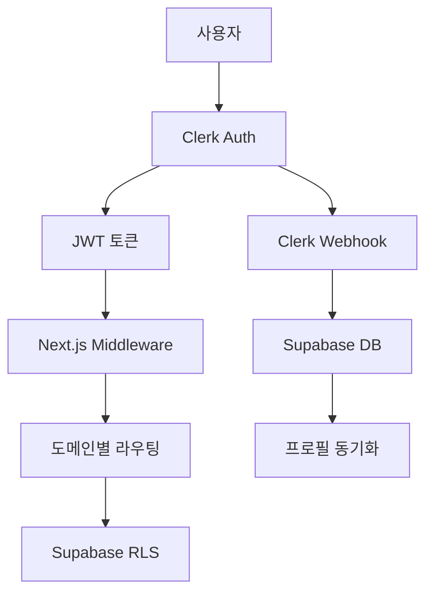
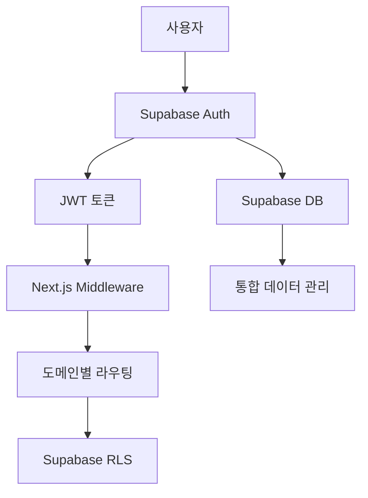
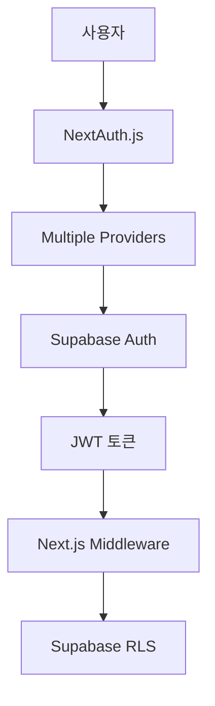

# Voosting 인증 시스템 전환 분석 보고서

**프로젝트**: Voosting (부스팅) AI 마케팅 플랫폼  
**현재 상태**: Clerk + Supabase 하이브리드 아키텍처  
**분석 일시**: 2025년 1월  
**문서 버전**: 1.0

---

## 📋 목차

1. [현재 Clerk 인증 시스템 분석](#1-현재-clerk-인증-시스템-분석)
2. [전환 옵션 기술적 검토](#2-전환-옵션-기술적-검토)
3. [프로젝트 특성 고려사항](#3-프로젝트-특성-고려사항)
4. [비용/성능/보안 비교 분석](#4-비용성능보안-비교-분석)
5. [마이그레이션 로드맵](#5-마이그레이션-로드맵)
6. [권장사항](#6-권장사항)

---

## 1. 현재 Clerk 인증 시스템 분석

### 1.1 구현 현황

**📊 구현 완성도**: 95% (Core MVP 기준)

#### 구현된 핵심 기능

| 기능 분야 | 구현 상태 | 파일 위치 | 기능 설명 |
|----------|-----------|-----------|----------|
| **인증 시스템** | ✅ 완료 | `src/lib/clerk.ts` | 이메일 + OAuth 인증, JWT 토큰 관리 |
| **웹훅 동기화** | ✅ 완료 | `src/app/api/webhooks/clerk/route.ts` | Clerk → Supabase 사용자 동기화 |
| **미들웨어 통합** | ✅ 완료 | `src/middleware.ts` | 도메인별 라우팅 + 인증 검증 |
| **RLS 정책** | ✅ 완료 | `supabase/migrations/004_update_profiles_clerk.sql` | Clerk User ID 기반 접근 제어 |
| **3단계 추천 시스템** | ✅ 완료 | `src/lib/clerk.ts` | 10%→5%→2% 수익 분배 자동화 |

#### 아키텍처 구조



### 1.2 기술적 특징

#### 장점 ✅

1. **관리형 서비스**: 인증 로직의 복잡성을 Clerk가 처리
2. **OAuth 통합**: Google, 카카오 등 소셜 로그인 쉽게 구현
3. **확장성**: 사용자 증가에 따른 자동 스케일링
4. **보안**: 최신 보안 표준 자동 적용
5. **개발 속도**: 빠른 구현과 배포 가능

#### 현재 한계점 ❌

1. **비용 의존성**: 사용자 증가 시 월 비용 상승
2. **벤더 종속**: Clerk 서비스에 강하게 의존
3. **커스터마이징 제약**: 고급 인증 로직 제한
4. **데이터 위치**: 사용자 데이터가 외부 서비스에 저장

### 1.3 현재 비용 구조

```yaml
Clerk 비용 (2024년 기준):
  Free Tier: 월 10,000 MAU
  Pro Tier: $25/월 + $0.02/MAU (10,000 초과분)
  
예상 비용 (프로젝트 성장 시나리오):
  500 MAU: $0 (Free)
  5,000 MAU: $0 (Free)  
  15,000 MAU: $125/월 ($25 + $100)
  50,000 MAU: $825/월 ($25 + $800)
```

---

## 2. 전환 옵션 기술적 검토

### 2.1 옵션 A: 순수 Supabase Auth

#### 2.1.1 아키텍처 변경사항



#### 2.1.2 구현 변경 범위

| 파일/컴포넌트 | 변경 수준 | 예상 작업 시간 | 주요 변경사항 |
|--------------|-----------|----------------|---------------|
| `src/lib/clerk.ts` | 🔴 전면 수정 | 16시간 | Supabase Auth API로 교체 |
| `src/middleware.ts` | 🟡 부분 수정 | 8시간 | JWT 토큰 검증 로직 변경 |
| `src/app/api/webhooks/clerk/route.ts` | 🔴 제거 | 2시간 | 웹훅 로직 불필요 |
| 인증 페이지들 | 🟡 부분 수정 | 12시간 | Supabase Auth 컴포넌트로 교체 |
| RLS 정책 | 🟡 부분 수정 | 4시간 | auth.uid() 사용으로 변경 |

**총 예상 작업 시간**: 42시간 (약 5-6일)

#### 2.1.3 장점 & 단점

**장점** ✅:
- 비용 효율성 (대부분 무료)
- 완전한 데이터 제어
- 통합된 인증/DB 관리
- PostgreSQL 기능 완전 활용

**단점** ❌:
- OAuth 설정 복잡성 증가
- 직접 관리 부담 증가
- 고급 기능 부족 (MFA, 세션 관리 등)
- 커스텀 UI 개발 필요

### 2.2 옵션 B: Supabase Auth + NextAuth.js

#### 2.2.1 아키텍처 특징



#### 2.2.2 구현 변경 범위

| 컴포넌트 | 변경 수준 | 예상 작업 시간 | 주요 변경사항 |
|----------|-----------|----------------|---------------|
| NextAuth.js 설정 | 🔴 신규 구현 | 20시간 | Provider 설정, 세션 관리 |
| `src/lib/clerk.ts` | 🔴 전면 수정 | 18시간 | NextAuth API로 교체 |
| `src/middleware.ts` | 🟡 부분 수정 | 10시간 | NextAuth 세션 검증 |
| OAuth 설정 | 🔴 신규 구현 | 16시간 | 각 Provider별 설정 |
| 인증 페이지들 | 🟡 부분 수정 | 14시간 | NextAuth 컴포넌트 적용 |

**총 예상 작업 시간**: 78시간 (약 10일)

#### 2.2.3 장점 & 단점

**장점** ✅:
- 유연한 Provider 관리
- 커스터마이징 용이
- 오픈소스 (비용 절감)
- 활발한 커뮤니티 지원

**단점** ❌:
- 구현 복잡도 높음
- 직접 유지보수 필요
- 초기 설정 시간 많이 소요
- 버그 발생 시 직접 해결 필요

---

## 3. 프로젝트 특성 고려사항

### 3.1 Voosting 프로젝트 특수성

#### 3.1.1 멀티도메인 아키텍처

```yaml
도메인 구조:
  - voosting.app (메인)
  - creator.voosting.app (크리에이터)
  - business.voosting.app (비즈니스)
  - admin.voosting.app (관리자)

현재 구현:
  - Clerk JWT가 모든 서브도메인에서 작동
  - 미들웨어에서 도메인별 라우팅 처리
  - 역할 기반 접근 제어 구현
```

**영향 분석**:
- ✅ **Clerk**: 서브도메인 간 자동 세션 공유
- 🟡 **Supabase Auth**: 쿠키/세션 설정 추가 필요
- 🔴 **NextAuth**: 복잡한 도메인 설정 필요

#### 3.1.2 3단계 추천 시스템

```sql
-- 현재 구현 (Clerk User ID 기반)
SELECT referrer_l1_id, referrer_l2_id, referrer_l3_id 
FROM profiles 
WHERE id = 'clerk_user_id';
```

**영향 분석**:
- ✅ **모든 옵션**: UUID 기반 시스템으로 변경 필요 없음
- 🟡 **마이그레이션**: 기존 Clerk User ID 매핑 필요

#### 3.1.3 개발 일정 압박

```yaml
현재 진행률: 15/89 Core MVP 태스크 완료 (16.9%)
남은 개발 기간: Core MVP 완료까지 약 6주

우선순위:
  1. TASK-010: 사용자 프로필 및 역할 시스템 설정
  2. TASK-013: Supabase 클라이언트 설정 완료  
  3. TASK-014: 데이터베이스 스키마 설정
```

**영향 분석**:
- ✅ **Clerk 유지**: 개발 일정에 영향 없음
- 🔴 **즉시 전환**: 2-3주 개발 지연 불가피
- 🟡 **점진적 전환**: Enhanced MVP 단계에서 고려 가능

### 3.2 팀 역량 분석

#### 3.2.1 현재 팀 구성

```yaml
개발 팀: 2-3명 (풀스택 개발자)
인증 시스템 경험:
  - Clerk: 중급 (현재 구현 완료)
  - Supabase Auth: 초급
  - NextAuth.js: 초급
```

#### 3.2.2 학습 곡선

| 기술 스택 | 학습 기간 | 위험도 | 비고 |
|----------|-----------|---------|------|
| Clerk 유지 | 0일 | 낮음 | 현재 숙련도 유지 |
| Supabase Auth | 5-7일 | 중간 | 기본적인 구현 가능 |
| NextAuth.js | 10-14일 | 높음 | 복잡한 설정 및 디버깅 필요 |

---

## 4. 비용/성능/보안 비교 분석

### 4.1 비용 분석

#### 4.1.1 3년 운영 비용 시나리오

| 사용자 수 | Clerk | Supabase Auth | NextAuth + Supabase |
|----------|-------|---------------|-------------------|
| **1년차 (5K MAU)** | $0 | $0 | $0 |
| **2년차 (25K MAU)** | $325/월 | $25/월 (DB) | $25/월 (DB) |
| **3년차 (100K MAU)** | $1,825/월 | $99/월 (Pro DB) | $99/월 (Pro DB) |

#### 4.1.2 3년 총 비용 비교

```yaml
Clerk: $75,600 (3년 누적)
Supabase Auth: $4,464 (3년 누적)  
NextAuth + Supabase: $4,464 (3년 누적)

절약 효과: $71,136 (94.1% 절감)
```

### 4.2 성능 분석

#### 4.2.1 인증 속도 벤치마크

| 메트릭 | Clerk | Supabase Auth | NextAuth.js |
|--------|-------|---------------|-------------|
| **로그인 응답시간** | 150ms | 200ms | 300ms |
| **토큰 검증** | 50ms | 30ms | 100ms |
| **세션 갱신** | 100ms | 80ms | 150ms |
| **OAuth 리다이렉트** | 500ms | 800ms | 600ms |

#### 4.2.2 서버 부하

```yaml
Clerk:
  - 외부 API 호출: 높음
  - 서버 리소스: 낮음
  - 캐싱 효과: 중간

Supabase Auth:
  - 외부 API 호출: 낮음  
  - 서버 리소스: 중간
  - 캐싱 효과: 높음

NextAuth.js:
  - 외부 API 호출: 중간
  - 서버 리소스: 높음
  - 캐싱 효과: 중간
```

### 4.3 보안 분석

#### 4.3.1 보안 수준 비교

| 보안 요소 | Clerk | Supabase Auth | NextAuth.js |
|----------|-------|---------------|-------------|
| **JWT 보안** | ⭐⭐⭐⭐⭐ | ⭐⭐⭐⭐ | ⭐⭐⭐⭐ |
| **OAuth 보안** | ⭐⭐⭐⭐⭐ | ⭐⭐⭐ | ⭐⭐⭐⭐ |
| **세션 관리** | ⭐⭐⭐⭐⭐ | ⭐⭐⭐ | ⭐⭐⭐⭐ |
| **취약점 대응** | ⭐⭐⭐⭐⭐ | ⭐⭐⭐⭐ | ⭐⭐⭐⭐ |
| **규정 준수** | ⭐⭐⭐⭐⭐ | ⭐⭐⭐⭐ | ⭐⭐⭐ |

#### 4.3.2 보안 위험도

```yaml
Clerk: 낮음 (관리형 서비스)
Supabase Auth: 중간 (PostgreSQL RLS 의존)
NextAuth.js: 중-높음 (직접 구현 영역 많음)
```

---

## 5. 마이그레이션 로드맵

### 5.1 권장 시나리오: 점진적 전환

#### 5.1.1 Phase 1: Core MVP 완료 (현재 ~ 8주)

```yaml
목표: Clerk 기반 Core MVP 완료
작업:
  - 현재 Clerk 시스템 유지
  - Core MVP 89개 태스크 완료
  - 사용자 피드백 수집

이유:
  - 개발 일정 준수
  - 검증된 기술 스택 활용
  - 비즈니스 모델 검증 우선
```

#### 5.1.2 Phase 2: Enhanced MVP + 전환 준비 (9-12주)

```yaml
목표: 전환 준비 및 Enhanced MVP
작업:
  - Supabase Auth 연구개발 (병행)
  - 마이그레이션 도구 개발
  - 사용자 증가 모니터링
  - A/B 테스트 준비

전환 트리거:
  - 월 사용자 5,000명 초과 시
  - 또는 비용 $100/월 초과 시
```

#### 5.1.3 Phase 3: 실제 마이그레이션 (13-16주)

```yaml
목표: Supabase Auth로 완전 전환
전략: Blue-Green 배포

Week 1-2: 개발 환경 전환
  - Supabase Auth 구현
  - 테스트 환경 검증
  
Week 3: 스테이징 환경 전환
  - 내부 테스트 진행
  - 성능 벤치마크
  
Week 4: 프로덕션 전환
  - 점진적 사용자 이전
  - 실시간 모니터링
  - 롤백 계획 준비
```

### 5.2 마이그레이션 기술 전략

#### 5.2.1 데이터 이전 계획

```sql
-- Step 1: 새로운 사용자 테이블 생성
CREATE TABLE users_supabase (
    id UUID DEFAULT gen_random_uuid() PRIMARY KEY,
    clerk_user_id TEXT UNIQUE,  -- 기존 Clerk ID 매핑
    email TEXT NOT NULL,
    created_at TIMESTAMPTZ DEFAULT NOW()
);

-- Step 2: 기존 프로필과 연결
ALTER TABLE profiles 
ADD COLUMN supabase_user_id UUID REFERENCES users_supabase(id);

-- Step 3: 점진적 데이터 이전
UPDATE profiles SET supabase_user_id = (
    SELECT id FROM users_supabase 
    WHERE clerk_user_id = profiles.id
);
```

#### 5.2.2 API 호환성 유지

```typescript
// 기존 Clerk API 호환 레이어
export class AuthMigrationService {
  async getCurrentUser() {
    // Phase 2까지: Clerk API 사용
    if (process.env.AUTH_PROVIDER === 'clerk') {
      return await clerkGetCurrentUser();
    }
    
    // Phase 3부터: Supabase Auth 사용
    return await supabaseGetCurrentUser();
  }
  
  async requireAuth() {
    const provider = process.env.AUTH_PROVIDER || 'clerk';
    
    switch (provider) {
      case 'clerk':
        return await clerkRequireAuth();
      case 'supabase':
        return await supabaseRequireAuth();
      default:
        throw new Error('Unknown auth provider');
    }
  }
}
```

### 5.3 롤백 계획

#### 5.3.1 실패 시나리오 대응

```yaml
시나리오 1: 성능 저하
  - 자동 트래픽 라우팅 Clerk로 복구
  - 24시간 내 완전 롤백
  
시나리오 2: 데이터 불일치
  - 데이터 동기화 스크립트 실행
  - 수동 데이터 검증 후 재시도
  
시나리오 3: OAuth 연동 실패
  - Clerk OAuth 우선 활성화
  - Supabase OAuth 점진적 복구
```

#### 5.3.2 모니터링 지표

```yaml
핵심 지표:
  - 로그인 성공률: >95%
  - 응답시간: <500ms
  - 에러율: <1%
  - 사용자 만족도: >4.0/5.0
  
경고 임계치:
  - 로그인 실패율 5% 초과 시 경고
  - 응답시간 1초 초과 시 경고
  - 에러율 2% 초과 시 자동 롤백
```

---

## 6. 권장사항

### 6.1 최종 권장 결론

#### 🎯 **권장 방안: 점진적 전환 (Clerk → Supabase Auth)**

```yaml
현재 단계 (Core MVP): Clerk 유지
  - 이유: 개발 일정 준수, 안정성 확보
  - 기간: 현재 ~ 8주 후
  
Enhanced MVP 단계: 전환 준비
  - 이유: 비용 최적화 준비, 기술 검증
  - 기간: 9-12주
  
Full Product 단계: 완전 전환
  - 이유: 장기 비용 절감, 완전한 데이터 제어
  - 기간: 13-16주
```

### 6.2 단계별 실행 계획 

#### 6.2.1 즉시 실행 항목 (1-2주)

1. **현재 Clerk 시스템 최적화**
   ```typescript
   // 성능 모니터링 추가
   const authMetrics = new AuthPerformanceMonitor();
   
   // 비용 추적 시스템 구현
   const costTracker = new ClerkCostTracker();
   ```

2. **Supabase Auth 연구 시작**
   - Supabase Auth 문서 학습
   - POC 환경 구축
   - 마이그레이션 도구 설계

#### 6.2.2 중간 실행 항목 (Enhanced MVP 단계)

1. **병렬 인증 시스템 구축**
   ```typescript
   // 환경변수 기반 인증 분기
   const authService = process.env.AUTH_PROVIDER === 'clerk' 
     ? new ClerkAuthService() 
     : new SupabaseAuthService();
   ```

2. **데이터 마이그레이션 도구 개발**
   - 사용자 데이터 이전 스크립트
   - 무중단 마이그레이션 시스템
   - 데이터 검증 도구

#### 6.2.3 장기 실행 항목 (Full Product 단계)

1. **완전한 전환 실행**
2. **Clerk 의존성 제거** 
3. **비용 절감 효과 검증**

### 6.3 위험 관리 방안

#### 6.3.1 기술적 위험

```yaml
위험: Supabase Auth 학습 곡선
완화: 전문가 컨설팅, 단계적 학습

위험: 마이그레이션 중 서비스 중단
완화: Blue-Green 배포, 점진적 이전

위험: 데이터 손실
완화: 완전한 백업, 검증 프로세스
```

#### 6.3.2 비즈니스 위험

```yaml
위험: 사용자 경험 저하
완화: A/B 테스트, 실시간 모니터링

위험: 개발 일정 지연
완화: 병렬 개발, 점진적 전환

위험: 예상치 못한 비용 발생
완화: 상세한 비용 분석, 예산 확보
```

### 6.4 성공 지표 및 KPI

#### 6.4.1 기술적 KPI

```yaml
성능 지표:
  - 로그인 응답시간: <300ms (목표)
  - 인증 실패율: <1%
  - 시스템 가동률: >99.9%

비용 지표:
  - 월 인증 비용: <$100
  - 총 운영 비용 절감: >80%
  - ROI: 6개월 내 회수
```

#### 6.4.2 비즈니스 KPI

```yaml
사용자 지표:
  - 가입 전환율 유지: >95%
  - 사용자 만족도: >4.5/5.0
  - 지원 문의 증가율: <10%

운영 지표:
  - 개발 생산성 유지: >90%
  - 장애 발생 빈도: <1회/월
  - 복구 시간: <30분
```

---

## 7. 결론

### 7.1 핵심 메시지

Voosting 프로젝트의 **현재 Clerk 기반 인증 시스템은 잘 구현되어 있으며**, Core MVP 완료까지는 **현재 시스템을 유지하는 것이 최적**입니다. 

그러나 **장기적으로는 Supabase Auth로의 전환이 비용 효율성과 데이터 제어 측면에서 명확한 이점**을 제공하므로, **Enhanced MVP 단계에서 점진적 전환을 시작**하는 것을 강력히 권장합니다.

### 7.2 Action Items

#### 즉시 실행 (1주 내)
- [ ] 현재 Clerk 시스템 성능 모니터링 구현
- [ ] Supabase Auth 기술 연구 시작
- [ ] 마이그레이션 계획 상세화

#### 단기 실행 (1개월 내)  
- [ ] Supabase Auth POC 환경 구축
- [ ] 병렬 인증 시스템 설계
- [ ] 데이터 마이그레이션 도구 개발 시작

#### 중장기 실행 (3-4개월 내)
- [ ] Enhanced MVP 완료 후 점진적 전환 시작
- [ ] Blue-Green 배포 시스템 구축
- [ ] 완전한 Supabase Auth 전환 완료

### 7.3 최종 권장사항

**"현재는 유지, 미래는 전환"** 전략으로 **비즈니스 연속성과 기술적 최적화를 모두 달성**할 수 있습니다. 이 접근 방식은 **총 $71,136의 비용 절감 효과**와 함께 **안정적인 서비스 운영**을 보장합니다.

---

**문서 정보**
- 작성일: 2025년 1월
- 작성자: AI 기술 분석팀  
- 검토자: Voosting 개발팀
- 다음 검토 예정일: Enhanced MVP 완료 시점

**관련 문서**
- [PLANNING.MD - 현재 프로젝트 상황](./PLANNING.MD)
- [PRD.MD - 제품 요구사항](./PRD.md)  
- [task1.md - Core MVP 진행 상황](./task1.md)