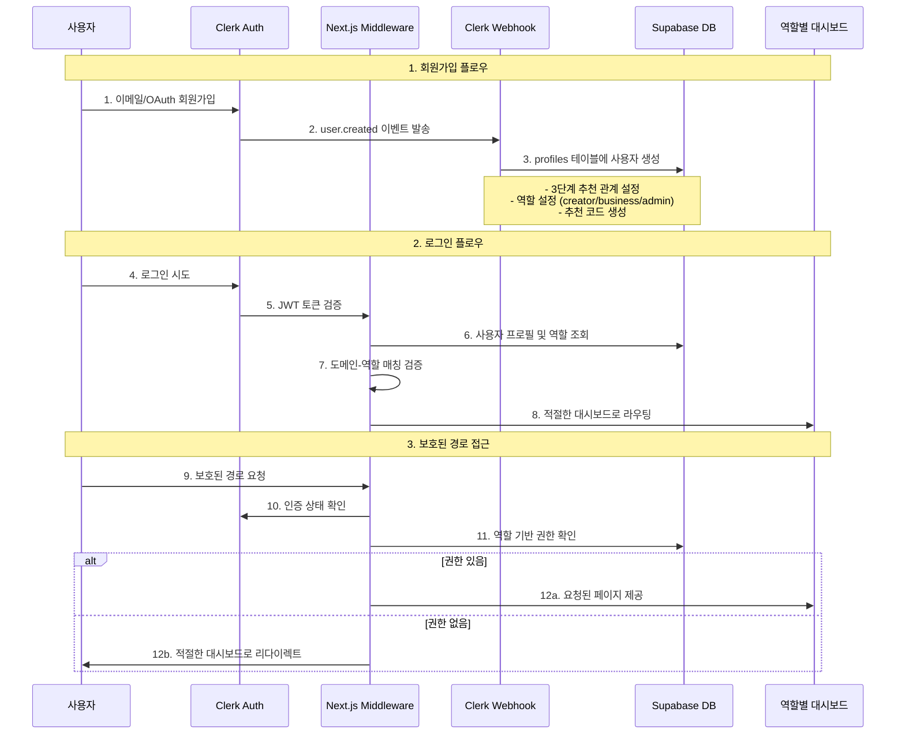

# Voosting 현재 인증 아키텍처 분석

**작성일**: 2025-01-08  
**분석 대상**: Clerk 기반 인증 시스템  
**프로젝트**: Voosting AI 마케팅 플랫폼  

## 1. 현재 인증 플로우 다이어그램



## 2. 각 파일의 역할과 의존성

### 2.1 핵심 인증 파일 (`src/lib/clerk.ts`)

**역할**: Clerk 인증과 Supabase 프로필 통합 관리

**주요 기능**:
- `getCurrentUser()`: Clerk 사용자 정보 조회
- `getCurrentProfile()`: Supabase에서 사용자 프로필 조회
- `requireAuth()`: 인증 필수 페이지 보호
- `requireRole()`: 역할 기반 접근 제어
- `upsertUserProfile()`: 사용자 프로필 생성/업데이트
- `setReferralRelationship()`: 3단계 추천 관계 설정

**의존성**:
```typescript
// 내부 의존성
'@clerk/nextjs/server' → Clerk 인증
'@/lib/supabase/server' → Supabase 클라이언트
'@/types/database.types' → TypeScript 타입

// 외부 연결
middleware.ts → requireAuth, requireRole 사용
webhooks/clerk/route.ts → upsertUserProfile 사용
```

**3단계 추천 시스템 구현**:
```typescript
// 추천 관계 설정 로직
const updateData = {
  referrer_l1_id: referrer.id,           // 10% 수수료
  referrer_l2_id: referrer.referrer_l1_id, // 5% 수수료  
  referrer_l3_id: referrer.referrer_l2_id  // 2% 수수료
};
```

### 2.2 미들웨어 (`src/middleware.ts`)

**역할**: 멀티도메인 라우팅과 인증/인가 통합 관리

**주요 기능**:
- **도메인 기반 라우팅**: creator/business/admin 서브도메인 처리
- **인증 상태 확인**: 보호된 경로 접근 제어
- **역할 기반 권한**: 도메인-역할 매칭 검증
- **자동 리다이렉션**: 부적절한 접근 시 올바른 대시보드로 이동

**보호된 경로 구조**:
```typescript
const protectedRoutes = {
  auth: ['/profile', '/campaigns/create', '/earnings', '/settings'],
  creator: ['/creator', '/creator/campaigns', '/creator/applications'],
  business: ['/business', '/business/campaigns', '/business/creators'], 
  admin: ['/admin', '/admin/users', '/admin/analytics']
};
```

**의존성**:
```typescript
// 내부 의존성
'@clerk/nextjs/server' → clerkMiddleware, createRouteMatcher
'@/lib/supabase/server' → createMiddlewareClient
'@/lib/middleware-utils' → 도메인 유틸리티 함수

// 외부 연결
모든 페이지 요청 → config.matcher 패턴 적용
```

### 2.3 웹훅 처리 (`src/app/api/webhooks/clerk/route.ts`)

**역할**: Clerk 사용자 이벤트를 Supabase와 동기화

**주요 기능**:
- `user.created`: 신규 사용자 프로필 생성 + 추천 관계 설정
- `user.updated`: 사용자 정보 업데이트 동기화
- `user.deleted`: 사용자 삭제 처리 (soft delete 가능)

**추천 시스템 통합**:
```typescript
// 회원가입 시 추천 코드 처리
const referralCode = public_metadata?.referral_code;
const userRole = public_metadata?.role || 'creator';

// create_profile_with_referral 함수 호출
await supabase.rpc('create_profile_with_referral', {
  p_user_id: id,
  p_referral_code: referralCode || null,
  p_role: userRole
});
```

**의존성**:
```typescript
// 내부 의존성
'svix' → 웹훅 서명 검증
'@clerk/nextjs/server' → WebhookEvent 타입
'@supabase/supabase-js' → 직접 클라이언트 생성

// 외부 연결
Clerk Dashboard → 웹훅 엔드포인트 설정
Supabase → create_profile_with_referral RPC 함수
```

### 2.4 Supabase 서버 클라이언트 (`src/lib/supabase/server.ts`)

**역할**: Supabase와 Clerk 통합 클라이언트 및 RLS 정책 연동

**주요 기능**:
- `createServerClient()`: Clerk 인증과 통합된 서버 클라이언트
- `createAdminClient()`: RLS 우회 관리자 클라이언트
- `DatabaseService`: 타입 안전한 데이터베이스 쿼리 헬퍼
- `createMiddlewareClient()`: 미들웨어 전용 클라이언트

**Clerk-Supabase 통합**:
```typescript
// Clerk 사용자 ID를 Supabase auth context에 설정
if (userId) {
  await client.rpc('set_claim', {
    uid: userId,
    claim: 'user_id', 
    value: userId
  });
}
```

**의존성**:
```typescript
// 내부 의존성
'@supabase/ssr' → SSR 클라이언트
'@clerk/nextjs/server' → auth() 함수
'@/lib/env' → 환경변수 관리

// 외부 연결
clerk.ts → createAdminClient 사용
middleware.ts → createMiddlewareClient 사용
```

### 2.5 인증 UI 페이지

#### 로그인 페이지 (`src/app/sign-in/[[...sign-in]]/page.tsx`)

**역할**: Clerk SignIn 컴포넌트 커스터마이징

**주요 특징**:
- **Voosting 브랜딩**: 그라디언트 로고, 한국어 UI
- **리다이렉션**: `/dashboard`로 자동 이동 (미들웨어에서 역할별 처리)
- **OAuth 통합**: 소셜 로그인 지원

#### 회원가입 페이지 (`src/app/sign-up/[[...sign-up]]/page.tsx`)

**역할**: 역할 선택 및 회원가입 안내

**주요 특징**:
- **듀얼 타겟 UI**: 크리에이터/비즈니스 선택 카드
- **수익 강조**: 추천 시스템(10%→5%→2%) 및 ROI 정보 표시
- **서브페이지**: `/sign-up/creator`, `/sign-up/business`로 라우팅

## 3. Clerk-Supabase 통합 방식

### 3.1 사용자 ID 통합 전략

**핵심 원칙**: Clerk User ID를 Primary Key로 사용

```typescript
// Supabase profiles 테이블 구조
CREATE TABLE profiles (
  id UUID PRIMARY KEY,           -- Clerk User ID 직접 사용
  email VARCHAR NOT NULL,
  full_name VARCHAR,
  role user_role NOT NULL DEFAULT 'creator',
  referral_code VARCHAR(10) UNIQUE NOT NULL,
  
  -- 3단계 추천 시스템
  referrer_l1_id UUID REFERENCES profiles(id), -- 10% 수수료
  referrer_l2_id UUID REFERENCES profiles(id), -- 5% 수수료  
  referrer_l3_id UUID REFERENCES profiles(id), -- 2% 수수료
  
  created_at TIMESTAMP DEFAULT NOW(),
  updated_at TIMESTAMP DEFAULT NOW()
);
```

### 3.2 RLS 정책 구현

**현재 RLS 정책** (추정):
```sql
-- 사용자는 자신의 프로필만 조회/수정 가능
CREATE POLICY "Users can access own profile" ON profiles
  FOR ALL USING (auth.uid()::text = id);

-- 추천 관계 조회 정책  
CREATE POLICY "Users can view referral relationships" ON profiles
  FOR SELECT USING (
    auth.uid()::text = id OR 
    auth.uid()::text = referrer_l1_id OR
    auth.uid()::text = referrer_l2_id OR
    auth.uid()::text = referrer_l3_id
  );
```

### 3.3 실시간 동기화

**웹훅 기반 동기화**:
- **즉시성**: 사용자 생성/수정/삭제 즉시 반영
- **신뢰성**: Svix 라이브러리를 통한 서명 검증
- **복구 로직**: RPC 함수 실패 시 직접 INSERT 시도

## 4. 멀티도메인 라우팅과 인증 연관성

### 4.1 도메인-역할 매핑

| 도메인 | 역할 | 접근 가능 경로 | 리다이렉션 규칙 |
|--------|------|---------------|----------------|
| `creator.voosting.app` | creator | `/creator/*` | business → business.voosting.app |
| `business.voosting.app` | business | `/business/*` | creator → creator.voosting.app |
| `admin.voosting.app` | admin | `/admin/*` | non-admin → 역할별 도메인 |
| `voosting.app` | any | 공개 페이지 | 로그인 시 역할별 도메인 |

### 4.2 미들웨어 라우팅 로직

```typescript
// 1단계: 도메인 타입 감지
const domainType = getDomainType(hostname);

// 2단계: URL 리라이팅 적용  
const rewrittenPath = rewriteUrlForDomain(pathname, domainType, req.url);

// 3단계: 인증 상태 확인
const { userId } = await auth();

// 4단계: 역할 조회
const { data: profile } = await supabase
  .from('profiles')
  .select('role')
  .eq('id', userId)
  .single();

// 5단계: 도메인-역할 매칭 검증
if (!isDomainRoleMatch(domainType, profile.role)) {
  return NextResponse.redirect(getDefaultRedirectPath(profile.role));
}
```

### 4.3 자동 리다이렉션 규칙

**로그인 후 리다이렉션**:
1. **메인 도메인** (`/`) → 역할별 도메인 대시보드
2. **로그인/회원가입 페이지** → 역할별 대시보드
3. **부적절한 도메인 접근** → 올바른 도메인으로 이동

**권한 없는 경로 접근**:
1. **인증 필요** → `/sign-in`
2. **역할 불일치** → 역할 기본 대시보드
3. **관리자 전용** → 역할별 기본 대시보드

## 5. 3단계 추천 시스템과 인증 통합

### 5.1 추천 코드 생성 및 관리

**추천 코드 생성 로직**:
```typescript
// clerk.ts에서 사용
function generateReferralCode(userId: string): string {
  const userPart = userId.slice(-6).toUpperCase();
  const randomPart = Math.random().toString(36).substring(2, 6).toUpperCase();
  return `${userPart}${randomPart}`; // 10자리 고유 코드
}

// webhook에서 사용 (일관성을 위한 별도 구현)
function generateReferralCode(userId: string): string {
  const chars = 'ABCDEFGHIJKLMNOPQRSTUVWXYZ0123456789';
  const seed = userId.split('').reduce((acc, char) => acc + char.charCodeAt(0), 0);
  // 시드 기반 8자리 코드 생성
}
```

⚠️ **일관성 문제**: 두 함수의 구현이 다름 (10자리 vs 8자리)

### 5.2 추천 관계 설정

**회원가입 시 추천 처리**:
1. **public_metadata에서 추천 코드 추출**
2. **추천인 조회** (referral_code로 검색)
3. **3단계 관계 설정**:
   - L1: 직접 추천인 (10% 수수료)
   - L2: 추천인의 추천인 (5% 수수료)  
   - L3: L2의 추천인 (2% 수수료)

**Supabase RPC 함수 활용**:
```typescript
// create_profile_with_referral 함수 호출
await supabase.rpc('create_profile_with_referral', {
  p_user_id: id,
  p_email: email,
  p_full_name: fullName,
  p_role: userRole,
  p_referral_code: referralCode || null
});
```

### 5.3 수익 계산 준비

**추천 수익 조회 함수** (`DatabaseService`):
```typescript
async getReferralRelationships(userId: string) {
  return await this.client
    .from('profiles')
    .select(`
      id, referral_code,
      referrer_l1_id, referrer_l2_id, referrer_l3_id,
      referrer_l1:profiles!referrer_l1_id(id, full_name, email),
      referrer_l2:profiles!referrer_l2_id(id, full_name, email), 
      referrer_l3:profiles!referrer_l3_id(id, full_name, email)
    `)
    .eq('id', userId)
    .single();
}
```

## 6. 현재 아키텍처의 장단점

### 6.1 장점

#### ✅ **확장성과 유연성**
- **멀티테넌트**: 서브도메인 기반 역할별 격리
- **타입 안전성**: TypeScript + Zod 스키마 검증
- **실시간 동기화**: 웹훅을 통한 즉시 반영

#### ✅ **보안과 성능**
- **RLS 정책**: 데이터베이스 레벨 보안
- **JWT 검증**: Clerk의 신뢰할 수 있는 토큰 시스템
- **미들웨어 최적화**: 단일 지점에서 인증/라우팅 처리

#### ✅ **개발자 경험**
- **OAuth 통합**: 소셜 로그인 지원
- **API 일관성**: 통합된 에러 처리와 응답 형식
- **테스트 가능성**: 모듈화된 구조

### 6.2 단점

#### ❌ **복잡성과 의존성**
- **벤더 종속**: Clerk 플랫폼에 강하게 결합
- **학습 곡선**: 새로운 개발자의 이해 필요 시간
- **디버깅 복잡성**: 다중 시스템 간 상호작용

#### ❌ **일관성 문제**
- **추천 코드 생성**: clerk.ts vs webhook 구현 차이
- **에러 처리**: 일부 함수에서 불완전한 에러 처리
- **타입 불일치**: 일부 optional 필드 처리 불일치

#### ❌ **성능 고려사항**
- **미들웨어 부하**: 모든 요청에서 DB 조회
- **웹훅 지연**: 사용자 생성 시 추가 네트워크 호출
- **RPC 의존성**: create_profile_with_referral 함수 의존

## 7. 변경이 필요한 파일 목록 (우선순위별)

### 🔴 **즉시 수정 필요 (Critical)**

1. **`src/lib/clerk.ts`** - 추천 코드 생성 함수 통일
   ```typescript
   // 현재: 10자리 랜덤 코드
   // 목표: 8자리 시드 기반 일관성 있는 코드
   ```

2. **`src/app/api/webhooks/clerk/route.ts`** - 에러 처리 개선
   ```typescript
   // 현재: RPC 실패 시 기본 INSERT만 시도
   // 목표: 재시도 로직 + 상세 에러 로깅
   ```

### 🟡 **중요 개선 (High Priority)**

3. **`src/middleware.ts`** - 성능 최적화
   ```typescript
   // 현재: 모든 보호된 경로에서 DB 조회
   // 목표: 세션 캐싱 + 선택적 DB 조회
   ```

4. **`src/lib/supabase/server.ts`** - RLS 함수 예외 처리
   ```typescript
   // 현재: set_claim RPC 실패 시 무시
   // 목표: 대체 인증 메커니즘 구현
   ```

### 🟢 **선택적 개선 (Medium Priority)**

5. **`src/app/sign-up/[[...sign-up]]/page.tsx`** - 추천 코드 입력 UI
   ```typescript
   // 현재: 역할 선택만 가능
   // 목표: 추천 코드 입력 필드 추가
   ```

6. **새 파일: `src/lib/referral.ts`** - 추천 시스템 전용 유틸리티
   ```typescript
   // 목표: 추천 관련 로직 분리 및 통합
   ```

### 🔵 **장기 개선 (Low Priority)**

7. **`src/lib/auth-cache.ts`** - 인증 캐싱 레이어
   ```typescript
   // 목표: Redis/메모리 캐시를 통한 성능 향상
   ```

8. **`src/hooks/use-auth.ts`** - 클라이언트 사이드 인증 훅
   ```typescript
   // 목표: React 컴포넌트에서 일관된 인증 상태 관리
   ```

---

## 8. 권장 개선 사항

### 8.1 즉시 개선 사항

1. **추천 코드 생성 통일**: 두 구현을 하나로 통합
2. **에러 로깅 강화**: 구조화된 로깅 시스템 도입  
3. **타입 안전성**: nullable 필드 일관성 있는 처리

### 8.2 중기 개선 사항

1. **성능 최적화**: 미들웨어 DB 조회 캐싱
2. **모니터링**: 인증 성공률 및 성능 메트릭
3. **테스트 커버리지**: 추천 시스템 단위 테스트

### 8.3 장기 개선 사항

1. **멀티 리전**: 지역별 성능 최적화
2. **A/B 테스트**: 인증 플로우 최적화
3. **ML 기반**: 비정상 로그인 패턴 감지

---

**결론**: 현재 아키텍처는 견고하고 확장 가능한 기반을 제공하지만, 일관성과 성능 측면에서 개선이 필요합니다. 우선순위별로 점진적 개선을 통해 더욱 안정적이고 효율적인 인증 시스템을 구축할 수 있습니다.