# Voosting Clerk → Pure Supabase Auth 전환 기술 분석 보고서

**작성일**: 2025-08-05  
**버전**: 1.0  
**범위**: Clerk 기반 인증 시스템의 완전한 Supabase Auth 전환을 위한 기술적 분석

## 📋 목차

1. [현재 Clerk 아키텍처 분석](#1-현재-clerk-아키텍처-분석)
2. [인증 플로우 및 세션 관리](#2-인증-플로우-및-세션-관리)
3. [Supabase 하이브리드 아키텍처 현황](#3-supabase-하이브리드-아키텍처-현황)
4. [멀티도메인 라우팅과 인증 연관성](#4-멀티도메인-라우팅과-인증-연관성)
5. [3단계 추천 시스템과 인증 연관성](#5-3단계-추천-시스템과-인증-연관성)
6. [마이그레이션 영향도 분석](#6-마이그레이션-영향도-분석)
7. [변경 필요 파일 목록](#7-변경-필요-파일-목록)
8. [기술적 위험 요소](#8-기술적-위험-요소)

---

## 1. 현재 Clerk 아키텍처 분석

### 1.1 핵심 통합 파일들

#### **`src/lib/clerk.ts`** - 인증 유틸리티 레이어
```typescript
// 주요 기능들
- getCurrentUser() : Clerk 사용자 정보 조회
- getCurrentProfile() : Supabase 프로필 정보 조회 (Admin Client 사용)
- requireAuth() : 인증 확인 및 리다이렉트
- requireRole() : 역할 기반 접근 제어
- upsertUserProfile() : 사용자 프로필 생성/업데이트
- setReferralRelationship() : 3단계 추천 관계 설정
```

**아키텍처 특징**:
- Clerk Session → Supabase Admin Client를 통한 프로필 조회
- RLS 정책을 우회하는 Admin Client 사용 패턴
- 3단계 추천 시스템과 완전 통합

#### **`src/middleware.ts`** - 라우팅 및 접근 제어
```typescript
// 핵심 기능
- clerkMiddleware() : Clerk 기반 미들웨어
- 멀티도메인 라우팅 (main/creator/business/admin)
- 역할 기반 경로 접근 제어
- Supabase Admin Client를 통한 사용자 역할 확인
```

**복잡성 지표**:
- 보호된 경로: 30개+ (역할별 분류)
- 도메인 타입: 4개 (main, creator, business, admin)
- 인증 플로우: 6단계 검증 프로세스

#### **`src/app/api/webhooks/clerk/route.ts`** - 사용자 동기화
```typescript
// 웹훅 이벤트 처리
- user.created : 프로필 생성 + 추천 관계 설정
- user.updated : 프로필 정보 업데이트
- user.deleted : 프로필 삭제 (soft delete)
```

**데이터 동기화 플로우**:
1. Clerk 이벤트 발생 → 2. 웹훅 호출 → 3. Supabase 프로필 동기화 → 4. 추천 관계 설정

### 1.2 아키텍처 다이어그램

```mermaid
graph TD
    A[사용자] --> B[Clerk Auth]
    B --> C[Next.js Middleware]
    C --> D[도메인 라우팅]
    D --> E[역할 기반 접근제어]
    
    B --> F[Clerk Webhook]
    F --> G[Supabase Admin Client]
    G --> H[프로필 동기화]
    H --> I[3단계 추천 설정]
    
    C --> J[Supabase Admin Client]
    J --> K[사용자 역할 확인]
    K --> L[페이지 렌더링]
    
    M[RLS 정책] -.-> |우회| J
    N[Supabase Auth] -.-> |사용 안함| O[미사용]
```



## 2. 인증 플로우 및 세션 관리

### 2.1 현재 인증 플로우 (6단계)

#### **Step 1-2**: 사용자 인증 및 세션 생성
```typescript
// Clerk가 JWT 토큰 및 세션 관리
const { userId } = await auth(); // Clerk session
const user = await currentUser(); // Clerk user object
```

#### **Step 3-4**: 미들웨어 인증 확인
```typescript
// middleware.ts
export default clerkMiddleware(async (auth, req) => {
  const { userId } = await auth();
  if (!userId && isProtectedRoute) {
    return NextResponse.redirect('/sign-in');
  }
});
```

#### **Step 5-6**: 사용자 프로필 및 역할 확인
```typescript
// Supabase Admin Client를 통한 역할 확인
const { data: profile } = await supabase
  .from('profiles')
  .select('role')
  .eq('id', userId) // Clerk User ID
  .single();
```

### 2.2 세션 관리 메커니즘

| 구성 요소 | 현재 (Clerk) | Pure Supabase로 전환 시 |
|-----------|-------------|----------------------|
| **세션 저장소** | Clerk JWT (httpOnly cookies) | Supabase JWT + Refresh Token |
| **토큰 갱신** | Clerk 자동 갱신 | Supabase Auth 자동 갱신 |
| **다중 탭 동기화** | Clerk BroadcastChannel | Supabase Auth 이벤트 |
| **로그아웃 처리** | Clerk signOut() | Supabase auth.signOut() |
| **세션 검증** | Clerk middleware | Supabase middleware |

### 2.3 OAuth 공급자 통합

#### 현재 구현 (Clerk 기반)
```typescript
// Clerk OAuth 설정 (dashboard에서 구성)
- Google OAuth 2.0
- 카카오 OAuth (Enhanced MVP 예정)
- 이메일/비밀번호 (기본)
```

#### Pure Supabase 전환 시 필요한 작업
```typescript
// Supabase OAuth 구성 (supabase dashboard)
- Google: Client ID/Secret 재설정
- 카카오: Provider 설정 및 리다이렉트 URL 변경
- 이메일 템플릿: 커스텀 이메일 템플릿 구성
```

## 3. Supabase 하이브리드 아키텍처 현황

### 3.1 현재 Supabase 통합 상태

#### **Database-Only 사용 패턴**
```typescript
// src/lib/supabase/server.ts
export async function createServerClient() {
  const { userId } = await auth(); // Clerk 의존성
  
  const client = createSupabaseServerClient(
    env.SUPABASE_URL,
    env.SUPABASE_ANON_KEY, // Auth 기능 비활성화
    { /* cookies config */ }
  );
  
  // Clerk User ID를 RLS Context에 설정
  if (userId) {
    await client.rpc('set_claim', {
      uid: userId,
      claim: 'user_id',
      value: userId
    });
  }
}
```

#### **Admin Client 패턴**
```typescript
// RLS 정책 우회를 위한 Service Role Key 사용
export function createAdminClient() {
  return createSupabaseServerClient(
    env.SUPABASE_URL,
    env.SUPABASE_SERVICE_ROLE_KEY, // RLS 우회
    { /* minimal cookies config */ }
  );
}
```

### 3.2 RLS 정책 현황

#### **현재 RLS 구조** (Clerk User ID 기반)
```sql
-- profiles 테이블 RLS 정책
CREATE POLICY "Users can access own profile" ON profiles
  FOR ALL USING (auth.uid()::text = id);
  
-- Clerk User ID가 직접 profiles.id에 저장
-- auth.uid()는 실제로는 set_claim RPC를 통해 설정됨
```

#### **Pure Supabase 전환 시 RLS 구조**
```sql
-- Supabase Auth UUID 기반
CREATE POLICY "Users can access own profile" ON profiles
  FOR ALL USING (auth.uid() = id);
  
-- auth.uid()가 Supabase Auth의 실제 UUID 반환
-- 추가 매핑 테이블 또는 마이그레이션 필요
```

### 3.3 데이터 구조 분석

#### **Profiles 테이블 구조**
```sql
CREATE TABLE profiles (
  id TEXT PRIMARY KEY,           -- 현재: Clerk User ID (TEXT)
  email VARCHAR NOT NULL,        -- 변경 없음
  full_name TEXT,               -- 변경 없음
  role user_role DEFAULT 'creator', -- 변경 없음
  referral_code VARCHAR(10) UNIQUE, -- 변경 없음
  
  -- 3단계 추천 시스템
  referrer_l1_id TEXT REFERENCES profiles(id), -- 10% 수익
  referrer_l2_id TEXT REFERENCES profiles(id), -- 5% 수익  
  referrer_l3_id TEXT REFERENCES profiles(id), -- 2% 수익
  
  created_at TIMESTAMP DEFAULT NOW(),
  updated_at TIMESTAMP DEFAULT NOW()
);
```

**마이그레이션 고려사항**:
- `id` 필드: TEXT (Clerk) → UUID (Supabase) 변환 필요
- 외래 키 제약조건: 모든 `referrer_l*_id` 필드 업데이트 필요
- 기존 데이터 보존: 사용자 매핑 테이블 또는 일괄 변환 스크립트 필요

## 4. 멀티도메인 라우팅과 인증 연관성

### 4.1 도메인 라우팅 아키텍처

#### **미들웨어 통합 구조**
```typescript
// src/middleware.ts - 핵심 플로우
1. clerkMiddleware() 래퍼 시작
2. 도메인 타입 감지 (main/creator/business/admin)
3. URL 리라이팅 적용
4. 인증 확인 (Clerk)
5. 사용자 역할 확인 (Supabase Admin Client)
6. 도메인-역할 매칭 검증
7. 최종 라우팅 또는 리다이렉트
```

#### **도메인별 접근 제어 매트릭스**
| 도메인 | 필요 역할 | 현재 구현 | Pure Supabase 전환 시 |
|--------|----------|-----------|----------------------|
| `main` | 모든 사용자 | ✅ 완료 | 🔧 세션 확인 로직 변경 |
| `creator.domain` | creator | ✅ 완료 | 🔧 역할 확인 로직 변경 |
| `business.domain` | business | ✅ 완료 | 🔧 역할 확인 로직 변경 |
| `admin.domain` | admin | ✅ 완료 | 🔧 관리자 확인 로직 변경 |

### 4.2 라우팅 의존성 분석

#### **Clerk 의존적인 미들웨어 코드**
```typescript
// 변경 필요한 부분들
const { userId } = await auth(); // Clerk → Supabase
const supabase = createMiddlewareClient(); // Admin → User Client
const { data: profile } = await supabase
  .from('profiles')
  .select('role')
  .eq('id', userId) // Clerk ID → Supabase ID
  .single();
```

#### **Pure Supabase 전환 시 변경점**
```typescript
// 새로운 미들웨어 구조
import { createServerClient } from '@supabase/ssr'

export async function middleware(request: NextRequest) {
  const supabase = createServerClient(/* 설정 */);
  const { data: { user } } = await supabase.auth.getUser();
  
  if (!user && isProtectedRoute) {
    return NextResponse.redirect('/auth/signin');
  }
  
  // 역할 확인을 위한 프로필 조회
  const { data: profile } = await supabase
    .from('profiles')
    .select('role')
    .eq('id', user.id) // Supabase Auth UUID
    .single();
}
```

## 5. 3단계 추천 시스템과 인증 연관성

### 5.1 현재 추천 시스템 구조

#### **데이터베이스 스키마**
```sql
-- 3단계 추천 관계
profiles.referrer_l1_id → 10% 수익 분배
profiles.referrer_l2_id → 5% 수익 분배  
profiles.referrer_l3_id → 2% 수익 분배

-- 추천 통계 뷰
CREATE VIEW user_referral_stats AS
SELECT 
  p.id,
  COUNT(r1.id) as level1_count,  -- 직접 추천한 사용자
  COUNT(r2.id) as level2_count,  -- 2단계 추천 사용자
  COUNT(r3.id) as level3_count   -- 3단계 추천 사용자
FROM profiles p
LEFT JOIN profiles r1 ON r1.referrer_l1_id = p.id
LEFT JOIN profiles r2 ON r2.referrer_l2_id = p.id  
LEFT JOIN profiles r3 ON r3.referrer_l3_id = p.id
GROUP BY p.id;
```

### 5.2 Clerk Webhook 통합

#### **사용자 생성 시 추천 처리**
```typescript
// src/app/api/webhooks/clerk/route.ts
if (eventType === 'user.created') {
  const referralCode = public_metadata?.referral_code;
  
  // create_profile_with_referral RPC 함수 호출
  const { data, error } = await supabase.rpc('create_profile_with_referral', {
    p_user_id: id,        // Clerk User ID
    p_email: email,
    p_role: userRole,
    p_referral_code: referralCode || null,
  });
}
```

#### **RPC 함수 구조** (Supabase 내)
```sql
CREATE OR REPLACE FUNCTION create_profile_with_referral(
  p_user_id TEXT,
  p_email TEXT,
  p_full_name TEXT DEFAULT NULL,
  p_role user_role DEFAULT 'creator',
  p_referral_code TEXT DEFAULT NULL
) RETURNS JSON AS $$
DECLARE
  v_referrer_profile RECORD;
  v_new_profile_id TEXT;
BEGIN
  -- 추천인 찾기
  IF p_referral_code IS NOT NULL THEN
    SELECT id, referrer_l1_id, referrer_l2_id
    INTO v_referrer_profile
    FROM profiles 
    WHERE referral_code = p_referral_code;
  END IF;
  
  -- 프로필 생성 + 3단계 추천 관계 설정
  INSERT INTO profiles (
    id, email, full_name, role, referral_code,
    referrer_l1_id, referrer_l2_id, referrer_l3_id
  ) VALUES (
    p_user_id,
    p_email, 
    p_full_name,
    p_role,
    generate_referral_code(p_user_id),
    v_referrer_profile.id,                    -- L1: 10%
    v_referrer_profile.referrer_l1_id,        -- L2: 5%  
    v_referrer_profile.referrer_l2_id         -- L3: 2%
  );
  
  RETURN json_build_object('success', true, 'profile_id', p_user_id);
END;
$$ LANGUAGE plpgsql SECURITY DEFINER;
```

### 5.3 Pure Supabase 전환 시 영향

#### **추천 시스템 연동 변경점**

| 현재 (Clerk) | Pure Supabase 전환 |
|-------------|-------------------|
| Clerk Webhook → RPC 호출 | Supabase Auth Trigger → RPC 호출 |
| Clerk User ID 기반 매핑 | Supabase Auth UUID 기반 |
| `public_metadata`에서 추천코드 | 회원가입 폼에서 추천코드 |
| 실시간 웹훅 동기화 | Auth 이벤트 리스너 |

#### **새로운 추천 시스템 플로우**
```typescript
// 회원가입 시 추천 코드 처리
async function signUpWithReferral() {
  // 1. Supabase Auth 회원가입
  const { data: authData, error: authError } = await supabase.auth.signUp({
    email,
    password,
    options: {
      data: {
        full_name: fullName,
        role: userRole,
        referral_code: referralCode // 추천 코드
      }
    }
  });
  
  // 2. Auth Hook 또는 Trigger에서 프로필 생성
  // 3. 추천 관계 설정은 동일한 RPC 함수 활용
}
```

## 6. 마이그레이션 영향도 분석

### 6.1 변경 복잡도 매트릭스

| 영역 | 복잡도 | 예상 작업 시간 | 위험도 | 우선순위 |
|------|--------|---------------|-------|----------|
| **인증 유틸리티** | 🔴 높음 | 8-12h | 🔴 높음 | 1 |
| **미들웨어 라우팅** | 🟡 중간 | 6-8h | 🟡 중간 | 2 |
| **웹훅 → Auth Hook** | 🟡 중간 | 4-6h | 🟡 중간 | 3 |
| **RLS 정책 재설계** | 🔴 높음 | 10-15h | 🔴 높음 | 1 |
| **사용자 데이터 마이그레이션** | 🔴 높음 | 15-20h | 🔴 높음 | 1 |
| **추천 시스템 연동** | 🟡 중간 | 6-10h | 🟡 중간 | 4 |
| **OAuth 재설정** | 🟢 낮음 | 2-4h | 🟢 낮음 | 5 |
| **UI 컴포넌트** | 🟢 낮음 | 4-6h | 🟢 낮음 | 6 |

### 6.2 데이터 마이그레이션 전략

#### **Option A: 점진적 마이그레이션** (권장)
```sql
-- 1단계: 매핑 테이블 생성
CREATE TABLE clerk_supabase_mapping (
  clerk_user_id TEXT PRIMARY KEY,
  supabase_user_id UUID NOT NULL REFERENCES auth.users(id),
  created_at TIMESTAMP DEFAULT NOW()
);

-- 2단계: 기존 사용자를 Supabase Auth로 초대
-- 3단계: 로그인 시 점진적 매핑 생성
-- 4단계: 모든 매핑 완료 후 profiles.id 업데이트
```

#### **Option B: 일괄 마이그레이션**
```sql
-- 1단계: 모든 기존 사용자에게 Supabase Auth 계정 생성
-- 2단계: profiles 테이블 id 컬럼 일괄 업데이트  
-- 3단계: 외래 키 제약조건 재설정
-- 4단계: RLS 정책 업데이트
```

**권장 방식**: Option A (점진적) - 서비스 중단 없이 안전한 전환 가능

## 7. 변경 필요 파일 목록

### 7.1 우선순위 1 (핵심 인증 시스템)

| 파일 경로 | 현재 상태 | 변경 유형 | 상세 내용 |
|----------|----------|-----------|----------|
| `src/lib/clerk.ts` | 🔴 전면 수정 | Replace | Clerk → Supabase Auth 유틸리티 함수 교체 |
| `src/lib/supabase/server.ts` | 🟡 부분 수정 | Update | Admin Client 패턴 → User Auth 패턴 |
| `src/lib/supabase/client.ts` | 🟡 부분 수정 | Update | Auth 상태 관리 함수 추가 |
| `src/middleware.ts` | 🔴 전면 수정 | Replace | clerkMiddleware → Supabase 미들웨어 |
| `src/app/api/webhooks/clerk/route.ts` | 🔴 제거/교체 | Replace | Auth Hook 또는 Trigger로 교체 |

### 7.2 우선순위 2 (라우팅 및 UI)

| 파일 경로 | 현재 상태 | 변경 유형 | 상세 내용 |
|----------|----------|-----------|----------|
| `src/app/sign-in/[[...sign-in]]/page.tsx` | 🔴 전면 수정 | Replace | Clerk SignIn → Supabase Auth UI |
| `src/app/sign-up/[[...sign-up]]/page.tsx` | 🔴 전면 수정 | Replace | Clerk SignUp → Supabase Auth UI |
| `src/lib/middleware-utils.ts` | 🟢 변경 없음 | Keep | 도메인 유틸리티는 그대로 유지 |
| `src/app/(creator)/dashboard/page.tsx` | 🟡 부분 수정 | Update | getCurrentProfile() 호출 변경 |
| `src/app/(business)/dashboard/page.tsx` | 🟡 부분 수정 | Update | getCurrentProfile() 호출 변경 |
| `src/app/(admin)/dashboard/page.tsx` | 🟡 부분 수정 | Update | getCurrentProfile() 호출 변경 |

### 7.3 우선순위 3 (데이터베이스 및 스키마)

| 파일 경로 | 현재 상태 | 변경 유형 | 상세 내용 |
|----------|----------|-----------|----------|
| `supabase/migrations/` | 🟡 새 마이그레이션 | Add | 사용자 ID 매핑 및 RLS 정책 수정 |
| `src/types/database.types.ts` | 🟡 부분 수정 | Update | profiles.id: TEXT → UUID 타입 변경 |
| `src/app/api/profile/route.ts` | 🟡 부분 수정 | Update | 인증 확인 로직 변경 |
| `src/app/api/referrals/route.ts` | 🟡 부분 수정 | Update | 사용자 ID 참조 방식 변경 |

### 7.4 우선순위 4 (환경 설정 및 배포)

| 파일 경로 | 현재 상태 | 변경 유형 | 상세 내용 |
|----------|----------|-----------|----------|
| `.env.example` | 🟡 부분 수정 | Update | CLERK_* 제거, Supabase Auth 설정 추가 |
| `package.json` | 🟡 부분 수정 | Update | @clerk/nextjs 제거, @supabase/auth-ui-* 추가 |
| `next.config.js` | 🟡 부분 수정 | Update | Clerk 관련 설정 제거 |

## 8. 기술적 위험 요소

### 8.1 높은 위험도 (🔴)

#### **사용자 데이터 손실 위험**
- **원인**: Clerk User ID → Supabase UUID 변환 과정에서 매핑 실패
- **영향**: 기존 프로필, 추천 관계, 캠페인 데이터 접근 불가
- **완화책**: 
  - 점진적 마이그레이션 방식 채택
  - 백업 및 롤백 계획 수립
  - 매핑 테이블을 통한 안전 장치

#### **3단계 추천 시스템 무결성**
- **원인**: 추천 관계 외래 키 업데이트 과정에서 참조 무결성 위반
- **영향**: 추천 수익 분배 시스템 전체 오류
- **완화책**:
  - 추천 관계 데이터 별도 백업
  - 단계별 외래 키 제약조건 업데이트
  - 추천 통계 재계산 스크립트 준비

### 8.2 중간 위험도 (🟡)

#### **멀티도메인 라우팅 중단**
- **원인**: 미들웨어 인증 로직 변경 중 오류 발생
- **영향**: 역할별 대시보드 접근 불가, 서비스 중단
- **완화책**:
  - 단계별 배포 (staging → production)
  - Feature Flag를 통한 점진적 활성화
  - 기존 Clerk 시스템 병행 운영 기간 설정

#### **OAuth 공급자 재설정**
- **원인**: Google, 카카오 OAuth 설정 변경 중 설정 오류
- **영향**: 소셜 로그인 기능 중단
- **완화책**:
  - OAuth 설정 변경 전 충분한 테스트
  - 기존 OAuth 설정 백업
  - 순차적 공급자 전환

### 8.3 낮은 위험도 (🟢)

#### **UI 컴포넌트 호환성**
- **원인**: Clerk UI 컴포넌트 → Supabase UI 컴포넌트 변경
- **영향**: 로그인/회원가입 페이지 디자인 변경
- **완화책**: Supabase Auth UI는 커스터마이징 가능, 기존 디자인 유지 가능

---

## 📊 요약 및 권장사항

### 전환 복잡도 요약
- **총 변경 파일**: 23개
- **핵심 변경 파일**: 8개 (우선순위 1)
- **예상 개발 시간**: 60-90시간
- **테스트 및 검증**: 20-30시간

### 권장 마이그레이션 전략
1. **점진적 전환**: 서비스 중단 없이 단계별 마이그레이션
2. **데이터 안전성 우선**: 매핑 테이블을 통한 안전한 사용자 데이터 보존
3. **철저한 테스트**: Staging 환경에서 완전한 시나리오 테스트 후 Production 적용

### 다음 단계
1. **상세 마이그레이션 계획** 수립 (일정, 담당자, 체크포인트)
2. **백업 및 롤백 절차** 문서화
3. **테스트 환경** 구축 및 시나리오 검증
4. **단계별 실행 계획** 수립

---

**문서 작성자**: Claude Code Analysis System  
**검토 필요**: Voosting 개발팀  
**업데이트 주기**: 마이그레이션 진행에 따라 수시 업데이트