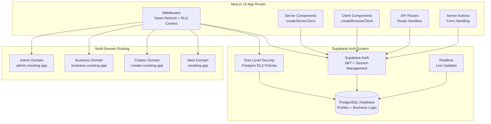

# Target Architecture: Pure Supabase Auth 시스템

## 개요

Clerk + Supabase 하이브리드 아키텍처에서 Pure Supabase Auth로 전환하는 목표 아키텍처를 설계합니다. 이 문서는 Supabase 공식 문서의 최신 Next.js 15 App Router 패턴을 기반으로 작성되었습니다.

## 🎯 목표 아키텍처 다이어그램



## 🏗️ Supabase Auth 핵심 컴포넌트 설계

### 1. Auth 클라이언트 구조

#### Server-Side Client (`/src/lib/supabase/server.ts`)

```typescript
import { createServerClient } from '@supabase/ssr'
import { cookies } from 'next/headers'
import type { Database } from '@/types/database.types'

/**
 * 서버 컴포넌트용 Supabase 클라이언트
 * 각 요청마다 새로 생성되며, 쿠키를 통해 세션 관리
 */
export async function createSupabaseServerClient() {
  const cookieStore = await cookies()

  return createServerClient<Database>(
    process.env.NEXT_PUBLIC_SUPABASE_URL!,
    process.env.NEXT_PUBLIC_SUPABASE_ANON_KEY!,
    {
      cookies: {
        get(name: string) {
          return cookieStore.get(name)?.value
        },
        set(name: string, value: string, options: any) {
          try {
            cookieStore.set({ name, value, ...options })
          } catch (error) {
            // 미들웨어에서는 쿠키 설정 불가 - 조용히 실패
          }
        },
        remove(name: string, options: any) {
          try {
            cookieStore.set({ name, value: '', ...options })
          } catch (error) {
            // 미들웨어에서는 쿠키 설정 불가 - 조용히 실패
          }
        },
      },
    }
  )
}

/**
 * 미들웨어용 제한적 클라이언트
 * 쿠키 읽기만 가능, 세션 검증 전용
 */
export function createSupabaseMiddlewareClient() {
  return createServerClient<Database>(
    process.env.NEXT_PUBLIC_SUPABASE_URL!,
    process.env.NEXT_PUBLIC_SUPABASE_ANON_KEY!,
    {
      cookies: {
        get(name: string) {
          return undefined // 미들웨어에서는 제한적 쿠키 접근
        },
        set() {},
        remove() {},
      },
    }
  )
}

/**
 * 관리자 권한 클라이언트
 * Service Role Key 사용으로 RLS 우회
 */
export function createSupabaseAdminClient() {
  return createServerClient<Database>(
    process.env.NEXT_PUBLIC_SUPABASE_URL!,
    process.env.SUPABASE_SERVICE_ROLE_KEY!,
    {
      cookies: {
        get: () => undefined,
        set: () => {},
        remove: () => {},
      },
    }
  )
}
```

#### Client-Side Client (`/src/lib/supabase/client.ts`)

```typescript
import { createBrowserClient } from '@supabase/ssr'
import type { Database } from '@/types/database.types'

/**
 * 클라이언트 컴포넌트용 Supabase 클라이언트
 * 싱글톤 패턴으로 브라우저에서 재사용
 */
let client: ReturnType<typeof createBrowserClient<Database>> | undefined

export function createSupabaseBrowserClient() {
  if (!client) {
    client = createBrowserClient<Database>(
      process.env.NEXT_PUBLIC_SUPABASE_URL!,
      process.env.NEXT_PUBLIC_SUPABASE_ANON_KEY!
    )
  }
  return client
}

/**
 * React Hook 형태의 클라이언트 접근
 */
export function useSupabase() {
  return createSupabaseBrowserClient()
}
```

### 2. 인증 유틸리티 라이브러리 (`/src/lib/auth.ts`)

```typescript
import { createSupabaseServerClient } from '@/lib/supabase/server'
import { redirect } from 'next/navigation'
import type { Database } from '@/types/database.types'

type UserRole = Database['public']['Enums']['user_role']
type Profile = Database['public']['Tables']['profiles']['Row']

/**
 * 서버에서 현재 사용자 정보 가져오기
 * 중요: getUser()를 사용하여 세션 검증 (getSession()은 보안 취약)
 */
export async function getCurrentUser() {
  const supabase = await createSupabaseServerClient()
  
  const { data: { user }, error } = await supabase.auth.getUser()
  
  if (error) {
    console.error('Auth error:', error)
    return null
  }
  
  return user
}

/**
 * 현재 사용자의 프로필 정보 가져오기
 */
export async function getCurrentProfile(): Promise<Profile | null> {
  const user = await getCurrentUser()
  
  if (!user) {
    return null
  }

  const supabase = await createSupabaseServerClient()
  
  const { data: profile, error } = await supabase
    .from('profiles')
    .select('*')
    .eq('id', user.id)
    .single()

  if (error) {
    console.error('Profile fetch error:', error)
    return null
  }

  return profile
}

/**
 * 인증이 필요한 페이지에서 사용
 */
export async function requireAuth(redirectTo?: string) {
  const user = await getCurrentUser()

  if (!user) {
    const params = redirectTo ? `?redirect_url=${encodeURIComponent(redirectTo)}` : ''
    redirect(`/auth/sign-in${params}`)
  }

  return user
}

/**
 * 특정 역할이 필요한 페이지에서 사용
 */
export async function requireRole(
  requiredRole: UserRole | UserRole[], 
  redirectTo?: string
) {
  const profile = await getCurrentProfile()

  if (!profile) {
    const params = redirectTo ? `?redirect_url=${encodeURIComponent(redirectTo)}` : ''
    redirect(`/auth/sign-in${params}`)
  }

  const allowedRoles = Array.isArray(requiredRole) ? requiredRole : [requiredRole]

  if (!allowedRoles.includes(profile.role)) {
    redirect('/unauthorized')
  }

  return profile
}

/**
 * 역할 확인 헬퍼 함수들
 */
export function hasRole(userRole: UserRole, requiredRole: UserRole | UserRole[]): boolean {
  const allowedRoles = Array.isArray(requiredRole) ? requiredRole : [requiredRole]
  return allowedRoles.includes(userRole)
}

export const roleCheckers = {
  isAdmin: (role: UserRole) => role === 'admin',
  isCreator: (role: UserRole) => role === 'creator',
  isBusiness: (role: UserRole) => role === 'business',
}
```

### 3. 미들웨어 아키텍처 (`/src/middleware.ts`)

```typescript
import { createSupabaseMiddlewareClient } from '@/lib/supabase/server'
import { NextResponse } from 'next/server'
import type { NextRequest } from 'next/server'
import {
  getDomainType,
  rewriteUrlForDomain,
  isDomainRoleMatch,
  getDefaultRedirectPath,
} from '@/lib/middleware-utils'

/**
 * 보호된 경로 정의
 */
const protectedRoutes = {
  auth: ['/profile', '/campaigns', '/earnings', '/settings'],
  creator: ['/creator'],
  business: ['/business'], 
  admin: ['/admin'],
}

const publicRoutes = [
  '/',
  '/about',
  '/contact', 
  '/pricing',
  '/auth/sign-in',
  '/auth/sign-up',
  '/auth/callback',
]

/**
 * Pure Supabase Auth 미들웨어
 */
export async function middleware(request: NextRequest) {
  const { pathname } = request.nextUrl
  const hostname = request.headers.get('host') || ''

  // 정적 파일 제외
  if (pathname.startsWith('/_next') || pathname.includes('.')) {
    return NextResponse.next()
  }

  const supabase = createSupabaseMiddlewareClient()
  const domainType = getDomainType(hostname)

  try {
    // 1. 세션 갱신 (Supabase Auth의 핵심 기능)
    const { data: { session }, error } = await supabase.auth.getSession()
    
    if (error) {
      console.error('Session error:', error)
    }

    // 2. URL 리라이팅 적용
    const rewrittenPath = rewriteUrlForDomain(pathname, domainType, request.url)
    const url = request.nextUrl.clone()
    
    if (rewrittenPath !== pathname) {
      url.pathname = rewrittenPath
    }

    // 3. 공개 경로 처리
    if (isPublicRoute(pathname)) {
      // 로그인된 사용자의 로그인/회원가입 페이지 접근 시 리다이렉트
      if (session?.user && ['/auth/sign-in', '/auth/sign-up'].includes(pathname)) {
        const profile = await getUserProfile(supabase, session.user.id)
        const dashboardPath = getRoleDashboard(profile?.role || 'creator')
        return NextResponse.redirect(new URL(dashboardPath, request.url))
      }

      return rewrittenPath !== pathname ? NextResponse.rewrite(url) : NextResponse.next()
    }

    // 4. 보호된 경로 처리
    if (isProtectedRoute(pathname)) {
      if (!session?.user) {
        const signInUrl = new URL('/auth/sign-in', request.url)
        signInUrl.searchParams.set('redirect_url', rewrittenPath)
        return NextResponse.redirect(signInUrl)
      }

      // 5. 역할 기반 접근 제어
      const profile = await getUserProfile(supabase, session.user.id)
      
      if (!profile) {
        return NextResponse.redirect(new URL('/auth/sign-in', request.url))
      }

      // 도메인-역할 매칭 확인
      if (!isDomainRoleMatch(domainType, profile.role)) {
        const correctPath = getDefaultRedirectPath(profile.role)
        return NextResponse.redirect(new URL(correctPath, request.url))
      }

      // 역할별 접근 권한 확인
      if (!hasRouteAccess(pathname, profile.role)) {
        const dashboardPath = getRoleDashboard(profile.role)
        return NextResponse.redirect(new URL(dashboardPath, request.url))
      }
    }

    // 6. 세션 갱신 응답 설정 (Supabase Auth 권장사항)
    const response = rewrittenPath !== pathname 
      ? NextResponse.rewrite(url) 
      : NextResponse.next()

    return response

  } catch (error) {
    console.error('Middleware error:', error)
    
    if (!isPublicRoute(pathname)) {
      return NextResponse.redirect(new URL('/auth/sign-in', request.url))
    }
    
    return NextResponse.next()
  }
}

/**
 * 헬퍼 함수들
 */
async function getUserProfile(supabase: any, userId: string) {
  const { data: profile } = await supabase
    .from('profiles')
    .select('role')
    .eq('id', userId)
    .single()
  
  return profile
}

function isPublicRoute(pathname: string): boolean {
  return publicRoutes.some(route => pathname.startsWith(route))
}

function isProtectedRoute(pathname: string): boolean {
  return Object.values(protectedRoutes)
    .flat()
    .some(route => pathname.startsWith(route))
}

function hasRouteAccess(pathname: string, userRole: string): boolean {
  if (userRole === 'admin') return true
  
  const roleRoutes = {
    creator: protectedRoutes.creator,
    business: protectedRoutes.business,
    admin: protectedRoutes.admin,
  }
  
  const specificRoutes = roleRoutes[userRole as keyof typeof roleRoutes] || []
  
  // 특정 역할 전용 경로 확인
  for (const [role, routes] of Object.entries(roleRoutes)) {
    if (role !== userRole && routes.some(route => pathname.startsWith(route))) {
      return false
    }
  }
  
  return true
}

function getRoleDashboard(role: string): string {
  const dashboards = {
    creator: '/creator/dashboard',
    business: '/business/dashboard', 
    admin: '/admin/dashboard',
  }
  
  return dashboards[role as keyof typeof dashboards] || '/creator/dashboard'
}

export const config = {
  matcher: [
    '/((?!api|_next/static|_next/image|favicon.ico|.*\\.).*)',
  ],
}
```

## 🔐 RLS 정책 설계

### 1. 기본 RLS 정책 구조

```sql
-- RLS 활성화
ALTER TABLE profiles ENABLE ROW LEVEL SECURITY;
ALTER TABLE campaigns ENABLE ROW LEVEL SECURITY;
ALTER TABLE applications ENABLE ROW LEVEL SECURITY;
ALTER TABLE earnings ENABLE ROW LEVEL SECURITY;

-- 현재 사용자 ID 가져오는 헬퍼 함수
CREATE OR REPLACE FUNCTION auth.current_user_id()
RETURNS UUID
LANGUAGE SQL STABLE
AS $$
  SELECT COALESCE(
    current_setting('request.jwt.claims', true)::json ->> 'sub',
    (current_setting('request.jwt.claims', true)::json ->> 'user_id')
  )::uuid;
$$;

-- 현재 사용자 역할 가져오는 헬퍼 함수
CREATE OR REPLACE FUNCTION auth.current_user_role()
RETURNS TEXT
LANGUAGE SQL STABLE SECURITY DEFINER
AS $$
  SELECT role FROM profiles WHERE id = auth.current_user_id();
$$;
```

### 2. 사용자 프로필 RLS 정책

```sql
-- 프로필 조회 정책: 본인 프로필만 조회 가능
CREATE POLICY "Users can view own profile"
ON profiles FOR SELECT
USING (auth.current_user_id() = id);

-- 프로필 수정 정책: 본인 프로필만 수정 가능
CREATE POLICY "Users can update own profile"
ON profiles FOR UPDATE
USING (auth.current_user_id() = id)
WITH CHECK (auth.current_user_id() = id);

-- 프로필 생성 정책: 회원가입 시에만 생성 가능
CREATE POLICY "Users can insert own profile"
ON profiles FOR INSERT
WITH CHECK (auth.current_user_id() = id);

-- 관리자는 모든 프로필 접근 가능
CREATE POLICY "Admins can access all profiles"
ON profiles FOR ALL
USING (auth.current_user_role() = 'admin');
```

### 3. 캠페인 관리 RLS 정책

```sql
-- 캠페인 조회 정책
CREATE POLICY "Users can view relevant campaigns"
ON campaigns FOR SELECT
USING (
  CASE auth.current_user_role()
    WHEN 'business' THEN created_by = auth.current_user_id()
    WHEN 'creator' THEN status = 'active' OR id IN (
      SELECT campaign_id FROM applications WHERE creator_id = auth.current_user_id()
    )
    WHEN 'admin' THEN true
    ELSE false
  END
);

-- 캠페인 생성 정책: 비즈니스 사용자만 생성 가능
CREATE POLICY "Business users can create campaigns"
ON campaigns FOR INSERT
WITH CHECK (
  auth.current_user_role() = 'business' AND 
  created_by = auth.current_user_id()
);

-- 캠페인 수정 정책: 생성자 또는 관리자만 수정 가능
CREATE POLICY "Campaign owners can update campaigns"
ON campaigns FOR UPDATE
USING (
  created_by = auth.current_user_id() OR 
  auth.current_user_role() = 'admin'
)
WITH CHECK (
  created_by = auth.current_user_id() OR 
  auth.current_user_role() = 'admin'
);
```

### 4. 3단계 추천 시스템 RLS 정책

```sql
-- 추천 관계 조회 정책: 본인과 관련된 추천 관계만 조회
CREATE POLICY "Users can view own referral relationships"
ON profiles FOR SELECT
USING (
  id = auth.current_user_id() OR
  referrer_l1_id = auth.current_user_id() OR
  referrer_l2_id = auth.current_user_id() OR
  referrer_l3_id = auth.current_user_id() OR
  auth.current_user_role() = 'admin'
);

-- 수익 조회 정책: 본인 수익만 조회 가능
CREATE POLICY "Users can view own earnings"
ON earnings FOR SELECT
USING (
  user_id = auth.current_user_id() OR
  auth.current_user_role() = 'admin'
);

-- 추천 수익 조회 정책
CREATE POLICY "Users can view referral earnings"
ON referral_earnings FOR SELECT
USING (
  referrer_id = auth.current_user_id() OR
  auth.current_user_role() = 'admin'
);
```

## 🔗 기존 기능 매핑

### 1. 멀티도메인 라우팅 유지

기존 미들웨어 로직을 그대로 유지하되, Clerk 인증 부분만 Supabase Auth로 교체:

- `clerkMiddleware()` → 커스텀 Supabase 미들웨어
- `auth()` → `supabase.auth.getSession()`
- 역할 기반 라우팅 로직은 동일하게 유지

### 2. 3단계 추천 시스템 통합

```typescript
/**
 * 추천 관계 설정 (Supabase Auth 기반)
 */
export async function setReferralRelationship(
  newUserId: string,
  referralCode: string
): Promise<{ success: boolean; error?: string }> {
  const supabase = createSupabaseAdminClient()
  
  // 추천인 조회
  const { data: referrer, error: referrerError } = await supabase
    .from('profiles')
    .select('id, referrer_l1_id, referrer_l2_id')
    .eq('referral_code', referralCode)
    .single()

  if (referrerError || !referrer) {
    return { success: false, error: 'Invalid referral code' }
  }

  // 3단계 추천 체인 설정
  const updateData = {
    referrer_l1_id: referrer.id,
    referrer_l2_id: referrer.referrer_l1_id,
    referrer_l3_id: referrer.referrer_l2_id,
  }

  const { error: updateError } = await supabase
    .from('profiles')
    .update(updateData)
    .eq('id', newUserId)

  return { success: !updateError, error: updateError?.message }
}
```

### 3. Role-based 접근 제어

기존 역할 기반 접근 제어 로직을 Supabase RLS 정책과 결합:

```typescript
/**
 * 서버 컴포넌트에서 역할 기반 접근 제어
 */
export async function withRoleProtection<T>(
  requiredRole: UserRole | UserRole[],
  component: () => Promise<T>
): Promise<T> {
  const profile = await requireRole(requiredRole)
  return component()
}

/**
 * 사용 예시
 */
export default async function AdminDashboard() {
  return withRoleProtection('admin', async () => {
    // 관리자만 접근 가능한 컴포넌트 로직
    return <AdminDashboardContent />
  })
}
```

### 4. 실시간 동기화 (웹훅 → Auth Hook)

Clerk 웹훅을 Supabase Auth Hook으로 대체:

```sql
-- Supabase Auth Hook 함수
CREATE OR REPLACE FUNCTION public.handle_new_user()
RETURNS TRIGGER AS $$
BEGIN
  INSERT INTO public.profiles (
    id,
    email,
    full_name,
    role,
    referral_code,
    created_at,
    updated_at
  ) VALUES (
    NEW.id,
    NEW.email,
    COALESCE(NEW.raw_user_meta_data->>'full_name', ''),
    COALESCE(NEW.raw_user_meta_data->>'role', 'creator')::user_role,
    generate_referral_code(NEW.id::text),
    NEW.created_at,
    NEW.updated_at
  );
  
  RETURN NEW;
END;
$$ LANGUAGE plpgsql SECURITY DEFINER;

-- 트리거 생성
CREATE TRIGGER on_auth_user_created
  AFTER INSERT ON auth.users
  FOR EACH ROW EXECUTE FUNCTION public.handle_new_user();
  
-- 사용자 업데이트 트리거
CREATE OR REPLACE FUNCTION public.handle_user_update()
RETURNS TRIGGER AS $$
BEGIN
  UPDATE public.profiles SET
    email = NEW.email,
    updated_at = NEW.updated_at
  WHERE id = NEW.id;
  
  RETURN NEW;
END;
$$ LANGUAGE plpgsql SECURITY DEFINER;

CREATE TRIGGER on_auth_user_updated
  AFTER UPDATE ON auth.users
  FOR EACH ROW EXECUTE FUNCTION public.handle_user_update();
```

## ⚡ 성능 최적화 방안

### 1. RLS 정책 최적화

```sql
-- 인덱스 생성 (RLS 정책 성능 향상)
CREATE INDEX CONCURRENTLY idx_profiles_user_id ON profiles (id);
CREATE INDEX CONCURRENTLY idx_profiles_role ON profiles (role);
CREATE INDEX CONCURRENTLY idx_campaigns_created_by ON campaigns (created_by);
CREATE INDEX CONCURRENTLY idx_campaigns_status ON campaigns (status);
CREATE INDEX CONCURRENTLY idx_applications_creator_id ON applications (creator_id);
CREATE INDEX CONCURRENTLY idx_applications_campaign_id ON applications (campaign_id);

-- 복합 인덱스 (다중 조건 쿼리 최적화)
CREATE INDEX CONCURRENTLY idx_campaigns_status_created_by 
ON campaigns (status, created_by);
CREATE INDEX CONCURRENTLY idx_profiles_referral_chain 
ON profiles (referrer_l1_id, referrer_l2_id, referrer_l3_id);
```

### 2. 세션 캐싱 전략

```typescript
/**
 * 서버 컴포넌트용 세션 캐시
 */
import { cache } from 'react'

export const getCachedUser = cache(async () => {
  const supabase = await createSupabaseServerClient()
  const { data: { user } } = await supabase.auth.getUser()
  return user
})

export const getCachedProfile = cache(async () => {
  const user = await getCachedUser()
  if (!user) return null
  
  const supabase = await createSupabaseServerClient()
  const { data: profile } = await supabase
    .from('profiles')
    .select('*')
    .eq('id', user.id)
    .single()
  
  return profile
})
```

### 3. 미들웨어 성능 개선

```typescript
/**
 * 최적화된 미들웨어 구조
 */
export async function middleware(request: NextRequest) {
  const { pathname } = request.nextUrl
  
  // 조기 반환 최적화
  if (shouldSkipMiddleware(pathname)) {
    return NextResponse.next()
  }
  
  // 캐시된 도메인 타입 감지
  const domainType = getCachedDomainType(request.headers.get('host'))
  
  // 배치 처리 최적화
  const [sessionResult, profileResult] = await Promise.allSettled([
    getSession(request),
    getUserProfile(request)
  ])
  
  // ... 나머지 로직
}

// 헬퍼 함수들
function shouldSkipMiddleware(pathname: string): boolean {
  return pathname.startsWith('/_next') || 
         pathname.includes('.') || 
         pathname === '/favicon.ico'
}

const domainTypeCache = new Map<string, string>()
function getCachedDomainType(hostname: string | null): string {
  if (!hostname) return 'main'
  
  if (!domainTypeCache.has(hostname)) {
    domainTypeCache.set(hostname, getDomainType(hostname))
  }
  
  return domainTypeCache.get(hostname)!
}
```

## 🛡️ 보안 강화 방안

### 1. JWT 설정 최적화

```sql
-- JWT 설정 최적화
ALTER ROLE authenticator SET pgrst.jwt_secret TO 'your-jwt-secret';

-- JWT 만료 시간 설정 (24시간)
ALTER ROLE authenticator SET pgrst.jwt_exp TO '24 hours';

-- 보안 헤더 설정
ALTER ROLE authenticator SET pgrst.openapi_security_active TO 'true';
```

### 2. Auth Hook 보안

```sql
-- Auth Hook 보안 강화
CREATE OR REPLACE FUNCTION public.handle_new_user()
RETURNS TRIGGER 
SECURITY DEFINER -- 보안 정의자 권한으로 실행
SET search_path = public, auth -- 경로 제한
AS $$
BEGIN
  -- 입력 검증
  IF NEW.email IS NULL OR NEW.email = '' THEN
    RAISE EXCEPTION 'Email is required';
  END IF;
  
  -- SQL 인젝션 방지를 위한 파라미터화 쿼리
  INSERT INTO public.profiles (id, email, role, referral_code)
  VALUES (
    NEW.id,
    NEW.email,
    COALESCE(NEW.raw_user_meta_data->>'role', 'creator')::user_role,
    generate_referral_code(NEW.id::text)
  );
  
  RETURN NEW;
EXCEPTION
  WHEN OTHERS THEN
    -- 에러 로깅
    INSERT INTO public.auth_errors (user_id, error_message, created_at)
    VALUES (NEW.id, SQLERRM, NOW());
    RAISE;
END;
$$ LANGUAGE plpgsql;
```

### 3. 사용자 데이터 보호

```sql
-- 민감한 데이터 암호화
CREATE EXTENSION IF NOT EXISTS pgcrypto;

-- 개인정보 암호화 함수
CREATE OR REPLACE FUNCTION encrypt_personal_data(data TEXT)
RETURNS TEXT AS $$
BEGIN
  RETURN crypt(data, gen_salt('bf', 8));
END;
$$ LANGUAGE plpgsql;

-- 프로필 테이블 암호화 적용
ALTER TABLE profiles 
ADD COLUMN encrypted_phone TEXT,
ADD COLUMN encrypted_address TEXT;

-- 암호화된 데이터 조회 함수
CREATE OR REPLACE FUNCTION decrypt_personal_data(encrypted_data TEXT, input_data TEXT)
RETURNS BOOLEAN AS $$
BEGIN
  RETURN encrypted_data = crypt(input_data, encrypted_data);
END;
$$ LANGUAGE plpgsql;
```

## 👨‍💻 개발자 경험 개선

### 1. 타입 안전성 확보

```typescript
/**
 * 타입 안전한 Auth 유틸리티
 */
import type { User } from '@supabase/supabase-js'
import type { Database } from '@/types/database.types'

type AuthUser = User
type UserProfile = Database['public']['Tables']['profiles']['Row']
type UserRole = Database['public']['Enums']['user_role']

/**
 * 타입 가드 함수들
 */
export function isAuthUser(user: unknown): user is AuthUser {
  return typeof user === 'object' && 
         user !== null && 
         'id' in user && 
         'email' in user
}

export function isValidRole(role: string): role is UserRole {
  return ['creator', 'business', 'admin'].includes(role)
}

export function assertUserRole(role: string): asserts role is UserRole {
  if (!isValidRole(role)) {
    throw new Error(`Invalid user role: ${role}`)
  }
}

/**
 * 타입 안전한 프로필 조회
 */
export async function getTypedProfile(userId: string): Promise<UserProfile | null> {
  const supabase = await createSupabaseServerClient()
  
  const { data, error } = await supabase
    .from('profiles')
    .select('*')
    .eq('id', userId)
    .returns<UserProfile[]>()
    .single()
  
  if (error) {
    console.error('Profile fetch error:', error)
    return null
  }
  
  return data
}
```

### 2. 에러 처리 표준화

```typescript
/**
 * 표준화된 에러 처리 시스템
 */
export class AuthError extends Error {
  constructor(
    message: string,
    public code: string,
    public status: number = 500
  ) {
    super(message)
    this.name = 'AuthError'
  }
}

export class RoleError extends AuthError {
  constructor(requiredRole: UserRole, userRole: UserRole) {
    super(
      `Access denied. Required role: ${requiredRole}, user role: ${userRole}`,
      'INSUFFICIENT_ROLE',
      403
    )
  }
}

/**
 * 에러 핸들링 유틸리티
 */
export function handleAuthError(error: unknown): never {
  if (error instanceof AuthError) {
    console.error(`Auth Error [${error.code}]:`, error.message)
    throw error
  }
  
  if (error instanceof Error) {
    console.error('Unexpected error:', error.message)
    throw new AuthError(error.message, 'UNKNOWN_ERROR')
  }
  
  console.error('Unknown error:', error)
  throw new AuthError('An unknown error occurred', 'UNKNOWN_ERROR')
}

/**
 * 안전한 비동기 함수 래퍼
 */
export function withErrorHandling<T extends any[], R>(
  fn: (...args: T) => Promise<R>
) {
  return async (...args: T): Promise<R> => {
    try {
      return await fn(...args)
    } catch (error) {
      handleAuthError(error)
    }
  }
}
```

### 3. 테스트 용이성

```typescript
/**
 * 테스트용 Auth 모킹
 */
export const mockAuthUser = (overrides: Partial<AuthUser> = {}): AuthUser => ({
  id: 'test-user-id',
  email: 'test@example.com',
  created_at: new Date().toISOString(),
  updated_at: new Date().toISOString(),
  email_confirmed_at: new Date().toISOString(),
  last_sign_in_at: new Date().toISOString(),
  role: 'authenticated',
  aud: 'authenticated',
  app_metadata: {},
  user_metadata: {},
  identities: [],
  ...overrides,
})

export const mockUserProfile = (overrides: Partial<UserProfile> = {}): UserProfile => ({
  id: 'test-user-id',
  email: 'test@example.com',
  full_name: 'Test User',
  role: 'creator',
  referral_code: 'TEST123',
  referrer_l1_id: null,
  referrer_l2_id: null,
  referrer_l3_id: null,
  created_at: new Date().toISOString(),
  updated_at: new Date().toISOString(),
  ...overrides,
})

/**
 * 테스트용 Supabase 클라이언트 모킹
 */
export function createMockSupabaseClient() {
  return {
    auth: {
      getUser: jest.fn(),
      getSession: jest.fn(),
      signInWithPassword: jest.fn(),
      signUp: jest.fn(),
      signOut: jest.fn(),
    },
    from: jest.fn(() => ({
      select: jest.fn(() => ({
        eq: jest.fn(() => ({
          single: jest.fn(),
        })),
      })),
      insert: jest.fn(),
      update: jest.fn(),
      delete: jest.fn(),
    })),
  }
}
```

## 🔄 마이그레이션 단계별 구현 계획

### Phase 1: 기반 구조 설정 (1-2일)
1. Supabase Auth 클라이언트 설정
2. 기본 RLS 정책 구현
3. Auth 유틸리티 함수 구현

### Phase 2: 미들웨어 전환 (2-3일)
1. Clerk 미들웨어를 Supabase 미들웨어로 교체
2. 세션 관리 로직 구현
3. 도메인 라우팅 통합 테스트

### Phase 3: 인증 페이지 구현 (2-3일)
1. 로그인/회원가입 페이지 구현
2. OAuth 프로바이더 설정
3. 역할 선택 플로우 구현

### Phase 4: 기능 통합 (3-4일)
1. 3단계 추천 시스템 통합
2. 실시간 기능 구현
3. 기존 대시보드 통합

### Phase 5: 테스트 및 최적화 (2-3일)
1. 종합 테스트 수행
2. 성능 최적화 적용
3. 보안 검증

## 📊 성과 지표

### 성능 목표
- 미들웨어 응답 시간: < 200ms (현재 215ms에서 개선)
- 인증 세션 검증: < 50ms
- RLS 정책 쿼리: < 100ms
- 페이지 로드 시간: < 2초

### 보안 목표
- JWT 토큰 보안 강화
- RLS 정책 100% 커버리지
- 에러 정보 노출 최소화
- 감사 로그 구현

### 개발자 경험 목표
- 타입 안전성 100%
- 에러 처리 표준화
- 테스트 커버리지 > 90%
- 개발 환경 설정 시간 < 5분

---

이 Pure Supabase Auth 아키텍처는 기존 Clerk + Supabase 하이브리드 시스템의 모든 기능을 유지하면서도 단일 인증 시스템의 장점을 제공합니다. 특히 비용 효율성, 개발 복잡성 감소, 그리고 Supabase 생태계와의 완전한 통합을 통해 더 나은 개발자 경험을 제공할 것으로 예상됩니다.