# Pure Supabase Auth 마이그레이션 가이드

**Voosting 프로젝트의 Clerk + Supabase 하이브리드 시스템을 Pure Supabase Auth로 전환하기 위한 완전한 가이드**

## 📋 개요

현재 Voosting은 **Clerk (인증) + Supabase (데이터베이스)** 하이브리드 아키텍처를 사용하고 있습니다. 이 마이그레이션 가이드는 **Pure Supabase Auth** 시스템으로의 안전하고 체계적인 전환을 위한 모든 정보를 제공합니다.

### 🎯 마이그레이션 목표

- **비용 최적화**: 이중 인증 서비스 비용 절감
- **아키텍처 단순화**: 단일 Supabase 플랫폼 통합
- **유지보수성 향상**: 일관된 인증 시스템
- **기능 확장성**: Supabase Auth의 고급 기능 활용

### ⚠️ 주요 고려사항

- **예상 작업 시간**: 60-90시간 (개발) + 20-30시간 (테스트)
- **사용자 영향**: 일회성 재로그인 필요
- **데이터 마이그레이션**: Clerk User ID → Supabase UUID 변환
- **다운타임**: 최소화 (점진적 전환 방식)

## 📚 문서 구조

### 🏗️ 1. 아키텍처 분석
- **[01-current-architecture.md](./01-current-architecture.md)** - 현재 Clerk 시스템 분석
- **[02-target-architecture.md](./02-target-architecture.md)** - 목표 Supabase Auth 아키텍처
- **[03-gap-analysis.md](./03-gap-analysis.md)** - 변경점 및 영향도 분석

### 🛠️ 2. 구현 가이드
- **[04-implementation-checklist.md](./04-implementation-checklist.md)** - 8단계 47항목 체크리스트
- **[05-environment-setup.md](./05-environment-setup.md)** - 환경 설정 가이드
- **[06-database-migration.md](./06-database-migration.md)** - 데이터베이스 스키마 변경

### 💻 3. 개발 가이드
- **[07-code-migration.md](./07-code-migration.md)** - 코드 변경 가이드 (18개 파일)
- **[08-testing-strategy.md](./08-testing-strategy.md)** - 테스트 전략 및 시나리오
- **[09-rollback-plan.md](./09-rollback-plan.md)** - 롤백 절차

### 📖 4. 참조 자료
- **[10-troubleshooting.md](./10-troubleshooting.md)** - 문제 해결 가이드
- **[11-performance-comparison.md](./11-performance-comparison.md)** - 성능 비교 분석
- **[appendix/](./appendix/)** - 코드 예제 및 설정 템플릿

## 🚀 빠른 시작

### 1. 사전 준비 체크리스트

```bash
# 1. 현재 시스템 백업
npm run supabase:backup

# 2. 개발 환경 확인
npm run test
npm run type-check

# 3. 의존성 확인
npm list @clerk/nextjs @supabase/supabase-js @supabase/ssr
```

### 2. 추천 읽기 순서

1. **📖 현재 시스템 이해**: [01-current-architecture.md](./01-current-architecture.md)
2. **🎯 목표 아키텍처 파악**: [02-target-architecture.md](./02-target-architecture.md)
3. **📋 실행 계획 검토**: [04-implementation-checklist.md](./04-implementation-checklist.md)
4. **⚙️ 환경 설정**: [05-environment-setup.md](./05-environment-setup.md)
5. **💾 데이터베이스 준비**: [06-database-migration.md](./06-database-migration.md)

### 3. 단계별 진행

```mermaid
graph LR
    A[준비 작업] --> B[Supabase Auth 설정]
    B --> C[컴포넌트 개발]
    C --> D[DB 스키마 업데이트]
    D --> E[미들웨어 전환]
    E --> F[UI 전환]
    F --> G[테스트 & 검증]
    G --> H[배포 & 정리]
```



## 📊 현재 vs 목표 아키텍처 비교

| 구성 요소 | 현재 (Clerk + Supabase) | 목표 (Pure Supabase) |
|----------|-------------------------|---------------------|
| **인증 제공자** | Clerk | Supabase Auth |
| **사용자 ID** | Clerk ID (TEXT) | Supabase UUID |
| **세션 관리** | Clerk JWT | Supabase JWT |
| **OAuth** | Clerk OAuth | Supabase OAuth |
| **UI 컴포넌트** | Clerk Components | Supabase Auth UI |
| **웹훅** | Clerk Webhooks | Supabase Auth Hooks |
| **데이터베이스** | Supabase (Database Only) | Supabase (Full Stack) |
| **RLS 정책** | Admin Client 패턴 | User Auth 패턴 |

## 🎯 마이그레이션 전략

### A. 점진적 전환 (권장)
- **장점**: 서비스 중단 최소화, 단계별 검증 가능
- **단점**: 작업 기간 연장 (3-4주)
- **적용**: 프로덕션 환경

### B. 일괄 전환
- **장점**: 빠른 완료 (1-2주)
- **단점**: 높은 위험도, 긴 다운타임
- **적용**: 스테이징 환경 테스트

## ⚠️ 주요 위험 요소

### 🔴 High Risk
- **사용자 데이터 마이그레이션** 중 데이터 손실
- **3단계 추천 시스템** 참조 무결성 위반
- **RLS 정책 오류**로 인한 데이터 노출

### 🟡 Medium Risk
- **OAuth 재설정** 중 로그인 불가
- **세션 불일치**로 인한 사용자 경험 저하
- **성능 저하** (초기 최적화 부족)

### 🟢 Low Risk
- **UI 컴포넌트** 스타일 불일치
- **환경 변수** 설정 오류
- **문서 불일치**

## 📞 지원 및 문의

### 개발팀 연락처
- **백엔드**: 인증 시스템, 데이터베이스 마이그레이션
- **프론트엔드**: UI 컴포넌트, 사용자 경험
- **DevOps**: 배포, 환경 설정

### 참조 링크
- **[Supabase Auth 공식 문서](https://supabase.com/docs/guides/auth)**
- **[Next.js Supabase 통합 가이드](https://supabase.com/docs/guides/getting-started/quickstarts/nextjs)**
- **[Clerk 마이그레이션 가이드](https://clerk.com/docs/deployments/migrate-from-clerk)**

---

**📅 최종 업데이트**: 2024년 8월 5일  
**✅ 문서 상태**: 작성 완료  
**👥 검토자**: 개발팀, QA팀

> 💡 **팁**: 마이그레이션 시작 전 반드시 [04-implementation-checklist.md](./04-implementation-checklist.md)의 사전 준비 사항을 완료하세요.