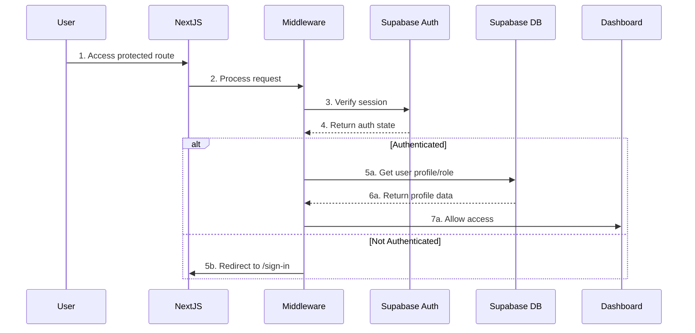

# Supabase Auth Migration Specification

## Executive Summary

This document outlines a comprehensive migration plan from Clerk to Supabase Auth for the Voosting platform. The migration will eliminate the `@clerk/nextjs/server` dependency error and provide a fully integrated authentication solution using Supabase's native auth capabilities.

## Current State Analysis

### Dependencies
- **Clerk**: `@clerk/nextjs` (v6.28.1) - Currently causing module resolution errors
- **Supabase**: `@supabase/supabase-js` (v2.43.0) - Used for database only
- **Next.js**: v15.4.x with App Router

### Current Architecture Issues
1. Module resolution error: `@clerk/nextjs/server` not found
2. Dual authentication systems (Clerk for auth, Supabase for database)
3. Complex webhook-based user synchronization
4. Additional cost for separate auth service

## Target Architecture

### Pure Supabase Architecture Benefits
1. **Single Service**: Auth + Database in one platform
2. **Native Integration**: Built-in RLS with auth.uid()
3. **Cost Efficiency**: No separate auth service billing
4. **Simplified Stack**: Fewer dependencies and webhooks
5. **Better Performance**: Direct database integration

## Architecture Design

### 1. Authentication Flow Architecture



### 2. Component Architecture

```typescript
// src/lib/supabase/client.ts
import { createClientComponentClient } from '@supabase/auth-helpers-nextjs'
import { createServerComponentClient } from '@supabase/auth-helpers-nextjs'
import { createRouteHandlerClient } from '@supabase/auth-helpers-nextjs'
import { createMiddlewareClient } from '@supabase/auth-helpers-nextjs'

// Client Components
export const createClient = () => createClientComponentClient<Database>()

// Server Components
export const createServerClient = (cookies: () => any) => 
  createServerComponentClient<Database>({ cookies })

// Route Handlers
export const createRouteClient = (cookies: () => any) => 
  createRouteHandlerClient<Database>({ cookies })

// Middleware
export const createMiddlewareSupabaseClient = (req: NextRequest, res: NextResponse) => 
  createMiddlewareClient<Database>({ req, res })
```

## Database Schema Updates

### 1. Auth Schema Enhancement

```sql
-- Enable UUID extension
CREATE EXTENSION IF NOT EXISTS "uuid-ossp";

-- Update profiles table to work with Supabase Auth
ALTER TABLE profiles 
  ALTER COLUMN id TYPE UUID USING id::uuid,
  ALTER COLUMN id SET DEFAULT auth.uid();

-- Add auth metadata columns
ALTER TABLE profiles
  ADD COLUMN IF NOT EXISTS auth_provider TEXT,
  ADD COLUMN IF NOT EXISTS last_sign_in_at TIMESTAMPTZ,
  ADD COLUMN IF NOT EXISTS email_confirmed_at TIMESTAMPTZ;

-- Create auth trigger for automatic profile creation
CREATE OR REPLACE FUNCTION public.handle_new_user()
RETURNS trigger AS $$
BEGIN
  INSERT INTO public.profiles (
    id,
    email,
    full_name,
    role,
    referral_code,
    auth_provider,
    created_at
  ) VALUES (
    new.id,
    new.email,
    COALESCE(new.raw_user_meta_data->>'full_name', ''),
    COALESCE(new.raw_user_meta_data->>'role', 'creator')::user_role,
    generate_referral_code(new.id::text),
    new.raw_app_meta_data->>'provider',
    now()
  );
  RETURN new;
END;
$$ LANGUAGE plpgsql SECURITY DEFINER;

-- Create trigger
CREATE OR REPLACE TRIGGER on_auth_user_created
  AFTER INSERT ON auth.users
  FOR EACH ROW EXECUTE PROCEDURE public.handle_new_user();
```

### 2. RLS Policy Updates

```sql
-- Enable RLS on all tables
ALTER TABLE profiles ENABLE ROW LEVEL SECURITY;
ALTER TABLE campaigns ENABLE ROW LEVEL SECURITY;
ALTER TABLE campaign_applications ENABLE ROW LEVEL SECURITY;

-- Profiles policies
CREATE POLICY "Users can view own profile" ON profiles
  FOR SELECT USING (auth.uid() = id);

CREATE POLICY "Users can update own profile" ON profiles
  FOR UPDATE USING (auth.uid() = id);

-- Admin can view all profiles
CREATE POLICY "Admins can view all profiles" ON profiles
  FOR SELECT USING (
    EXISTS (
      SELECT 1 FROM profiles 
      WHERE id = auth.uid() AND role = 'admin'
    )
  );

-- Campaign policies based on role
CREATE POLICY "Business users can manage own campaigns" ON campaigns
  FOR ALL USING (
    auth.uid() = business_id OR
    EXISTS (
      SELECT 1 FROM profiles 
      WHERE id = auth.uid() AND role = 'admin'
    )
  );

CREATE POLICY "Creators can view active campaigns" ON campaigns
  FOR SELECT USING (
    status = 'active' OR
    EXISTS (
      SELECT 1 FROM campaign_applications 
      WHERE campaign_id = campaigns.id AND creator_id = auth.uid()
    )
  );
```

## Middleware Implementation

### New Middleware Design

```typescript
// src/middleware.ts
import { createMiddlewareClient } from '@supabase/auth-helpers-nextjs'
import { NextResponse } from 'next/server'
import type { NextRequest } from 'next/server'
import type { Database } from '@/types/database.types'
import {
  getDomainType,
  rewriteUrlForDomain,
  isDomainRoleMatch,
  getDefaultRedirectPath,
} from '@/lib/middleware-utils'

// Protected routes configuration
const protectedRoutes = {
  auth: ['/dashboard', '/profile', '/settings'],
  creator: ['/creator/dashboard', '/creator/campaigns', '/creator/earnings'],
  business: ['/business/dashboard', '/business/campaigns', '/business/creators'],
  admin: ['/admin/dashboard', '/admin/users', '/admin/analytics'],
}

const publicRoutes = [
  '/',
  '/about',
  '/pricing',
  '/sign-in',
  '/sign-up',
  '/auth/callback',
  '/auth/confirm',
]

export async function middleware(req: NextRequest) {
  const res = NextResponse.next()
  const supabase = createMiddlewareClient<Database>({ req, res })
  
  const { pathname } = req.nextUrl
  const hostname = req.headers.get('host') || ''
  
  // Skip static files and API routes
  if (pathname.startsWith('/_next') || pathname.includes('.') || pathname.startsWith('/api')) {
    return res
  }
  
  try {
    // Get session
    const { data: { session } } = await supabase.auth.getSession()
    
    // Domain detection and URL rewriting
    const domainType = getDomainType(hostname)
    const rewrittenPath = rewriteUrlForDomain(pathname, domainType, req.url)
    
    // Check if route is protected
    const isProtected = !publicRoutes.some(route => pathname.startsWith(route))
    
    if (isProtected && !session) {
      // Redirect to sign-in
      const redirectUrl = new URL('/sign-in', req.url)
      redirectUrl.searchParams.set('redirect_url', rewrittenPath)
      return NextResponse.redirect(redirectUrl)
    }
    
    if (session) {
      // Get user profile for role-based access
      const { data: profile } = await supabase
        .from('profiles')
        .select('role')
        .eq('id', session.user.id)
        .single()
      
      if (profile) {
        // Check domain-role match
        if (!isDomainRoleMatch(domainType, profile.role)) {
          const correctPath = getDefaultRedirectPath(profile.role)
          return NextResponse.redirect(new URL(correctPath, req.url))
        }
        
        // Check route access
        if (!hasRouteAccess(pathname, profile.role)) {
          const dashboardUrl = getDefaultDashboard(profile.role)
          return NextResponse.redirect(new URL(dashboardUrl, req.url))
        }
      }
    }
    
    // Apply URL rewriting if needed
    if (rewrittenPath !== pathname) {
      const url = req.nextUrl.clone()
      url.pathname = rewrittenPath
      return NextResponse.rewrite(url)
    }
    
    return res
  } catch (error) {
    console.error('Middleware error:', error)
    return res
  }
}

export const config = {
  matcher: ['/((?!api|_next/static|_next/image|favicon.ico).*)'],
}
```

## Authentication Flows

### 1. Registration Flow

```typescript
// src/app/auth/sign-up/page.tsx
'use client'

import { createClient } from '@/lib/supabase/client'
import { useRouter } from 'next/navigation'
import { useState } from 'react'

export default function SignUpPage() {
  const supabase = createClient()
  const router = useRouter()
  const [loading, setLoading] = useState(false)
  
  async function handleSignUp(formData: FormData) {
    setLoading(true)
    
    const email = formData.get('email') as string
    const password = formData.get('password') as string
    const role = formData.get('role') as 'creator' | 'business'
    const referralCode = formData.get('referral_code') as string
    
    const { data, error } = await supabase.auth.signUp({
      email,
      password,
      options: {
        data: {
          role,
          referral_code: referralCode,
        },
        emailRedirectTo: `${window.location.origin}/auth/callback`,
      },
    })
    
    if (error) {
      console.error('Sign up error:', error)
      setLoading(false)
      return
    }
    
    // Redirect to confirmation page
    router.push('/auth/confirm?email=' + email)
  }
  
  return (
    <form action={handleSignUp}>
      {/* Form fields */}
    </form>
  )
}
```

### 2. Login Flow

```typescript
// src/app/auth/sign-in/page.tsx
'use client'

import { createClient } from '@/lib/supabase/client'
import { useRouter } from 'next/navigation'

export default function SignInPage() {
  const supabase = createClient()
  const router = useRouter()
  
  async function handleSignIn(formData: FormData) {
    const email = formData.get('email') as string
    const password = formData.get('password') as string
    
    const { data, error } = await supabase.auth.signInWithPassword({
      email,
      password,
    })
    
    if (error) {
      console.error('Sign in error:', error)
      return
    }
    
    // Get user profile to determine redirect
    const { data: profile } = await supabase
      .from('profiles')
      .select('role')
      .eq('id', data.user.id)
      .single()
    
    if (profile) {
      const redirectPath = getDefaultDashboard(profile.role)
      router.push(redirectPath)
    }
  }
  
  async function handleOAuthSignIn(provider: 'google' | 'kakao') {
    const { data, error } = await supabase.auth.signInWithOAuth({
      provider,
      options: {
        redirectTo: `${window.location.origin}/auth/callback`,
      },
    })
  }
  
  return (
    <div>
      <form action={handleSignIn}>
        {/* Email/Password form */}
      </form>
      
      <button onClick={() => handleOAuthSignIn('google')}>
        Sign in with Google
      </button>
      <button onClick={() => handleOAuthSignIn('kakao')}>
        Sign in with Kakao
      </button>
    </div>
  )
}
```

### 3. Session Management

```typescript
// src/lib/supabase/auth.ts
import { createServerClient } from '@/lib/supabase/server'
import { redirect } from 'next/navigation'
import { cookies } from 'next/headers'

export async function getSession() {
  const supabase = createServerClient(cookies)
  const { data: { session } } = await supabase.auth.getSession()
  return session
}

export async function getCurrentUser() {
  const session = await getSession()
  return session?.user ?? null
}

export async function getCurrentProfile() {
  const supabase = createServerClient(cookies)
  const user = await getCurrentUser()
  
  if (!user) return null
  
  const { data: profile } = await supabase
    .from('profiles')
    .select('*')
    .eq('id', user.id)
    .single()
  
  return profile
}

export async function requireAuth(redirectTo?: string) {
  const session = await getSession()
  
  if (!session) {
    const redirectUrl = redirectTo ? `?redirect_url=${encodeURIComponent(redirectTo)}` : ''
    redirect(`/sign-in${redirectUrl}`)
  }
  
  return session
}

export async function requireRole(requiredRole: UserRole | UserRole[], redirectTo?: string) {
  const profile = await getCurrentProfile()
  
  if (!profile) {
    const redirectUrl = redirectTo ? `?redirect_url=${encodeURIComponent(redirectTo)}` : ''
    redirect(`/sign-in${redirectUrl}`)
  }
  
  const allowedRoles = Array.isArray(requiredRole) ? requiredRole : [requiredRole]
  
  if (!allowedRoles.includes(profile.role)) {
    redirect('/unauthorized')
  }
  
  return profile
}
```

## Migration Execution Plan

### Phase 1: Preparation (Day 1-2)
1. **Backup Current System**
   - Export all user data from Clerk
   - Backup current database state
   - Document all active user sessions

2. **Setup Supabase Auth**
   - Enable authentication in Supabase dashboard
   - Configure OAuth providers (Google, Kakao)
   - Set up email templates

3. **Install Dependencies**
   ```bash
   npm install @supabase/auth-helpers-nextjs
   npm uninstall @clerk/nextjs svix
   ```

### Phase 2: Database Migration (Day 3-4)
1. **Run Schema Updates**
   - Execute auth schema SQL scripts
   - Create auth triggers and functions
   - Update RLS policies

2. **Migrate User Data**
   ```sql
   -- Script to migrate existing users to auth.users
   INSERT INTO auth.users (
     id, email, created_at, updated_at
   ) SELECT 
     id::uuid, email, created_at, updated_at
   FROM profiles
   ON CONFLICT (id) DO NOTHING;
   ```

### Phase 3: Code Migration (Day 5-7)
1. **Update Authentication Code**
   - Replace Clerk imports with Supabase
   - Update middleware implementation
   - Convert auth components

2. **Update API Routes**
   - Remove Clerk webhook handlers
   - Update protected API routes
   - Add Supabase auth helpers

3. **Update Client Components**
   - Replace ClerkProvider with SupabaseProvider
   - Update auth hooks and utilities
   - Convert sign-in/sign-up pages

### Phase 4: Testing (Day 8-9)
1. **Unit Tests**
   - Update auth-related tests
   - Test middleware functions
   - Verify RLS policies

2. **E2E Tests**
   - Test registration flows
   - Test login/logout
   - Test role-based access

3. **Load Testing**
   - Verify performance
   - Test concurrent sessions
   - Monitor database queries

### Phase 5: Deployment (Day 10)
1. **Staging Deployment**
   - Deploy to staging environment
   - Run smoke tests
   - Monitor for errors

2. **Production Deployment**
   - Schedule maintenance window
   - Deploy with feature flags
   - Monitor closely

3. **Post-Deployment**
   - Monitor error rates
   - Track user feedback
   - Be ready to rollback

## Rollback Strategy

### Immediate Rollback (< 1 hour)
1. **Code Rollback**
   ```bash
   git revert --no-commit HEAD~5..HEAD
   git commit -m "Revert: Supabase Auth migration"
   git push origin main --force-with-lease
   ```

2. **Re-enable Clerk**
   - Restore Clerk environment variables
   - Redeploy previous version
   - Verify functionality

### Gradual Rollback (> 1 hour)
1. **Dual Auth Mode**
   - Keep both auth systems active
   - Route users based on registration date
   - Gradually migrate back

2. **Data Preservation**
   - Export Supabase auth data
   - Re-import to Clerk
   - Maintain user sessions

## Security Considerations

### 1. Session Security
- JWT tokens stored in httpOnly cookies
- 7-day session expiry (configurable)
- Secure flag enabled in production
- SameSite=Lax for CSRF protection

### 2. Password Policy
```typescript
const passwordPolicy = {
  minLength: 8,
  requireUppercase: true,
  requireLowercase: true,
  requireNumbers: true,
  requireSpecialChars: true,
}
```

### 3. Rate Limiting
```typescript
// src/lib/supabase/rate-limit.ts
const authRateLimits = {
  signIn: { attempts: 5, window: '15m' },
  signUp: { attempts: 3, window: '1h' },
  passwordReset: { attempts: 3, window: '1h' },
}
```

## Performance Optimization

### 1. Edge Function Authentication
```typescript
// Use edge runtime for auth checks
export const runtime = 'edge'

export async function GET(request: Request) {
  const supabase = createClient()
  const { data: { session } } = await supabase.auth.getSession()
  
  if (!session) {
    return new Response('Unauthorized', { status: 401 })
  }
  
  // Process request
}
```

### 2. Session Caching
```typescript
// Cache session data in middleware
const sessionCache = new Map<string, Session>()

export async function getCachedSession(sessionId: string) {
  if (sessionCache.has(sessionId)) {
    return sessionCache.get(sessionId)
  }
  
  const session = await supabase.auth.getSession()
  sessionCache.set(sessionId, session)
  
  // Clear cache after 5 minutes
  setTimeout(() => sessionCache.delete(sessionId), 5 * 60 * 1000)
  
  return session
}
```

## Monitoring and Observability

### 1. Auth Metrics
- Track sign-up/sign-in rates
- Monitor failed authentication attempts
- Measure session duration
- Track OAuth provider usage

### 2. Error Tracking
```typescript
// src/lib/monitoring/auth-errors.ts
export function trackAuthError(error: AuthError) {
  console.error('Auth error:', {
    code: error.code,
    message: error.message,
    timestamp: new Date().toISOString(),
    userId: error.userId,
  })
  
  // Send to monitoring service
}
```

### 3. Audit Logging
```sql
-- Create auth audit table
CREATE TABLE auth_audit_log (
  id UUID PRIMARY KEY DEFAULT uuid_generate_v4(),
  user_id UUID REFERENCES auth.users(id),
  action TEXT NOT NULL,
  ip_address INET,
  user_agent TEXT,
  created_at TIMESTAMPTZ DEFAULT NOW()
);

-- Index for efficient queries
CREATE INDEX idx_auth_audit_user_id ON auth_audit_log(user_id);
CREATE INDEX idx_auth_audit_created_at ON auth_audit_log(created_at);
```

## Success Criteria

1. **Zero Authentication Errors**: No module resolution errors
2. **Seamless User Experience**: No disruption to existing users
3. **Performance Improvement**: <100ms auth checks
4. **Cost Reduction**: Eliminate Clerk subscription costs
5. **Simplified Architecture**: Single service for auth + database

## Conclusion

This migration plan provides a comprehensive path from Clerk to Supabase Auth, addressing all technical requirements while maintaining security and performance standards. The phased approach ensures minimal risk and allows for rollback at any stage if needed.