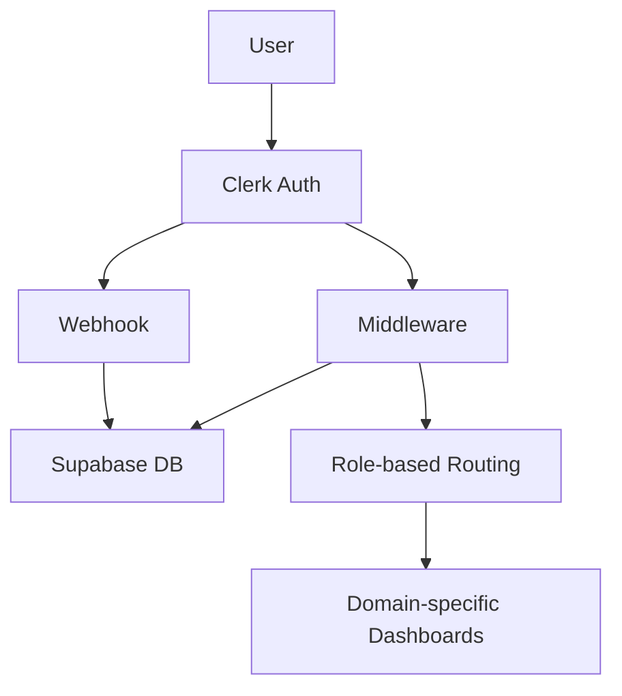
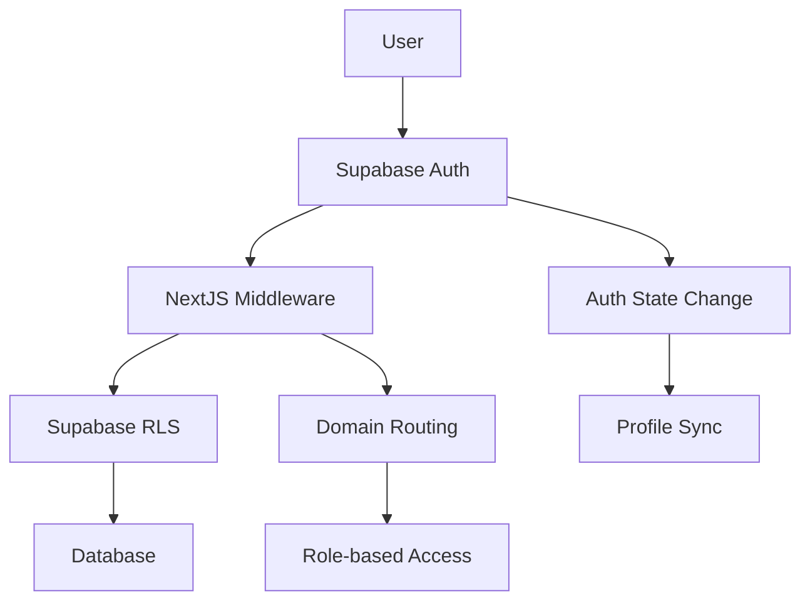

# Supabase Auth 마이그레이션 가이드

## 개요

현재 Voosting 프로젝트는 **Clerk + Supabase** 하이브리드 아키텍처를 사용하고 있습니다. 이 문서는 Pure Supabase Auth로의 완전 전환을 위한 포괄적인 가이드입니다.

## 현재 Clerk 구현 분석

### 1. 현재 아키텍처 상태



**핵심 컴포넌트**:
- **src/lib/clerk.ts** (206줄) - 인증 유틸리티 함수 모음
- **src/middleware.ts** (313줄) - 멀티도메인 인증 라우팅
- **src/app/api/webhooks/clerk/route.ts** (184줄) - 사용자 동기화
- **src/lib/supabase/client.ts** (339줄) - 클라이언트 사이드 Supabase
- **src/lib/supabase/server.ts** (282줄) - 서버 사이드 Supabase

### 2. Clerk 의존성 분석

#### 2.1 인증 관련 함수 (src/lib/clerk.ts)

```typescript
// 현재 Clerk 기반 함수들
- getCurrentUser() -> currentUser() from '@clerk/nextjs/server'
- getCurrentProfile() -> Clerk user ID 기반 Supabase 조회
- requireAuth() -> auth() from '@clerk/nextjs/server'
- requireRole() -> Clerk + Supabase 하이브리드
- upsertUserProfile() -> Admin client 사용
```

#### 2.2 미들웨어 의존성 (src/middleware.ts)

```typescript
// Clerk 미들웨어 의존성
- clerkMiddleware() from '@clerk/nextjs/server'
- createRouteMatcher() from '@clerk/nextjs/server'
- auth() 함수를 통한 userId 획득 (Lines 176, 236)
```

#### 2.3 웹훅 시스템 (src/app/api/webhooks/clerk/route.ts)

```typescript
// Clerk 웹훅 의존성
- WebhookEvent from '@clerk/nextjs/server'
- Svix 웹훅 검증 시스템
- user.created/updated/deleted 이벤트 처리
```

### 3. 멀티도메인 라우팅 시스템

현재 구현된 도메인별 라우팅:
- **Main Domain**: voosting.app (공개 페이지)
- **Creator Domain**: creator.voosting.app (크리에이터 대시보드)
- **Business Domain**: business.voosting.app (비즈니스 대시보드)
- **Admin Domain**: admin.voosting.app (관리자 대시보드)

### 4. 3단계 추천 시스템 연동

```typescript
// 현재 추천 시스템 구조
referrer_l1_id: string; // 직접 추천인 (10% 커미션)
referrer_l2_id: string; // 2단계 추천인 (5% 커미션)
referrer_l3_id: string; // 3단계 추천인 (2% 커미션)
```

## Pure Supabase Auth 아키텍처 설계

### 1. 새로운 아키텍처 개념



### 2. 핵심 변경 사항

#### 2.1 인증 플로우 변경

```typescript
// Before (Clerk)
const { userId } = await auth();
const user = await currentUser();

// After (Supabase)
const { data: { user } } = await supabase.auth.getUser();
const { data: { session } } = await supabase.auth.getSession();
```

#### 2.2 세션 관리 변경

```typescript
// Before (Clerk 자동 관리)
// 쿠키 기반 세션, 자동 갱신

// After (Supabase 수동 관리)
// JWT 토큰 기반, 수동 갱신 필요
supabase.auth.onAuthStateChange((event, session) => {
  // 세션 상태 변경 처리
});
```

#### 2.3 RLS 정책 활용

```sql
-- Clerk User ID 기반 RLS에서 Supabase Auth UID 기반으로 변경
-- Before
CREATE POLICY "Users can access own profile" ON profiles
  FOR ALL USING (id = current_setting('request.jwt.claim.user_id')::text);

-- After  
CREATE POLICY "Users can access own profile" ON profiles
  FOR ALL USING (id = auth.uid()::text);
```

### 3. 새로운 파일 구조

```
src/lib/
├── auth/                    # 새로운 인증 모듈
│   ├── client.ts           # 클라이언트 사이드 인증
│   ├── server.ts           # 서버 사이드 인증
│   ├── middleware.ts       # 미들웨어 인증 유틸
│   ├── providers.tsx       # 인증 프로바이더
│   └── types.ts           # 인증 관련 타입
├── supabase/
│   ├── client.ts          # 기존 클라이언트 (업데이트)
│   ├── server.ts          # 기존 서버 (업데이트)
│   └── admin.ts           # 관리자 클라이언트
└── utils/
    ├── profile.ts         # 프로필 관리 유틸
    └── referral.ts        # 추천 시스템 유틸
```

## 3단계 마이그레이션 전략

### Phase 1: 기반 구축 (2-3일)

#### 1.1 Supabase Auth 설정

```bash
# 1. Supabase Auth 설정 확인
npx supabase status

# 2. Auth 설정 업데이트
# Dashboard > Authentication > Settings
# - Enable email confirmation
# - Configure OAuth providers
# - Set redirect URLs
```

#### 1.2 환경 변수 업데이트

```bash
# .env.local에 추가
NEXT_PUBLIC_SUPABASE_URL=your-project-url
NEXT_PUBLIC_SUPABASE_ANON_KEY=your-anon-key
SUPABASE_SERVICE_ROLE_KEY=your-service-role-key

# Clerk 변수는 일시적으로 유지 (마이그레이션 완료 후 제거)
```

#### 1.3 새로운 인증 모듈 구현

**src/lib/auth/client.ts**:
```typescript
import { createBrowserClient } from '@supabase/ssr'

export function createAuthClient() {
  return createBrowserClient(
    process.env.NEXT_PUBLIC_SUPABASE_URL!,
    process.env.NEXT_PUBLIC_SUPABASE_ANON_KEY!
  )
}

export async function signUpWithEmail(email: string, password: string, metadata?: any) {
  const supabase = createAuthClient()
  
  return await supabase.auth.signUp({
    email,
    password,
    options: {
      data: metadata
    }
  })
}

export async function signInWithEmail(email: string, password: string) {
  const supabase = createAuthClient()
  
  return await supabase.auth.signInWithPassword({
    email,
    password
  })
}

export async function signOut() {
  const supabase = createAuthClient()
  return await supabase.auth.signOut()
}
```

#### 1.4 RLS 정책 업데이트

```sql
-- 기존 Clerk User ID 기반 정책 제거
DROP POLICY IF EXISTS "Users can access own profile" ON profiles;

-- 새로운 Supabase Auth 기반 정책 생성
CREATE POLICY "Users can access own data" ON profiles
  FOR ALL USING (auth.uid()::text = id);

-- 추천 시스템을 위한 정책
CREATE POLICY "Users can view referrer data" ON profiles
  FOR SELECT USING (
    auth.uid()::text = id OR
    auth.uid()::text = referrer_l1_id OR
    auth.uid()::text = referrer_l2_id OR
    auth.uid()::text = referrer_l3_id
  );
```

### Phase 2: 핵심 기능 마이그레이션 (3-4일)

#### 2.1 미들웨어 교체

**새로운 src/middleware.ts**:
```typescript
import { createServerClient } from '@supabase/ssr'
import { NextResponse } from 'next/server'
import type { NextRequest } from 'next/server'

export async function middleware(request: NextRequest) {
  let response = NextResponse.next({
    request: {
      headers: request.headers,
    },
  })

  const supabase = createServerClient(
    process.env.NEXT_PUBLIC_SUPABASE_URL!,
    process.env.NEXT_PUBLIC_SUPABASE_ANON_KEY!,
    {
      cookies: {
        get(name: string) {
          return request.cookies.get(name)?.value
        },
        set(name: string, value: string, options: any) {
          request.cookies.set({
            name,
            value,
            ...options,
          })
          response = NextResponse.next({
            request: {
              headers: request.headers,
            },
          })
          response.cookies.set({
            name,
            value,
            ...options,
          })
        },
        remove(name: string, options: any) {
          request.cookies.set({
            name,
            value: '',
            ...options,
          })
          response = NextResponse.next({
            request: {
              headers: request.headers,
            },
          })
          response.cookies.set({
            name,
            value: '',
            ...options,
          })
        },
      },
    }
  )

  // 사용자 인증 확인
  const {
    data: { user },
  } = await supabase.auth.getUser()

  // 도메인 및 경로 기반 라우팅 로직 (기존 유지)
  const hostname = request.headers.get('host') || ''
  const { pathname } = request.nextUrl
  
  // ... 기존 도메인 라우팅 로직 적용

  return response
}
```

#### 2.2 인증 상태 관리 컴포넌트

**src/lib/auth/providers.tsx**:
```typescript
'use client'

import { createContext, useContext, useEffect, useState } from 'react'
import { createAuthClient } from './client'
import type { User, Session } from '@supabase/supabase-js'

interface AuthContextType {
  user: User | null
  session: Session | null
  loading: boolean
  signOut: () => Promise<void>
}

const AuthContext = createContext<AuthContextType | undefined>(undefined)

export function AuthProvider({ children }: { children: React.ReactNode }) {
  const [user, setUser] = useState<User | null>(null)
  const [session, setSession] = useState<Session | null>(null)
  const [loading, setLoading] = useState(true)
  
  const supabase = createAuthClient()

  useEffect(() => {
    // 초기 세션 확인
    supabase.auth.getSession().then(({ data: { session } }) => {
      setSession(session)
      setUser(session?.user ?? null)
      setLoading(false)
    })

    // 인증 상태 변경 리스너
    const {
      data: { subscription },
    } = supabase.auth.onAuthStateChange(async (event, session) => {
      setSession(session)
      setUser(session?.user ?? null)
      setLoading(false)

      // 프로필 동기화 (필요시)
      if (event === 'SIGNED_IN' && session?.user) {
        await syncUserProfile(session.user)
      }
    })

    return () => subscription.unsubscribe()
  }, [])

  const signOut = async () => {
    await supabase.auth.signOut()
  }

  return (
    <AuthContext.Provider value={{ user, session, loading, signOut }}>
      {children}
    </AuthContext.Provider>
  )
}

export const useAuth = () => {
  const context = useContext(AuthContext)
  if (context === undefined) {
    throw new Error('useAuth must be used within an AuthProvider')
  }
  return context
}

async function syncUserProfile(user: User) {
  // 프로필 동기화 로직
  const supabase = createAuthClient()
  
  const { data: existingProfile } = await supabase
    .from('profiles')
    .select()
    .eq('id', user.id)
    .single()

  if (!existingProfile) {
    await supabase.from('profiles').insert({
      id: user.id,
      email: user.email!,
      full_name: user.user_metadata?.full_name,
      role: user.user_metadata?.role || 'creator',
      referral_code: generateReferralCode(user.id),
    })
  }
}
```

#### 2.3 로그인/회원가입 페이지 교체

**src/app/auth/sign-in/page.tsx**:
```typescript
'use client'

import { useState } from 'react'
import { useRouter } from 'next/navigation'
import { signInWithEmail } from '@/lib/auth/client'

export default function SignInPage() {
  const [email, setEmail] = useState('')
  const [password, setPassword] = useState('')
  const [loading, setLoading] = useState(false)
  const [error, setError] = useState('')
  
  const router = useRouter()

  const handleSubmit = async (e: React.FormEvent) => {
    e.preventDefault()
    setLoading(true)
    setError('')
    
    try {
      const { data, error } = await signInWithEmail(email, password)
      
      if (error) {
        setError(error.message)
        return
      }
      
      // 역할에 따른 리다이렉트
      const userRole = data.user?.user_metadata?.role || 'creator'
      const redirectUrl = getRedirectUrl(userRole)
      router.push(redirectUrl)
      
    } catch (err) {
      setError('로그인 중 오류가 발생했습니다.')
    } finally {
      setLoading(false)
    }
  }

  return (
    // UI 구현
  )
}
```

### Phase 3: 최종 정리 및 검증 (1-2일)

#### 3.1 Clerk 의존성 제거

```bash
# 1. Clerk 패키지 제거
npm uninstall @clerk/nextjs svix

# 2. 환경 변수 정리
# CLERK_* 변수 모두 제거

# 3. 파일 삭제
rm -rf src/app/api/webhooks/clerk/
rm src/lib/clerk.ts
```

#### 3.2 테스트 및 검증

```bash
# 1. 유닛 테스트 실행
npm run test

# 2. E2E 테스트 실행  
npm run test:e2e

# 3. 빌드 테스트
npm run build
```

#### 3.3 배포 준비

```bash
# 1. 환경 변수 설정 확인
# 2. Supabase 프로덕션 설정 확인
# 3. 도메인 설정 확인
# 4. SSL 인증서 설정 확인
```

## 코드 변경 가이드

### 1. 인증 함수 매핑

| Clerk 함수 | Supabase 대체 | 변경 사항 |
|-----------|--------------|-----------|
| `currentUser()` | `supabase.auth.getUser()` | 반환 구조 변경 |
| `auth()` | `supabase.auth.getSession()` | 세션 기반으로 변경 |
| `requireAuth()` | `getUser() + redirect` | 에러 처리 변경 |
| `clerkMiddleware()` | `createServerClient()` | 미들웨어 패턴 변경 |

### 2. 타입 변경

```typescript
// Before (Clerk)
import type { User } from '@clerk/nextjs/server'

// After (Supabase)
import type { User } from '@supabase/supabase-js'
```

### 3. 에러 처리 변경

```typescript
// Before (Clerk)
if (!userId) {
  redirect('/sign-in')
}

// After (Supabase)
const { data: { user }, error } = await supabase.auth.getUser()
if (error || !user) {
  redirect('/auth/sign-in')
}
```

## 멀티도메인 라우팅 유지 방법

### 1. 미들웨어 패턴 유지

기존의 도메인 감지 로직은 그대로 유지하고, 인증 부분만 Supabase로 교체:

```typescript
// 기존과 동일한 도메인 라우팅 로직
const domain = getDomainFromHost(hostname)
const domainType = getDomainType(domain)

// Supabase 인증으로 교체
const { data: { user } } = await supabase.auth.getUser()

if (user) {
  // 기존 역할 기반 라우팅 로직 유지
  const { data: profile } = await supabase
    .from('profiles')
    .select('role')
    .eq('id', user.id)
    .single()

  if (profile && !isDomainRoleMatch(domainType, profile.role)) {
    const correctPath = getDefaultRedirectPath(profile.role)
    return NextResponse.redirect(new URL(correctPath, request.url))
  }
}
```

### 2. 도메인별 인증 상태 관리

각 도메인별로 독립적인 인증 상태를 유지하면서도 통합된 세션 관리:

```typescript
// 도메인별 인증 체크
export function useDomainAuth(requiredRole?: UserRole) {
  const { user, session } = useAuth()
  const [profile, setProfile] = useState<Profile | null>(null)
  
  useEffect(() => {
    if (user) {
      // 프로필 정보 로드 및 도메인 매칭 확인
      loadProfileAndValidateDomain(user.id, requiredRole)
    }
  }, [user, requiredRole])

  return { user, session, profile }
}
```

## 3단계 추천 시스템 연동 방법

### 1. 회원가입 시 추천 코드 처리

```typescript
export async function signUpWithReferral(
  email: string,
  password: string,
  referralCode?: string,
  role: UserRole = 'creator'
) {
  const supabase = createAuthClient()
  
  // 1. Supabase Auth에 사용자 생성
  const { data, error } = await supabase.auth.signUp({
    email,
    password,
    options: {
      data: {
        role,
        referral_code: referralCode
      }
    }
  })
  
  if (error) return { data: null, error }
  
  // 2. 프로필 생성 시 추천 관계 설정
  if (data.user) {
    await createProfileWithReferral(data.user.id, email, role, referralCode)
  }
  
  return { data, error: null }
}

async function createProfileWithReferral(
  userId: string,
  email: string,
  role: UserRole,
  referralCode?: string
) {
  const supabase = createAuthClient()
  
  // 기존 추천 시스템 로직 재사용
  let referralData = {}
  if (referralCode) {
    const result = await setReferralRelationship(userId, referralCode)
    if (result.success) {
      referralData = result.data || {}
    }
  }
  
  return await supabase.from('profiles').insert({
    id: userId,
    email,
    role,
    referral_code: generateReferralCode(userId),
    ...referralData
  })
}
```

### 2. Database Function 활용

Supabase의 Database Function을 활용하여 추천 관계 설정을 자동화:

```sql
-- 기존 함수 업데이트 (Clerk User ID -> Supabase Auth UID)
CREATE OR REPLACE FUNCTION create_profile_with_referral(
  p_user_id UUID,
  p_email TEXT,
  p_full_name TEXT DEFAULT NULL,
  p_role user_role DEFAULT 'creator',
  p_referral_code TEXT DEFAULT NULL
) RETURNS JSON AS $$
DECLARE
  referrer_data RECORD;
  result JSON;
BEGIN
  -- 추천 코드가 있으면 추천 관계 설정
  IF p_referral_code IS NOT NULL THEN
    SELECT id, referrer_l1_id, referrer_l2_id
    INTO referrer_data
    FROM profiles
    WHERE referral_code = p_referral_code;
    
    IF FOUND THEN
      INSERT INTO profiles (
        id, email, full_name, role, referral_code,
        referrer_l1_id, referrer_l2_id, referrer_l3_id
      ) VALUES (
        p_user_id, p_email, p_full_name, p_role, 
        generate_referral_code(p_user_id::TEXT),
        referrer_data.id,
        referrer_data.referrer_l1_id,
        referrer_data.referrer_l2_id
      );
    ELSE
      -- 잘못된 추천 코드
      RETURN '{"success": false, "error": "Invalid referral code"}'::JSON;
    END IF;
  ELSE
    -- 추천 코드 없이 프로필 생성
    INSERT INTO profiles (id, email, full_name, role, referral_code)
    VALUES (p_user_id, p_email, p_full_name, p_role, generate_referral_code(p_user_id::TEXT));
  END IF;
  
  RETURN '{"success": true}'::JSON;
END;
$$ LANGUAGE plpgsql;
```

## 성능 최적화 고려사항

### 1. 세션 캐싱

```typescript
// 세션 정보 캐싱으로 불필요한 API 호출 방지
const sessionCache = new Map<string, { session: Session; timestamp: number }>()

export async function getCachedSession() {
  const cacheKey = 'current_session'
  const cached = sessionCache.get(cacheKey)
  
  if (cached && Date.now() - cached.timestamp < 60000) { // 1분 캐시
    return cached.session
  }
  
  const { data: { session } } = await supabase.auth.getSession()
  
  if (session) {
    sessionCache.set(cacheKey, { session, timestamp: Date.now() })
  }
  
  return session
}
```

### 2. 데이터베이스 연결 최적화

```typescript
// 연결 풀링 최적화
export function createOptimizedServerClient() {
  return createServerClient(
    process.env.NEXT_PUBLIC_SUPABASE_URL!,
    process.env.NEXT_PUBLIC_SUPABASE_ANON_KEY!,
    {
      db: {
        schema: 'public',
      },
      auth: {
        persistSession: true,
        detectSessionInUrl: true,
      },
      global: {
        headers: {
          'x-application-name': 'voosting-nextjs',
        },
      },
    }
  )
}
```

## 보안 고려사항

### 1. RLS 정책 강화

```sql
-- 민감한 데이터에 대한 추가 보안 정책
CREATE POLICY "Restrict sensitive profile data" ON profiles
  FOR SELECT USING (
    CASE 
      WHEN auth.uid()::text = id THEN true
      ELSE false
    END
  );

-- 관리자 전용 데이터 접근 제한
CREATE POLICY "Admin only access" ON admin_logs
  FOR ALL USING (
    EXISTS (
      SELECT 1 FROM profiles 
      WHERE id = auth.uid()::text 
      AND role = 'admin'
    )
  );
```

### 2. API 엔드포인트 보안

```typescript
// API 라우트에서 인증 체크 강화
export async function withAuth(handler: (req: Request, user: User) => Promise<Response>) {
  return async (req: Request) => {
    const supabase = createServerClient()
    
    const { data: { user }, error } = await supabase.auth.getUser()
    
    if (error || !user) {
      return new Response('Unauthorized', { status: 401 })
    }
    
    return handler(req, user)
  }
}
```

## 마이그레이션 후 검증 체크리스트

### 1. 기능적 검증
- [ ] 이메일 로그인/로그아웃 정상 동작
- [ ] OAuth 로그인 정상 동작  
- [ ] 회원가입 시 프로필 생성 확인
- [ ] 추천 코드 시스템 정상 동작
- [ ] 도메인별 라우팅 정상 동작
- [ ] 역할별 접근 권한 정상 동작

### 2. 성능 검증
- [ ] 미들웨어 응답 시간 < 500ms
- [ ] 초기 로그인 시간 < 2초
- [ ] 세션 갱신 시간 < 1초
- [ ] 데이터베이스 쿼리 최적화 확인

### 3. 보안 검증
- [ ] RLS 정책 정상 동작 확인
- [ ] 무단 접근 차단 확인
- [ ] 세션 만료 처리 확인
- [ ] CSRF 보호 확인

### 4. 호환성 검증
- [ ] 기존 사용자 데이터 마이그레이션 확인
- [ ] 추천 관계 데이터 무결성 확인
- [ ] 캠페인 데이터 연결 확인
- [ ] 수익 데이터 연결 확인

## 롤백 계획

마이그레이션 실패 시를 대비한 롤백 계획:

### 1. 코드 롤백
```bash
# Git을 통한 코드 롤백
git checkout [마이그레이션 이전 커밋]
npm install  # 이전 의존성 복원
```

### 2. 데이터베이스 롤백
```sql
-- RLS 정책 롤백
DROP POLICY IF EXISTS "Users can access own data" ON profiles;
CREATE POLICY "Users can access own profile" ON profiles
  FOR ALL USING (id = current_setting('request.jwt.claim.user_id')::text);
```

### 3. 환경 변수 롤백
```bash
# .env.local 롤백
# Clerk 환경 변수 복원
NEXT_PUBLIC_CLERK_PUBLISHABLE_KEY=...
CLERK_SECRET_KEY=...
CLERK_WEBHOOK_SECRET=...
```

이 마이그레이션 가이드를 통해 안전하고 체계적으로 Pure Supabase Auth로 전환할 수 있습니다. 각 단계별로 충분한 테스트를 거쳐 진행하시기 바랍니다.