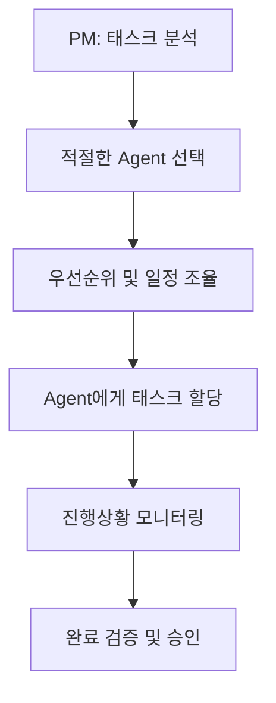

# TASK.MD

# 📝 캐쉬업 (CashUp) 개발 태스크

**🎯 MVP 우선 개발 전략 기반 - 221개 태스크 재분류 완료**

> ⚠️ **중요**: 이 문서의 모든 태스크는 3단계 MVP 전략에 따라 우선순위가 재분류되었습니다. 개발팀은 [태스크 우선순위 재분류 문서](./mvp/TASK-PRIORITY-RECLASSIFICATION.md)를 참고하여 Core MVP부터 순차적으로 개발하시기 바랍니다.

## 📊 현재 개발 진행상황 (2024년 12월 기준)

### 🎯 전체 진행률
- **총 태스크**: 221개
- **완료된 태스크**: 10개 (4.5%)
- **현재 진행 중**: TASK-010 (사용자 프로필 및 역할 시스템)

### ✅ 완료된 주요 태스크
- **TASK-001**: Next.js 15 프로젝트 생성 ✅
- **TASK-002**: 기본 디렉토리 구조 생성 ✅
- **TASK-003**: ESLint, Prettier 설정 ✅
- **TASK-004**: Tailwind CSS v4 설정 ✅
- **TASK-005**: Shadcn/ui 설치 및 설정 ✅
- **TASK-006**: Supabase Auth 프로젝트 생성 및 설정 ✅
- **TASK-007**: Supabase Auth 미들웨어 구현 ✅
- **TASK-009**: 기본 로그인/회원가입 페이지 구현 ✅
- **TASK-011**: Supabase 프로젝트 생성 ✅
- **TASK-012**: 환경 변수 설정 ✅
- **TASK-015**: 미들웨어 도메인 라우팅 구현 ✅
- **TASK-173**: Vitest 전환 검토 및 구현 ✅

### 🔄 다음 우선순위
1. **TASK-010**: 사용자 프로필 및 역할 시스템 설정 (진행 중)
2. **TASK-013**: Supabase 클라이언트 설정
3. **TASK-014**: Supabase Auth 데이터베이스 스키마 설정
4. **TASK-008**: 카카오 OAuth 연동 설정 (보류 중)

---

## 🎯 MVP 개발 우선순위

### 즉시 시작 (Priority 1) - Core MVP
- **개발 기간**: Week 1-8 (8주)
- **포함 태스크**: 89개 (40.3%)
- **목표**: 핵심 비즈니스 모델 검증

### 2차 개발 (Priority 2) - Enhanced MVP  
- **개발 기간**: Week 9-12 (4주)
- **포함 태스크**: 78개 (35.3%)
- **목표**: 차별화 기능 구현

### 3차 개발 (Priority 3) - Full Product
- **개발 기간**: Week 13-16 (4주)  
- **포함 태스크**: 54개 (24.4%)
- **목표**: 완성도 높은 제품

## 📚 관련 MVP 문서
- [MVP 로드맵](./mvp/MVP-ROADMAP.md)
- [Core MVP 상세 계획](./mvp/CORE-MVP.md)
- [Enhanced MVP 계획](./mvp/ENHANCED-MVP.md)
- [221개 태스크 우선순위 재분류](./mvp/TASK-PRIORITY-RECLASSIFICATION.md)

---

## 📖 목차
- [MVP 개발 우선순위](#mvp-개발-우선순위) ⬆️
- [태스크 관리 가이드](#태스크-관리-가이드)
- [팀 구성 및 역할](#팀-구성-및-역할)
- [Phase 1: 기반 구축](#phase-1-기반-구축-week-1-2) **← Core MVP 시작**
- [Phase 2: 사용자 관리](#phase-2-사용자-관리-week-3-4)
- [Phase 3: 데이터 모델](#phase-3-데이터-모델-week-5-7)
- [Phase 4: 핵심 기능](#phase-4-핵심-기능-week-8-11)
- [Phase 5: 추천 시스템 및 결제](#phase-5-추천-시스템-및-결제-week-12-14) **← Enhanced MVP 시작**
- [Phase 6: 보안 및 모니터링](#phase-6-보안-및-모니터링-week-15) **← Full Product 시작**
- [Phase 7: 최적화 및 배포](#phase-7-최적화-및-배포-week-16)

---

## 📋 태스크 관리 가이드

### 태스크 상태 (Status)
| 상태 | 아이콘 | 설명 |
|------|--------|------|
| **TODO** | ⭕ | 작업 시작 전 |
| **IN_PROGRESS** | 🟡 | 작업 진행 중 |
| **REVIEW** | 🔍 | 코드 리뷰 필요 |
| **TESTING** | 🧪 | 테스트 진행 중 |
| **DONE** | ✅ | 작업 완료 |
| **BLOCKED** | 🚫 | 블로커 발생 |

### 우선순위 (Priority)
| 레벨 | 아이콘 | 설명 | SLA |
|------|--------|------|-----|
| **P0** | 🔴 | 블로커 (즉시 처리) | 즉시 |
| **P1** | 🟠 | 긴급 (이번 주 내) | 1주일 |
| **P2** | 🟡 | 중요 (다음 주 내) | 2주일 |
| **P3** | 🟢 | 일반 (계획된 일정) | 1개월 |

### 태스크 크기 추정 (Story Points)
| 크기 | 시간 | 복잡도 | 예시 |
|------|------|--------|------|
| **XS** | 1-2시간 | 매우 낮음 | 버튼 스타일 수정 |
| **S** | 4-6시간 | 낮음 | 간단한 폼 컴포넌트 |
| **M** | 1일 | 보통 | CRUD API 구현 |
| **L** | 2-3일 | 높음 | 복잡한 UI 컴포넌트 |
| **XL** | 1주일 | 매우 높음 | 전체 인증 시스템 |

### 태스크 템플릿
```markdown
## TASK-XXX: [태스크 제목]

**우선순위**: P1 🟠  
**크기**: M (1일)  
**담당자**: @developer  
**관련 이슈**: #123  

### 📝 설명
[태스크에 대한 상세 설명]

### ✅ 완료 기준
- [ ] 기준 1
- [ ] 기준 2
- [ ] 테스트 작성 및 통과

### 🔗 관련 링크
- [디자인 파일]()
- [참고 문서]()
```

---

## 👥 팀 구성 및 역할

### 🎯 Agent 기반 역할 분담

본 프로젝트는 각 분야별 30년 경험의 전문 Agent들로 구성된 팀으로 진행됩니다.

#### 🔴 Project Manager (PM)
**Agent**: `project-manager-30yr`  
**주요 역할**:
- 전체 프로젝트 일정 관리 및 조율
- 팀 간 커뮤니케이션 및 의존성 관리
- 진행상황 추적 및 리포팅
- 블로커 해결 및 우선순위 조정
- 세션 연속성 관리 및 문서화
- 요구사항 구현 감독

**담당 업무**:
- 프로젝트 킥오프 및 계획 수립
- 일일/주간 진행상황 리뷰
- 리스크 관리 및 이슈 해결
- 품질 게이트 관리

#### 🔵 Senior Lead Developer
**Agent**: `senior-lead-developer`  
**주요 역할**:
- 시스템 아키텍처 설계 및 의사결정
- 복잡한 백엔드 로직 구현
- 기술 리더십 및 코드 품질 관리
- 인프라 및 DevOps 관리

**담당 업무**:
- Next.js 프로젝트 구조 설계
- Supabase 데이터베이스 스키마 설계
- Clerk 인증 시스템 통합
- API 설계 및 구현
- 성능 최적화 및 보안 강화

#### 🟡 Senior Frontend Developer
**Agent**: `senior-frontend-developer`  
**주요 역할**:
- 사용자 인터페이스 구현
- React/Next.js 컴포넌트 개발
- 상태 관리 및 성능 최적화
- 반응형 디자인 구현

**담당 업무**:
- UI 컴포넌트 라이브러리 구축
- 페이지 및 레이아웃 구현
- 블록 에디터 개발
- 대시보드 및 관리 패널 구현
- 접근성 및 사용성 최적화

#### 🟠 Senior Web Designer
**Agent**: `senior-web-designer`  
**주요 역할**:
- UI/UX 디자인 시스템 구축
- 시각적 컴포넌트 디자인
- 사용자 경험 최적화
- 브랜딩 및 스타일 가이드 수립

**담당 업무**:
- 디자인 시스템 구축
- 컴포넌트 시각적 디자인
- 사용자 워크플로우 최적화
- 브랜드 아이덴티티 적용
- 모바일 반응형 디자인

#### 🟣 Senior QA Engineer
**Agent**: `senior-qa-engineer`  
**주요 역할**:
- 품질 보증 및 테스트 전략 수립
- 요구사항 검증 및 테스트 계획
- 테스트 자동화 및 품질 관리
- 버그 추적 및 품질 개선

**담당 업무**:
- 테스트 전략 및 계획 수립
- 단위/통합/E2E 테스트 작성
- 품질 기준 정의 및 검증
- 테스트 자동화 파이프라인 구축
- 사용자 승인 테스트 관리

### 🤝 협업 매트릭스

| 업무 영역 | PM | Lead Dev | Frontend | Designer | QA |
|-----------|----|---------|---------|---------|----|
| **아키텍처 설계** | 📋 조율 | 🎯 주도 | 🔍 참여 | 🔍 참여 | 🔍 검토 |
| **UI/UX 구현** | 📋 조율 | 🔍 참여 | 🎯 주도 | 🎯 주도 | 🔍 검토 |
| **백엔드 개발** | 📋 조율 | 🎯 주도 | 🔍 참여 | ❌ 없음 | 🔍 검토 |
| **테스트 및 QA** | 📋 조율 | 🔍 참여 | 🔍 참여 | 🔍 참여 | 🎯 주도 |
| **배포 및 운영** | 📋 조율 | 🎯 주도 | 🔍 참여 | ❌ 없음 | 🔍 검토 |

**범례**:
- 🎯 주도: 해당 영역의 주요 담당자
- 🔍 참여: 협업 및 지원 역할
- 📋 조율: 프로젝트 관리 및 조율
- ❌ 없음: 해당 영역 비참여

### 🔄 업무 프로세스

#### 1. 태스크 할당 프로세스


#### 2. 협업 프로세스
- **일일 스탠드업**: PM 주도, 모든 Agent 참여
- **기술 리뷰**: Lead Developer 주도, 관련 Agent 참여
- **디자인 리뷰**: Designer 주도, Frontend Developer 협업
- **품질 리뷰**: QA Engineer 주도, 모든 Agent 참여

#### 3. 에스컬레이션 경로
1. **1차**: 담당 Agent 내 해결 시도
2. **2차**: PM 개입 후 관련 Agent 협업
3. **3차**: Lead Developer + PM 긴급 대응
4. **최종**: 외부 전문가 자문 요청

---

## 🚀 Phase 1: 기반 구축 (Week 1-2)

> **목표**: 프로젝트 초기 설정 및 기본 인프라 구축  
> **기간**: 2주  
> **산출물**: 기본 Next.js 앱, Clerk 인증, Supabase 연동

### 📅 Week 1: 프로젝트 설정

#### Day 1-2: 초기 프로젝트 설정

##### TASK-000: 프로젝트 킥오프 및 계획 수립
**우선순위**: P0 🔴 **크기**: M (6시간) **담당자**: Project Manager (PM)

**완료 기준**:
- [ ] 프로젝트 목표 및 범위 정의
- [ ] 팀 역할 및 책임 분담
- [ ] 일정 및 마일스톤 수립
- [ ] 커뮤니케이션 계획 수립
- [ ] 리스크 분석 및 대응 계획

---

##### TASK-001: Next.js 15 프로젝트 생성
**우선순위**: P0 🔴 **크기**: S (4시간) **담당자**: Senior Lead Developer
**상태**: ✅ DONE

```bash
npx create-next-app@latest cashup --typescript --tailwind --app
cd cashup
npm install
```

**완료 기준**:
- [x] Next.js 15 프로젝트 생성 완료
- [x] TypeScript 설정 완료
- [x] 기본 Tailwind CSS 설정 완료
- [x] 개발 서버 정상 실행 확인

---

##### TASK-002: 기본 디렉토리 구조 생성
**우선순위**: P1 🟠 **크기**: XS (1시간) **담당자**: Senior Lead Developer
**상태**: ✅ DONE

```
cashup/
├── app/
│   ├── (main)/
│   ├── (creator)/
│   ├── (business)/
│   ├── (admin)/
│   └── api/
├── components/
│   ├── ui/
│   ├── forms/
│   └── blocks/
├── lib/
├── hooks/
├── stores/
└── types/
```

**완료 기준**:
- [x] 모든 디렉토리 생성 완료
- [x] 각 디렉토리에 README.md 파일 생성
- [x] tsconfig.json path mapping 설정

---

##### TASK-003: ESLint, Prettier 설정
**우선순위**: P1 🟠 **크기**: S (2시간) **담당자**: Senior Lead Developer
**상태**: ✅ DONE

**완료 기준**:
- [x] ESLint 설정 파일 생성
- [x] Prettier 설정 파일 생성
- [x] VSCode 설정 파일 생성
- [x] pre-commit hook 설정

---

##### TASK-004: Tailwind CSS v4 설정
**우선순위**: P1 🟠 **크기**: S (3시간) **담당자**: Senior Frontend Developer
**상태**: ✅ DONE

**완료 기준**:
- [x] Tailwind CSS v4 설치 및 설정
- [x] 커스텀 컬러 팔레트 정의
- [x] 반응형 브레이크포인트 설정
- [x] 글로벌 스타일 파일 생성

---

##### TASK-005: Shadcn/ui 설치 및 설정
**우선순위**: P1 🟠 **크기**: M (4시간) **담당자**: Senior Web Designer
**상태**: ✅ DONE

```bash
npx shadcn-ui@latest init
npx shadcn-ui@latest add button card input
```

**완료 기준**:
- [x] Shadcn/ui 초기 설정 완료
- [x] 기본 컴포넌트 설치 (Button, Card, Input)
- [x] 컴포넌트 스토리북 설정 (선택사항)
- [x] 테마 설정 완료

---

#### Day 3-4: Supabase Auth 인증 설정

##### TASK-006: Supabase Auth 프로젝트 생성 및 설정
**우선순위**: P0 🔴 **크기**: M (6시간) **담당자**: Senior Lead Developer
**상태**: ✅ DONE

**완료 기준**:
- [x] Supabase 프로젝트 생성 및 Auth 설정
- [x] Next.js에 Supabase Auth SDK 설치
- [x] 환경 변수 설정
- [x] 기본 인증 페이지 생성

---

##### TASK-007: Supabase Auth 미들웨어 구현
**우선순위**: P1 🟠 **크기**: L (1일) **담당자**: Senior Lead Developer
**상태**: ✅ DONE

```typescript
// middleware.ts 구현
import { createServerClient } from '@supabase/ssr'
import { NextResponse, type NextRequest } from 'next/server'

export async function middleware(request: NextRequest) {
  // Supabase 클라이언트 생성
  // 도메인별 라우팅 로직
  // RLS 기반 권한 검사 로직
}
```

**완료 기준**:
- [x] 도메인별 라우팅 미들웨어 구현
- [x] RLS 기반 접근 제어 구현
- [x] 보호된 라우트 설정 완료
- [x] 미들웨어 테스트 완료

---

##### TASK-008: 카카오 OAuth 연동 설정
**우선순위**: P1 🟠 **크기**: M (4시간) **담당자**: Senior Lead Developer

**완료 기준**:
- [ ] 카카오 개발자 계정 생성
- [ ] OAuth 앱 등록
- [ ] Supabase Dashboard에서 카카오 OAuth 설정
- [ ] 로그인 플로우 테스트

---

##### TASK-009: 기본 로그인/회원가입 페이지 구현
**우선순위**: P1 🟠 **크기**: M (6시간) **담당자**: Senior Frontend Developer
**상태**: ✅ DONE

**완료 기준**:
- [x] 로그인 페이지 UI 구현
- [x] 회원가입 페이지 UI 구현
- [x] 카카오 로그인 버튼 구현
- [x] 반응형 디자인 적용

---

##### TASK-010: 사용자 프로필 및 역할 시스템 설정
**우선순위**: P2 🟡 **크기**: M (6시간) **담당자**: Senior Lead Developer

**완료 기준**:
- [ ] profiles 테이블 생성 (auth.users 연동)
- [ ] user_role ENUM 정의 (business, creator, admin)
- [ ] 회원가입 시 기본 프로필 생성 트리거
- [ ] 역할 기반 대시보드 리다이렉션
- [ ] 3단계 추천 시스템 필드 추가

---

#### Day 5: Supabase 기본 설정

##### TASK-011: Supabase 프로젝트 생성
**우선순위**: P0 🔴 **크기**: S (2시간) **담당자**: Senior Lead Developer
**상태**: ✅ DONE

**완료 기준**:
- [x] Supabase 계정 생성
- [x] 프로젝트 생성
- [x] 데이터베이스 초기 설정
- [x] API 키 확인

---

##### TASK-012: 환경 변수 설정
**우선순위**: P1 🟠 **크기**: XS (1시간) **담당자**: Senior Lead Developer
**상태**: ✅ DONE

```bash
# .env.local
NEXT_PUBLIC_SUPABASE_URL=
NEXT_PUBLIC_SUPABASE_ANON_KEY=
SUPABASE_SERVICE_ROLE_KEY=
NEXT_PUBLIC_KAKAO_CLIENT_ID=
KAKAO_CLIENT_SECRET=
```

**완료 기준**:
- [x] 모든 필수 환경 변수 설정
- [x] .env.example 파일 생성
- [x] 환경 변수 검증 함수 구현

---

##### TASK-013: Supabase 클라이언트 설정
**우선순위**: P1 🟠 **크기**: M (4시간) **담당자**: Senior Lead Developer

**완료 기준**:
- [ ] 서버 사이드 클라이언트 설정
- [ ] 클라이언트 사이드 클라이언트 설정
- [ ] TypeScript 타입 설정
- [ ] 연결 테스트 완료

---

##### TASK-014: Supabase Auth 데이터베이스 스키마 설정
**우선순위**: P1 🟠 **크기**: L (1일) **담당자**: Senior Lead Developer

**완료 기준**:
- [ ] profiles 테이블 및 RLS 정책 생성
- [ ] referral_earnings 테이블 생성
- [ ] 다중 도메인 접근 RLS 정책 설정
- [ ] 데이터베이스 트리거 및 함수 구현
- [ ] 통합 인증 테스트 완료

---

### 📅 Week 2: 기본 UI 및 라우팅

#### Day 1-2: 도메인별 라우팅

##### TASK-015: 미들웨어 도메인 라우팅 구현
**우선순위**: P0 🔴 **크기**: L (1일) **담당자**: Senior Lead Developer
**상태**: ✅ DONE

**완료 기준**:
- [x] 서브도메인 감지 로직 구현
- [x] 도메인별 라우트 리라이팅
- [x] 테스트 환경에서 동작 확인
- [x] 에러 처리 구현

---

##### TASK-016: 메인 레이아웃 컴포넌트 생성
**우선순위**: P1 🟠 **크기**: M (6시간) **담당자**: Senior Frontend Developer

**완료 기준**:
- [ ] 헤더 컴포넌트 구현
- [ ] 푸터 컴포넌트 구현
- [ ] 네비게이션 메뉴 구현
- [ ] 반응형 레이아웃 적용

---

##### TASK-017: 크리에이터 레이아웃 구현
**우선순위**: P1 🟠 **크기**: M (6시간) **담당자**: Senior Frontend Developer

**완료 기준**:
- [ ] 사이드바 네비게이션 구현
- [ ] 대시보드 헤더 구현
- [ ] 메뉴 아이템 구성
- [ ] 모바일 반응형 적용

---

##### TASK-018: 비즈니스 레이아웃 구현
**우선순위**: P1 🟠 **크기**: M (6시간) **담당자**: Senior Frontend Developer

**완료 기준**:
- [ ] 비즈니스 전용 사이드바 구현
- [ ] 상단 네비게이션 구현
- [ ] 브랜딩 요소 적용
- [ ] 접근성 개선

---

##### TASK-019: 관리자 레이아웃 구현
**우선순위**: P2 🟡 **크기**: M (6시간) **담당자**: Senior Frontend Developer

**완료 기준**:
- [ ] 관리자 전용 UI 구현
- [ ] 시스템 상태 표시
- [ ] 고급 네비게이션 구현
- [ ] 권한 기반 메뉴 표시

---

#### Day 3-4: 기본 UI 컴포넌트

##### TASK-020: Button 컴포넌트 구현
**우선순위**: P1 🟠 **크기**: S (3시간) **담당자**: Senior Web Designer

**완료 기준**:
- [ ] 다양한 variant 구현 (primary, secondary, outline)
- [ ] 크기 옵션 구현 (sm, md, lg)
- [ ] 로딩 상태 구현
- [ ] 아이콘 버튼 지원

---

##### TASK-021: Card 컴포넌트 구현
**우선순위**: P1 🟠 **크기**: S (3시간) **담당자**: Senior Web Designer

**완료 기준**:
- [ ] 기본 Card 레이아웃 구현
- [ ] Header, Content, Footer 섹션
- [ ] 그림자 및 border 옵션
- [ ] 호버 효과 구현

---

##### TASK-022: Input 컴포넌트 구현
**우선순위**: P1 🟠 **크기**: M (4시간) **담당자**: Senior Web Designer

**완료 기준**:
- [ ] 기본 Input 컴포넌트
- [ ] 에러 상태 표시
- [ ] 라벨 및 도움말 텍스트
- [ ] 다양한 input type 지원

---

##### TASK-023: Badge 컴포넌트 구현
**우선순위**: P2 🟡 **크기**: XS (2시간) **담당자**: Senior Web Designer

**완료 기준**:
- [ ] 상태별 색상 variant
- [ ] 크기 옵션
- [ ] 아이콘 지원
- [ ] 애니메이션 효과

---

##### TASK-024: Avatar 컴포넌트 구현
**우선순위**: P2 🟡 **크기**: S (3시간) **담당자**: Senior Web Designer

**완료 기준**:
- [ ] 이미지 기반 아바타
- [ ] 이니셜 기반 fallback
- [ ] 크기 옵션
- [ ] 온라인 상태 표시

---

#### Day 5: 랜딩 페이지

##### TASK-025: 메인 랜딩 페이지 UI 구현
**우선순위**: P1 🟠 **크기**: L (1일) **담당자**: Senior Frontend Developer

**완료 기준**:
- [ ] Hero 섹션 구현
- [ ] 기능 소개 섹션
- [ ] CTA (Call to Action) 버튼
- [ ] 고객 후기 섹션

---

##### TASK-026: 헤더 및 네비게이션 구현
**우선순위**: P1 🟠 **크기**: M (4시간) **담당자**: Senior Frontend Developer

**완료 기준**:
- [ ] 로고 및 브랜딩
- [ ] 메인 네비게이션 메뉴
- [ ] 로그인/회원가입 버튼
- [ ] 모바일 햄버거 메뉴

---

##### TASK-027: 푸터 구현
**우선순위**: P2 🟡 **크기**: S (3시간) **담당자**: Senior Frontend Developer

**완료 기준**:
- [ ] 회사 정보
- [ ] 링크 모음
- [ ] 소셜 미디어 링크
- [ ] 저작권 정보

---

##### TASK-028: 반응형 레이아웃 적용
**우선순위**: P1 🟠 **크기**: M (6시간) **담당자**: Senior Frontend Developer

**완료 기준**:
- [ ] 모바일 (320px-768px) 최적화
- [ ] 태블릿 (768px-1024px) 최적화
- [ ] 데스크톱 (1024px+) 최적화
- [ ] 크로스 브라우저 테스트

---

## 🔐 Phase 2: 사용자 관리 (Week 3-4)

> **목표**: 완전한 인증 시스템 및 사용자 관리 기능 구현  
> **기간**: 2주  
> **산출물**: 역할별 대시보드, 프로필 관리, 권한 시스템

### 📅 Week 3: 인증 시스템 완성

#### Day 1-2: Clerk 고급 기능

##### TASK-029: 사용자 프로필 페이지 구현
**우선순위**: P1 🟠 **크기**: L (1일) **담당자**: Senior Frontend Developer

**완료 기준**:
- [ ] 프로필 정보 표시
- [ ] 아바타 업로드 기능
- [ ] 기본 정보 수정 폼
- [ ] 계정 설정 메뉴

---

##### TASK-030: 역할별 접근 권한 설정
**우선순위**: P0 🔴 **크기**: L (1일) **담당자**: Senior Lead Developer

**완료 기준**:
- [ ] 역할별 라우트 보호
- [ ] 컴포넌트 레벨 권한 검사
- [ ] API 엔드포인트 보호
- [ ] 권한 없음 페이지 구현

---

##### TASK-031: Clerk 웹훅 API 구현
**우선순위**: P1 🟠 **크기**: M (6시간) **담당자**: Senior Lead Developer

```typescript
// app/api/webhooks/clerk/route.ts
export async function POST(req: Request) {
  // 웹훅 검증 및 처리
}
```

**완료 기준**:
- [ ] 웹훅 서명 검증
- [ ] 사용자 생성/수정/삭제 이벤트 처리
- [ ] Supabase 동기화
- [ ] 에러 핸들링

---

##### TASK-032: 사용자 메타데이터 동기화
**우선순위**: P1 🟠 **크기**: M (4시간) **담당자**: Senior Lead Developer

**완료 기준**:
- [ ] Clerk 메타데이터 → Supabase 동기화
- [ ] 실시간 동기화 구현
- [ ] 데이터 정합성 검증
- [ ] 동기화 실패 처리

---

#### Day 3-4: 프로필 관리

##### TASK-033: 프로필 수정 폼 구현
**우선순위**: P1 🟠 **크기**: L (1일) **담당자**: Senior Frontend Developer

**완료 기준**:
- [ ] React Hook Form 통합
- [ ] 유효성 검증 (Zod)
- [ ] 실시간 저장 기능
- [ ] 성공/실패 알림

---

##### TASK-034: 아바타 업로드 기능
**우선순위**: P2 🟡 **크기**: M (6시간) **담당자**: Senior Frontend Developer

**완료 기준**:
- [ ] 이미지 선택 UI
- [ ] 크롭 기능
- [ ] Supabase Storage 업로드
- [ ] 미리보기 기능

---

##### TASK-035: 본인인증 상태 관리
**우선순위**: P1 🟠 **크기**: M (4시간) **담당자**: Senior Lead Developer

**완료 기준**:
- [ ] 인증 상태 표시 UI
- [ ] 인증 프로세스 안내
- [ ] 인증 레벨별 기능 제한
- [ ] 재인증 플로우

---

##### TASK-036: 사용자 설정 페이지
**우선순위**: P2 🟡 **크기**: M (6시간) **담당자**: Senior Frontend Developer

**완료 기준**:
- [ ] 알림 설정
- [ ] 개인정보 설정
- [ ] 계정 보안 설정
- [ ] 데이터 내보내기

---

#### Day 5: 대시보드 기본 구조

##### TASK-037: 크리에이터 대시보드 홈 페이지
**우선순위**: P1 🟠 **크기**: L (1일) **담당자**: Senior Frontend Developer

**완료 기준**:
- [ ] 수익 현황 위젯
- [ ] 활성 캠페인 목록
- [ ] 최근 활동 피드
- [ ] 퀵 액션 버튼

---

##### TASK-038: 비즈니스 대시보드 홈 페이지
**우선순위**: P1 🟠 **크기**: L (1일) **담당자**: Senior Frontend Developer

**완료 기준**:
- [ ] 캠페인 성과 요약
- [ ] 예산 사용 현황
- [ ] 크리에이터 추천
- [ ] 분석 차트

---

##### TASK-039: 관리자 대시보드 홈 페이지
**우선순위**: P2 🟡 **크기**: L (1일) **담당자**: Senior Frontend Developer

**완료 기준**:
- [ ] 시스템 상태 모니터링
- [ ] 사용자 통계
- [ ] 수익 현황
- [ ] 알림 센터

---

##### TASK-040: 사이드바 네비게이션 구현
**우선순위**: P1 🟠 **크기**: M (6시간) **담당자**: Senior Frontend Developer

**완료 기준**:
- [ ] 계층형 메뉴 구조
- [ ] 활성 상태 표시
- [ ] 모바일 반응형
- [ ] 키보드 네비게이션

---

### 📅 Week 4: 권한 관리 및 보안

#### Day 1-2: 데이터베이스 보안

##### TASK-041: Supabase RLS 정책 설정
**우선순위**: P0 🔴 **크기**: L (1일) **담당자**: Senior Lead Developer

```sql
-- profiles 테이블 RLS 정책
CREATE POLICY "Users can view own profile" ON profiles
  FOR SELECT USING (auth.jwt() ->> 'sub' = id);
```

**완료 기준**:
- [ ] 모든 테이블 RLS 활성화
- [ ] 역할별 접근 정책 정의
- [ ] 정책 테스트 완료
- [ ] 성능 최적화

---

##### TASK-042: Clerk 토큰 검증 함수 구현
**우선순위**: P0 🔴 **크기**: M (6시간) **담당자**: Senior Lead Developer

**완료 기준**:
- [ ] JWT 토큰 검증 유틸리티
- [ ] 토큰 만료 처리
- [ ] 역할 추출 함수
- [ ] 에러 처리

---

##### TASK-043: API 권한 미들웨어 구현
**우선순위**: P1 🟠 **크기**: M (6시간) **담당자**: Senior Lead Developer

**완료 기준**:
- [ ] API 라우트 권한 검사
- [ ] 역할 기반 접근 제어
- [ ] 요청 로깅
- [ ] Rate Limiting

---

##### TASK-044: 에러 핸들링 시스템
**우선순위**: P1 🟠 **크기**: M (4시간) **담당자**: Senior Lead Developer

**완료 기준**:
- [ ] 글로벌 에러 바운더리
- [ ] API 에러 응답 표준화
- [ ] 사용자 친화적 에러 메시지
- [ ] 에러 로깅

---

#### Day 3-4: 사용자 관리 시스템

##### TASK-045: 관리자 사용자 목록 페이지
**우선순위**: P2 🟡 **크기**: L (1일) **담당자**: Senior Frontend Developer

**완료 기준**:
- [ ] 사용자 테이블 구현
- [ ] 검색 및 필터링
- [ ] 페이지네이션
- [ ] 정렬 기능

---

##### TASK-046: 사용자 상세 정보 페이지
**우선순위**: P2 🟡 **크기**: M (6시간) **담당자**: Senior Frontend Developer

**완료 기준**:
- [ ] 상세 프로필 정보
- [ ] 활동 이력 표시
- [ ] 수익/지출 내역
- [ ] 제재 이력

---

##### TASK-047: 사용자 역할 변경 기능
**우선순위**: P2 🟡 **크기**: M (4시간) **담당자**: Senior Lead Developer

**완료 기준**:
- [ ] 역할 변경 API
- [ ] 권한 검증 로직
- [ ] 변경 이력 로깅
- [ ] 실시간 권한 업데이트

---

##### TASK-048: 계정 정지/해제 기능
**우선순위**: P2 🟡 **크기**: M (4시간) **담당자**: Senior Lead Developer

**완료 기준**:
- [ ] 계정 상태 관리
- [ ] 정지 사유 기록
- [ ] 자동 해제 스케줄링
- [ ] 알림 시스템

---

#### Day 5: 테스트 및 디버깅

##### TASK-049: 인증 플로우 E2E 테스트
**우선순위**: P1 🟠 **크기**: M (6시간) **담당자**: Senior QA Engineer

**완료 기준**:
- [ ] 회원가입 플로우 테스트
- [ ] 로그인 플로우 테스트
- [ ] 권한 검사 테스트
- [ ] 로그아웃 플로우 테스트

---

##### TASK-050: 권한 시스템 테스트
**우선순위**: P1 🟠 **크기**: M (4시간) **담당자**: Senior QA Engineer

**완료 기준**:
- [ ] 역할별 접근 권한 테스트
- [ ] API 권한 테스트
- [ ] RLS 정책 테스트
- [ ] 보안 취약점 테스트

---

##### TASK-051: 버그 수정 및 코드 리팩토링
**우선순위**: P1 🟠 **크기**: M (6시간) **담당자**: Senior Lead Developer

**완료 기준**:
- [ ] 발견된 버그 수정
- [ ] 코드 리뷰 피드백 반영
- [ ] 성능 최적화
- [ ] 문서화 업데이트

---

## 🗄️ Phase 3: 데이터 모델 (Week 5-7)

> **목표**: 핵심 데이터베이스 스키마 및 API 구축  
> **기간**: 3주  
> **산출물**: 완전한 데이터 모델, CRUD API, 실시간 기능

### 📅 Week 5: 핵심 테이블 설계

#### Day 1-2: 데이터베이스 스키마

##### TASK-052: profiles 테이블 생성 및 마이그레이션
**우선순위**: P0 🔴 **크기**: M (6시간) **담당자**: Senior Lead Developer

```sql
CREATE TABLE profiles (
  id TEXT PRIMARY KEY, -- Clerk User ID
  email TEXT NOT NULL,
  name TEXT NOT NULL,
  role user_role NOT NULL DEFAULT 'creator',
  -- 추가 필드들...
);
```

**완료 기준**:
- [ ] 테이블 스키마 정의 완료
- [ ] 마이그레이션 파일 생성
- [ ] 인덱스 설정
- [ ] 제약 조건 설정

---

##### TASK-053: campaigns 테이블 설계 및 생성
**우선순위**: P0 🔴 **크기**: M (6시간) **담당자**: Senior Lead Developer

**완료 기준**:
- [ ] 캠페인 기본 정보 필드
- [ ] 상태 관리 ENUM
- [ ] 외래키 관계 설정
- [ ] JSON 필드 스키마 정의

---

##### TASK-054: shared_pages 테이블 생성
**우선순위**: P1 🟠 **크기**: M (4시간) **담당자**: Senior Lead Developer

**완료 기준**:
- [ ] 페이지 메타데이터 필드
- [ ] slug 유니크 제약
- [ ] 소유자 관계 설정
- [ ] 공개/비공개 상태 관리

---

##### TASK-055: page_blocks 테이블 생성
**우선순위**: P1 🟠 **크기**: M (4시간) **담당자**: Senior Lead Developer

**완료 기준**:
- [ ] 블록 타입 ENUM 정의
- [ ] 순서 관리 필드
- [ ] JSON 데이터 스키마
- [ ] 계층 구조 지원

---

##### TASK-056: creator_kpis 테이블 생성 (3단계 추천 포함)
**우선순위**: P1 🟠 **크기**: L (1일) **담당자**: Senior Lead Developer

**완료 기준**:
- [ ] 기본 KPI 필드
- [ ] 3단계 추천 수익 필드
- [ ] 추천 카운트 필드
- [ ] 계산 타임스탬프

---

#### Day 3-4: TypeScript 타입 정의

##### TASK-057: Supabase 타입 자동 생성 설정
**우선순위**: P1 🟠 **크기**: S (3시간) **담당자**: Senior Lead Developer

```bash
npx supabase gen types typescript --project-id "$PROJECT_ID" > types/database.types.ts
```

**완료 기준**:
- [ ] 타입 생성 스크립트 설정
- [ ] 자동 업데이트 워크플로우
- [ ] CI/CD 통합
- [ ] 타입 검증

---

##### TASK-058: Database 인터페이스 정의
**우선순위**: P1 🟠 **크기**: M (4시간) **담당자**: Senior Lead Developer

**완료 기준**:
- [ ] 모든 테이블 타입 정의
- [ ] Row, Insert, Update 타입
- [ ] 관계 타입 정의
- [ ] Enum 타입 정의

---

##### TASK-059: 비즈니스 로직 타입 정의
**우선순위**: P1 🟠 **크기**: M (4시간) **담당자**: Senior Lead Developer

**완료 기준**:
- [ ] API 응답 타입
- [ ] 폼 데이터 타입
- [ ] 상태 관리 타입
- [ ] 이벤트 타입

---

##### TASK-060: API 응답 타입 정의
**우선순위**: P1 🟠 **크기**: S (3시간) **담당자**: Senior Lead Developer

**완료 기준**:
- [ ] 성공 응답 타입
- [ ] 에러 응답 타입
- [ ] 페이지네이션 타입
- [ ] 메타데이터 타입

---

#### Day 5: 기본 CRUD 함수

##### TASK-061: 프로필 CRUD 함수 구현
**우선순위**: P1 🟠 **크기**: M (6시간) **담당자**: Senior Lead Developer

**완료 기준**:
- [ ] 프로필 조회 함수
- [ ] 프로필 업데이트 함수
- [ ] 프로필 삭제 함수
- [ ] 에러 핸들링

---

##### TASK-062: 캠페인 CRUD 함수 구현
**우선순위**: P1 🟠 **크기**: L (1일) **담당자**: Senior Lead Developer

**완료 기준**:
- [ ] 캠페인 생성/조회/수정/삭제
- [ ] 필터링 및 검색
- [ ] 정렬 및 페이지네이션
- [ ] 상태 변경 함수

---

##### TASK-063: 공유페이지 CRUD 함수 구현
**우선순위**: P1 🟠 **크기**: M (6시간) **담당자**: Senior Lead Developer

**완료 기준**:
- [ ] 페이지 생성/조회/수정/삭제
- [ ] slug 유효성 검증
- [ ] 블록 관계 처리
- [ ] 권한 검사

---

##### TASK-064: Supabase 클라이언트 유틸리티 함수
**우선순위**: P1 🟠 **크기**: M (4시간) **담당자**: Senior Lead Developer

**완료 기준**:
- [ ] 인증된 클라이언트 헬퍼
- [ ] 쿼리 빌더 유틸리티
- [ ] 에러 핸들링 헬퍼
- [ ] 캐싱 전략

---

### 📅 Week 6: 추천 시스템 데이터 모델

#### Day 1-2: 추천 네트워크 설계

##### TASK-065: 추천 관계 테이블 설계
**우선순위**: P0 🔴 **크기**: L (1일) **담당자**: Senior Lead Developer

**완료 기준**:
- [ ] referral_relationships 테이블
- [ ] 3단계 추천 체계 구현
- [ ] 순환 참조 방지 로직
- [ ] 추천 이력 추적

---

##### TASK-066: 추천 수익 계산 로직 구현
**우선순위**: P1 🟠 **크기**: L (1일) **담당자**: Senior Lead Developer

```typescript
// 추천 수익 계산: 1단계 10%, 2단계 5%, 3단계 2%
const calculateReferralEarnings = (amount: number) => {
  return {
    level1: amount * 0.1,
    level2: amount * 0.05,
    level3: amount * 0.02
  }
}
```

**완료 기준**:
- [ ] 수익 분배 알고리즘
- [ ] 실시간 계산 함수
- [ ] 히스토리 추적
- [ ] 정산 로직

---

##### TASK-067: 3단계 추천 추적 시스템
**우선순위**: P1 🟠 **크기**: M (6시간) **담당자**: Senior Lead Developer

**완료 기준**:
- [ ] 추천 트리 구조
- [ ] 레벨별 카운팅
- [ ] 성과 집계 함수
- [ ] 통계 생성

---

##### TASK-068: 추천 통계 집계 함수
**우선순위**: P2 🟡 **크기**: M (4시간) **담당자**: Senior Lead Developer

**완료 기준**:
- [ ] 일일/월간 통계
- [ ] 추천 성과 지표
- [ ] 랭킹 시스템
- [ ] 데이터 시각화 지원

---

#### Day 3-4: 수익 관리 시스템

##### TASK-069: transactions 테이블 생성
**우선순위**: P1 🟠 **크기**: M (4시간) **담당자**: Senior Lead Developer

**완료 기준**:
- [ ] 거래 내역 스키마
- [ ] 거래 타입 정의
- [ ] 잔액 추적 로직
- [ ] 감사 로그

---

##### TASK-070: payout_requests 테이블 생성
**우선순위**: P1 🟠 **크기**: M (4시간) **담당자**: Senior Lead Developer

**완료 기준**:
- [ ] 출금 요청 스키마
- [ ] 승인 워크플로우
- [ ] 상태 관리
- [ ] 수수료 계산

---

##### TASK-071: 수익 계산 Edge Function
**우선순위**: P1 🟠 **크기**: L (1일) **담당자**: Senior Lead Developer

```typescript
// Supabase Edge Function
export const handler = async (req: Request) => {
  // 수익 계산 및 분배 로직
}
```

**완료 기준**:
- [ ] 자동 수익 계산
- [ ] 실시간 업데이트
- [ ] 에러 복구 로직
- [ ] 성능 최적화

---

##### TASK-072: 자동 정산 로직 구현
**우선순위**: P2 🟡 **크기**: M (6시간) **담당자**: Senior Lead Developer

**완료 기준**:
- [ ] 스케줄링 시스템
- [ ] 정산 규칙 엔진
- [ ] 실패 처리 로직
- [ ] 알림 시스템

---

#### Day 5: 캠페인 참여 시스템

##### TASK-073: campaign_participants 테이블
**우선순위**: P1 🟠 **크기**: M (4시간) **담당자**: Senior Lead Developer

**완료 기준**:
- [ ] 참여자 정보 스키마
- [ ] 참여 상태 관리
- [ ] 성과 추적 필드
- [ ] 관계 설정

---

##### TASK-074: submissions 테이블 생성
**우선순위**: P1 🟠 **크기**: M (4시간) **담당자**: Senior Lead Developer

**완료 기준**:
- [ ] 제출물 정보 스키마
- [ ] 파일 첨부 지원
- [ ] 리뷰 상태 관리
- [ ] 피드백 시스템

---

##### TASK-075: 캠페인 상태 관리 로직
**우선순위**: P1 🟠 **크기**: M (6시간) **담당자**: Senior Lead Developer

**완료 기준**:
- [ ] 상태 전환 규칙
- [ ] 자동 상태 업데이트
- [ ] 알림 트리거
- [ ] 히스토리 추적

---

##### TASK-076: 성과 추적 시스템
**우선순위**: P2 🟡 **크기**: M (6시간) **담당자**: Senior Lead Developer

**완료 기준**:
- [ ] 클릭 추적
- [ ] 전환 추적
- [ ] 수익 추적
- [ ] 분석 데이터 생성

---

### 📅 Week 7: 실시간 기능 및 최적화

#### Day 1-2: Supabase Realtime

##### TASK-077: 실시간 알림 시스템 설계
**우선순위**: P1 🟠 **크기**: L (1일) **담당자**: Senior Lead Developer

**완료 기준**:
- [ ] 알림 스키마 설계
- [ ] 구독 관리 시스템
- [ ] 알림 타입 정의
- [ ] 전송 로직

---

##### TASK-078: 캠페인 상태 실시간 업데이트
**우선순위**: P1 🟠 **크기**: M (6시간) **담당자**: Senior Lead Developer

**완료 기준**:
- [ ] 상태 변경 구독
- [ ] UI 자동 업데이트
- [ ] 충돌 해결 로직
- [ ] 연결 관리

---

##### TASK-079: 수익 실시간 반영
**우선순위**: P1 🟠 **크기**: M (6시간) **담당자**: Senior Lead Developer

**완료 기준**:
- [ ] 수익 변경 구독
- [ ] 대시보드 자동 업데이트
- [ ] 애니메이션 효과
- [ ] 에러 처리

---

##### TASK-080: 채팅 시스템 기본 구조
**우선순위**: P3 🟢 **크기**: L (1일) **담당자**: Senior Lead Developer

**완료 기준**:
- [ ] 메시지 스키마
- [ ] 실시간 메시징
- [ ] 읽음 상태 관리
- [ ] 파일 공유

---

#### Day 3-4: 데이터베이스 최적화

##### TASK-081: 인덱스 설정 및 쿼리 최적화
**우선순위**: P1 🟠 **크기**: M (6시간) **담당자**: Senior Lead Developer

**완료 기준**:
- [ ] 성능 병목 분석
- [ ] 적절한 인덱스 설정
- [ ] 쿼리 최적화
- [ ] 실행 계획 분석

---

##### TASK-082: 복합 쿼리 함수 구현
**우선순위**: P1 🟠 **크기**: M (6시간) **담당자**: Senior Lead Developer

**완료 기준**:
- [ ] JOIN 쿼리 최적화
- [ ] 집계 함수 구현
- [ ] 서브쿼리 최적화
- [ ] 성능 테스트

---

##### TASK-083: 캐싱 전략 설계
**우선순위**: P2 🟡 **크기**: M (4시간) **담당자**: Senior Lead Developer

**완료 기준**:
- [ ] 캐싱 레이어 설계
- [ ] 캐시 무효화 전략
- [ ] Redis 연동 (선택사항)
- [ ] 성능 측정

---

##### TASK-084: 성능 모니터링 설정
**우선순위**: P2 🟡 **크기**: S (3시간) **담당자**: Senior Lead Developer

**완료 기준**:
- [ ] 쿼리 성능 모니터링
- [ ] 슬로우 쿼리 탐지
- [ ] 알림 설정
- [ ] 대시보드 구성

---

#### Day 5: API 문서화

##### TASK-085: API 엔드포인트 문서 작성
**우선순위**: P2 🟡 **크기**: M (6시간) **담당자**: Senior Lead Developer

**완료 기준**:
- [ ] OpenAPI 스펙 작성
- [ ] 예제 코드 포함
- [ ] 에러 코드 정의
- [ ] 인증 방법 안내

---

##### TASK-086: 데이터베이스 스키마 문서
**우선순위**: P2 🟡 **크기**: S (3시간) **담당자**: Senior Lead Developer

**완료 기준**:
- [ ] ERD 다이어그램
- [ ] 테이블 설명
- [ ] 관계 설명
- [ ] 제약 조건 문서

---

##### TASK-087: 개발자 가이드 작성
**우선순위**: P2 🟡 **크기**: M (4시간) **담당자**: Senior Lead Developer

**완료 기준**:
- [ ] 환경 설정 가이드
- [ ] 개발 워크플로우
- [ ] 코딩 표준
- [ ] 트러블슈팅

---

## 🎯 Phase 4: 핵심 기능 (Week 8-11)

> **목표**: 주요 비즈니스 로직 및 사용자 인터페이스 구현  
> **기간**: 4주  
> **산출물**: 캠페인 시스템, 페이지 빌더, AI 매칭

### 📅 Week 8: 캠페인 관리 시스템

#### Day 1-2: 캠페인 생성

##### TASK-088: 캠페인 생성 마법사 UI
**우선순위**: P0 🔴 **크기**: XL (1.5일) **담당자**: Senior Web Designer

**완료 기준**:
- [ ] 다단계 폼 구조 구현
- [ ] 단계별 유효성 검증
- [ ] 진행 상태 표시
- [ ] 임시 저장 기능

---

##### TASK-089: 캠페인 폼 유효성 검증
**우선순위**: P1 🟠 **크기**: M (4시간) **담당자**: Senior Frontend Developer

**완료 기준**:
- [ ] Zod 스키마 정의
- [ ] 실시간 검증
- [ ] 에러 메시지 표시
- [ ] 조건부 필드 검증

---

##### TASK-090: 이미지 업로드 기능
**우선순위**: P1 🟠 **크기**: M (6시간) **담당자**: Senior Frontend Developer

**완료 기준**:
- [ ] 드래그 앤 드롭 업로드
- [ ] 이미지 압축
- [ ] 미리보기 기능
- [ ] 업로드 진행률 표시

---

##### TASK-091: 캠페인 미리보기 기능
**우원순위**: P2 🟡 **크기**: M (4시간) **담당자**: Senior Frontend Developer

**완료 기준**:
- [ ] 실시간 미리보기
- [ ] 모바일 미리보기
- [ ] 공유 링크 생성
- [ ] 피드백 수집

---

#### Day 3-4: 캠페인 목록 및 필터링

##### TASK-092: 캠페인 목록 페이지 (비즈니스)
**우선순위**: P1 🟠 **크기**: L (1일) **담당자**: Senior Frontend Developer

**완료 기준**:
- [ ] 캠페인 카드 레이아웃
- [ ] 상태별 탭 분류
- [ ] 빠른 액션 버튼
- [ ] 벌크 작업 기능

---

##### TASK-093: 캠페인 목록 페이지 (크리에이터)
**우선순위**: P1 🟠 **크기**: L (1일) **담당자**: Senior Frontend Developer

**완료 기준**:
- [ ] 추천 캠페인 섹션
- [ ] 매칭 점수 표시
- [ ] 관심 표시 기능
- [ ] 신청 상태 추적

---

##### TASK-094: 필터링 및 검색 기능
**우선순위**: P1 🟠 **크기**: M (6시간) **담당자**: Senior Frontend Developer

**완료 기준**:
- [ ] 다중 필터 시스템
- [ ] 실시간 검색
- [ ] 필터 저장/불러오기
- [ ] 고급 검색 옵션

---

##### TASK-095: 페이지네이션 구현
**우선순위**: P1 🟠 **크기**: S (3시간) **담당자**: Senior Frontend Developer

**완료 기준**:
- [ ] 페이지 기반 페이지네이션
- [ ] 무한 스크롤 옵션
- [ ] 페이지 크기 선택
- [ ] 성능 최적화

---

#### Day 5: 캠페인 상세 및 관리

##### TASK-096: 캠페인 상세 페이지
**우선순위**: P1 🟠 **크기**: L (1일) **담당자**: Senior Frontend Developer

**완료 기준**:
- [ ] 상세 정보 표시
- [ ] 참여자 목록
- [ ] 성과 차트
- [ ] 액션 버튼

---

##### TASK-097: 캠페인 수정 기능
**우선순위**: P1 🟠 **크기**: M (6시간) **담당자**: Senior Frontend Developer

**완료 기준**:
- [ ] 인라인 편집 지원
- [ ] 변경 사항 추적
- [ ] 승인 워크플로우
- [ ] 이력 관리

---

##### TASK-098: 캠페인 상태 변경
**우선순위**: P1 🟠 **크기**: M (4시간) **담당자**: Senior Lead Developer

**완료 기준**:
- [ ] 상태 전환 로직
- [ ] 조건 검증
- [ ] 알림 발송
- [ ] 로그 기록

---

##### TASK-099: 캠페인 삭제 기능
**우선순위**: P2 🟡 **크기**: S (3시간) **담당자**: Senior Lead Developer

**완료 기준**:
- [ ] 소프트 삭제 구현
- [ ] 관련 데이터 정리
- [ ] 복구 기능
- [ ] 권한 검증

---

### 📅 Week 9: 공유 페이지 시스템

#### Day 1-2: 공유 페이지 기본 구조

##### TASK-100: 공유 페이지 렌더링 시스템
**우선순위**: P0 🔴 **크기**: L (1일) **담당자**: Senior Frontend Developer

**완료 기준**:
- [ ] 동적 페이지 렌더링
- [ ] 블록 기반 레이아웃
- [ ] SEO 메타데이터
- [ ] 소셜 공유 최적화

---

##### TASK-101: URL 라우팅 (domain/[slug])
**우선순위**: P0 🔴 **크기**: M (6시간) **담당자**: Senior Lead Developer

**완료 기준**:
- [ ] 동적 라우트 구현
- [ ] slug 유효성 검증
- [ ] 404 페이지 처리
- [ ] 리다이렉션 로직

---

##### TASK-102: 페이지 메타데이터 관리
**우선순위**: P1 🟠 **크기**: S (3시간) **담당자**: Senior Frontend Developer

**완료 기준**:
- [ ] 기본 메타데이터 설정
- [ ] 동적 제목/설명
- [ ] 파비콘 설정
- [ ] 구조화된 데이터

---

##### TASK-103: 방문자 추적 시스템
**우선순위**: P2 🟡 **크기**: M (4시간) **담당자**: Senior Lead Developer

**완료 기준**:
- [ ] 페이지뷰 카운팅
- [ ] 유니크 방문자 추적
- [ ] 추천 소스 추적
- [ ] 분석 데이터 수집

---

#### Day 3-4: 블록 시스템 기본

##### TASK-104: 블록 타입 정의 및 구현
**우선순위**: P1 🟠 **크기**: L (1일) **담당자**: Senior Frontend Developer

**완료 기준**:
- [ ] 블록 인터페이스 정의
- [ ] 렌더링 시스템 구현
- [ ] 스타일링 시스템
- [ ] 데이터 검증

---

##### TASK-105: 텍스트 블록 컴포넌트
**우선순위**: P1 🟠 **크기**: M (4시간) **담당자**: Senior Frontend Developer

**완료 기준**:
- [ ] 리치 텍스트 에디터
- [ ] 스타일 옵션
- [ ] 텍스트 정렬
- [ ] 폰트 설정

---

##### TASK-106: 링크 블록 컴포넌트
**우선순위**: P1 🟠 **크기**: M (4시간) **담당자**: Senior Frontend Developer

**완료 기준**:
- [ ] 링크 입력 폼
- [ ] 미리보기 생성
- [ ] 클릭 추적
- [ ] 스타일 커스터마이징

---

##### TASK-107: 이미지 블록 컴포넌트
**우선순위**: P1 🟠 **크기**: M (6시간) **담당자**: Senior Frontend Developer

**완료 기준**:
- [ ] 이미지 업로드
- [ ] 크기 조절
- [ ] 정렬 옵션
- [ ] 지연 로딩

---

#### Day 5: 페이지 관리

##### TASK-108: 페이지 목록 관리 UI
**우선순위**: P1 🟠 **크기**: M (6시간) **담당자**: Senior Frontend Developer

**완료 기준**:
- [ ] 페이지 카드 레이아웃
- [ ] 빠른 편집 기능
- [ ] 상태 표시
- [ ] 검색 및 정렬

---

##### TASK-109: 페이지 생성/수정 기능
**우선순위**: P1 🟠 **크기**: M (6시간) **담당자**: Senior Frontend Developer

**완료 기준**:
- [ ] 페이지 설정 폼
- [ ] 템플릿 선택
- [ ] 미리보기 모드
- [ ] 자동 저장

---

##### TASK-110: 페이지 공개/비공개 설정
**우선순위**: P1 🟠 **크기**: S (3시간) **담당자**: Senior Lead Developer

**완료 기준**:
- [ ] 공개 상태 토글
- [ ] 공개 일정 설정
- [ ] 비밀번호 보호
- [ ] 도메인 제한

---

##### TASK-111: 페이지 복제 기능
**우선순위**: P2 🟡 **크기**: M (4시간) **담당자**: Senior Lead Developer

**완료 기준**:
- [ ] 페이지 전체 복제
- [ ] 블록별 복제
- [ ] 이름 자동 생성
- [ ] 관계 데이터 처리

---

### 📅 Week 10: 블록 에디터

#### Day 1-2: 드래그 앤 드롭 에디터

##### TASK-112: DnD Kit 설치 및 기본 설정
**우선순위**: P0 🔴 **크기**: M (6시간) **담당자**: Senior Frontend Developer

```bash
npm install @dnd-kit/core @dnd-kit/sortable @dnd-kit/utilities
```

**완료 기준**:
- [ ] DnD Kit 라이브러리 설치
- [ ] 기본 컨텍스트 설정
- [ ] 드래그 가능한 요소 구현
- [ ] 드롭 존 설정

---

##### TASK-113: 블록 드래그 앤 드롭 구현
**우선순위**: P1 🟠 **크기**: L (1일) **담당자**: Senior Frontend Developer

**완료 기준**:
- [ ] 블록 재정렬 기능
- [ ] 시각적 피드백
- [ ] 드래그 핸들 구현
- [ ] 터치 지원

---

##### TASK-114: 블록 순서 변경 기능
**우선순위**: P1 🟠 **크기**: M (4시간) **담당자**: Senior Frontend Developer

**완료 기준**:
- [ ] 순서 변경 로직
- [ ] 데이터베이스 업데이트
- [ ] 실시간 동기화
- [ ] 실행 취소 기능

---

##### TASK-115: 블록 추가/삭제 UI
**우선순위**: P1 🟠 **크기**: M (6시간) **담당자**: Senior Frontend Developer

**완료 기준**:
- [ ] 블록 추가 패널
- [ ] 블록 삭제 확인
- [ ] 복사/붙여넣기
- [ ] 키보드 단축키

---

#### Day 3-4: 고급 블록 타입

##### TASK-116: 캠페인 블록 컴포넌트
**우선순위**: P1 🟠 **크기**: L (1일) **담당자**: Senior Frontend Developer

**완료 기준**:
- [ ] 캠페인 선택 인터페이스
- [ ] 동적 데이터 로딩
- [ ] 커스텀 스타일링
- [ ] 클릭 추적

---

##### TASK-117: 소셜 링크 블록
**우선순위**: P1 🟠 **크기**: M (4시간) **담당자**: Senior Frontend Developer

**완료 기준**:
- [ ] 플랫폼별 아이콘
- [ ] 링크 검증
- [ ] 그리드 레이아웃
- [ ] 스타일 옵션

---

##### TASK-118: 연락처 블록
**우선순위**: P2 🟡 **크기**: M (4시간) **담당자**: Senior Frontend Developer

**완료 기준**:
- [ ] 연락처 정보 입력
- [ ] 클릭투콜 기능
- [ ] 이메일 링크
- [ ] 지도 통합

---

##### TASK-119: 비디오 임베드 블록
**우선순위**: P2 🟡 **크기**: M (6시간) **담당자**: Senior Frontend Developer

**완료 기준**:
- [ ] YouTube/Vimeo 지원
- [ ] 자동 썸네일 생성
- [ ] 반응형 플레이어
- [ ] 재생 통계

---

#### Day 5: 에디터 UX 개선

##### TASK-120: 실시간 프리뷰 기능
**우선순위**: P1 🟠 **크기**: M (6시간) **담당자**: Senior Frontend Developer

**완료 기준**:
- [ ] 분할 화면 프리뷰
- [ ] 디바이스별 프리뷰
- [ ] 실시간 업데이트
- [ ] 프리뷰 모드 전환

---

##### TASK-121: 블록 설정 패널
**우선순위**: P1 🟠 **크기**: M (6시간) **담당자**: Senior Frontend Developer

**완료 기준**:
- [ ] 속성 편집 패널
- [ ] 조건부 설정 표시
- [ ] 설정 그룹화
- [ ] 즉시 적용

---

##### TASK-122: 테마 선택 기능
**우선순위**: P2 🟡 **크기**: M (4시간) **담당자**: Senior Frontend Developer

**완료 기준**:
- [ ] 미리 정의된 테마
- [ ] 커스텀 테마 생성
- [ ] 색상 선택기
- [ ] 폰트 선택

---

##### TASK-123: 모바일 반응형 에디터
**우선순위**: P1 🟠 **크기**: L (1일) **담당자**: Senior Frontend Developer

**완료 기준**:
- [ ] 터치 최적화
- [ ] 축소된 UI
- [ ] 제스처 지원
- [ ] 성능 최적화

---

### 📅 Week 11: AI 매칭 시스템

#### Day 1-2: Gemini API 연동

##### TASK-124: Google Gemini API 설정
**우선순위**: P1 🟠 **크기**: M (4시간) **담당자**: Senior Lead Developer

**완료 기준**:
- [ ] API 키 발급 및 설정
- [ ] SDK 설치 및 설정
- [ ] 환경 변수 구성
- [ ] 기본 연결 테스트

---

##### TASK-125: AI 프롬프트 설계
**우선순위**: P1 🟠 **크기**: L (1일) **담당자**: Senior Lead Developer

**완료 기준**:
- [ ] 매칭 프롬프트 템플릿
- [ ] 컨텍스트 데이터 구조
- [ ] 응답 형식 정의
- [ ] 품질 검증 로직

---

##### TASK-126: 매칭 점수 계산 로직
**우선순위**: P1 🟠 **크기**: M (6시간) **담당자**: Senior Lead Developer

**완료 기준**:
- [ ] 점수 알고리즘 구현
- [ ] 가중치 시스템
- [ ] 정규화 로직
- [ ] 성능 최적화

---

##### TASK-127: API 응답 캐싱 시스템
**우선순위**: P2 🟡 **크기**: M (4시간) **담당자**: Senior Lead Developer

**완료 기준**:
- [ ] 응답 캐시 구현
- [ ] TTL 설정
- [ ] 캐시 무효화
- [ ] 비용 최적화

---

#### Day 3-4: 매칭 알고리즘

##### TASK-128: 크리에이터 프로필 분석
**우선순위**: P1 🟠 **크기**: M (6시간) **담당자**: Senior Lead Developer

**완료 기준**:
- [ ] 프로필 데이터 수집
- [ ] 특성 추출 알고리즘
- [ ] 카테고리 분류
- [ ] 성과 이력 분석

---

##### TASK-129: 캠페인 요구사항 매칭
**우선순위**: P1 🟠 **크기**: M (6시간) **담당자**: Senior Lead Developer

**완료 기준**:
- [ ] 요구사항 파싱
- [ ] 조건 매칭 로직
- [ ] 우선순위 계산
- [ ] 제외 조건 처리

---

##### TASK-130: 추천 캠페인 시스템
**우선순위**: P1 🟠 **크기**: L (1일) **담당자**: Senior Lead Developer

**완료 기준**:
- [ ] 개인화 추천 알고리즘
- [ ] 실시간 추천 업데이트
- [ ] 추천 이유 설명
- [ ] 피드백 수집

---

##### TASK-131: 매칭 결과 UI 구현
**우선순위**: P1 🟠 **크기**: M (6시간) **담당자**: Senior Frontend Developer

**완료 기준**:
- [ ] 매칭 점수 시각화
- [ ] 추천 이유 표시
- [ ] 필터링 옵션
- [ ] 즐겨찾기 기능

---

#### Day 5: 통계 및 분석

##### TASK-132: 캠페인 성과 분석 페이지
**우선순위**: P1 🟠 **크기**: L (1일) **담당자**: Senior Frontend Developer

**완료 기준**:
- [ ] 성과 지표 대시보드
- [ ] 시계열 차트
- [ ] 비교 분석
- [ ] 데이터 내보내기

---

##### TASK-133: 크리에이터 성과 대시보드
**우선순위**: P1 🟠 **크기**: L (1일) **담당자**: Senior Frontend Developer

**완료 기준**:
- [ ] 개인 성과 지표
- [ ] 순위 표시
- [ ] 성장 추이
- [ ] 목표 설정

---

##### TASK-134: Chart.js 통합
**우선순위**: P1 🟠 **크기**: M (4시간) **담당자**: Senior Frontend Developer

**완료 기준**:
- [ ] 차트 라이브러리 설치
- [ ] 차트 컴포넌트 구현
- [ ] 상호작용 기능
- [ ] 반응형 디자인

---

##### TASK-135: 데이터 시각화 컴포넌트
**우선순위**: P2 🟡 **크기**: M (6시간) **담당자**: Senior Frontend Developer

**완료 기준**:
- [ ] 재사용 가능한 차트 컴포넌트
- [ ] 다양한 차트 타입
- [ ] 애니메이션 효과
- [ ] 접근성 개선

---

## 💰 Phase 5: 추천 시스템 및 결제 (Week 12-14)

> **목표**: 3단계 추천 시스템 구현 및 토스페이먼츠 연동  
> **기간**: 3주  
> **산출물**: 추천 네트워크, 결제 시스템, 본인인증

### 📅 Week 12: 3단계 추천 시스템

#### Day 1-2: 추천 네트워크 구현

##### TASK-136: 추천 코드 생성 시스템
**우선순위**: P0 🔴 **크기**: M (6시간) **담당자**: Senior Lead Developer

**완료 기준**:
- [ ] 고유 추천 코드 생성
- [ ] 코드 유효성 검증
- [ ] 만료 기간 관리
- [ ] 중복 방지 로직

---

##### TASK-137: 추천 링크 추적 기능
**우선순위**: P1 🟠 **크기**: M (6시간) **담당자**: Senior Lead Developer

**완료 기준**:
- [ ] 링크 클릭 추적
- [ ] 소스 분석
- [ ] 전환율 측정
- [ ] UTM 파라미터 지원

---

##### TASK-138: 3단계 추천 관계 저장
**우선순위**: P0 🔴 **크기**: L (1일) **담당자**: Senior Lead Developer

**완료 기준**:
- [ ] 추천 트리 구조 구현
- [ ] 관계 데이터 저장
- [ ] 순환 참조 방지
- [ ] 관계 업데이트 로직

---

##### TASK-139: 추천 가입 플로우 구현
**우선순위**: P1 🟠 **크기**: M (6시간) **담당자**: Senior Frontend Developer

**완료 기준**:
- [ ] 추천 링크를 통한 가입
- [ ] 추천인 정보 표시
- [ ] 혜택 안내
- [ ] 가입 완료 확인

---

#### Day 3-4: 수익 분배 시스템

##### TASK-140: 추천 수익 계산 (10%, 5%, 2%)
**우선순위**: P0 🔴 **크기**: L (1일) **담당자**: Senior Lead Developer

```typescript
const REFERRAL_RATES = {
  LEVEL_1: 0.10, // 10%
  LEVEL_2: 0.05, // 5%
  LEVEL_3: 0.02  // 2%
}
```

**완료 기준**:
- [ ] 3단계 수익 분배 로직
- [ ] 실시간 계산 시스템
- [ ] 수익 이력 추적
- [ ] 세금 처리 고려

---

##### TASK-141: 자동 수익 분배 로직
**우선순위**: P1 🟠 **크기**: L (1일) **담당자**: Senior Lead Developer

**완료 기준**:
- [ ] 수익 발생 시 자동 분배
- [ ] 트랜잭션 처리
- [ ] 실패 처리 및 재시도
- [ ] 분배 내역 로깅

---

##### TASK-142: 추천 수익 대시보드
**우선순위**: P1 🟠 **크기**: L (1일) **담당자**: Senior Frontend Developer

**완료 기준**:
- [ ] 3단계 수익 현황 표시
- [ ] 추천 네트워크 시각화
- [ ] 수익 상세 내역
- [ ] 예상 수익 계산

---

##### TASK-143: 추천 네트워크 시각화
**우선순위**: P2 🟡 **크기**: M (6시간) **담당자**: Senior Frontend Developer

**완료 기준**:
- [ ] 트리 구조 시각화
- [ ] 인터랙티브 차트
- [ ] 성과 지표 표시
- [ ] 확대/축소 기능

---

#### Day 5: 추천 관리 기능

##### TASK-144: 추천인 관리 페이지
**우선순위**: P1 🟠 **크기**: M (6시간) **담당자**: Senior Frontend Developer

**완료 기준**:
- [ ] 추천인 목록 표시
- [ ] 단계별 필터링
- [ ] 성과 정렬
- [ ] 상세 정보 보기

---

##### TASK-145: 추천 통계 및 분석
**우선순위**: P2 🟡 **크기**: M (6시간) **담당자**: Senior Lead Developer

**완료 기준**:
- [ ] 추천 성과 지표
- [ ] 시간별 통계
- [ ] 전환율 분석
- [ ] 비교 분석

---

##### TASK-146: 추천 이벤트 시스템
**우선순위**: P3 🟢 **크기**: M (4시간) **담당자**: Senior Lead Developer

**완료 기준**:
- [ ] 이벤트 기간 관리
- [ ] 특별 혜택 적용
- [ ] 이벤트 알림
- [ ] 성과 추적

---

##### TASK-147: 추천 수익 상세 내역
**우선순위**: P2 🟡 **크기**: M (4시간) **담당자**: Senior Frontend Developer

**완료 기준**:
- [ ] 거래별 수익 내역
- [ ] 추천 경로 표시
- [ ] 수익 계산 설명
- [ ] 데이터 내보내기

---

### 📅 Week 13: 토스페이먼츠 연동

#### Day 1-2: 결제 시스템 기본

##### TASK-148: 토스페이먼츠 SDK 설치
**우선순위**: P0 🔴 **크기**: S (3시간) **담당자**: Senior Lead Developer

```bash
npm install @tosspayments/payment-sdk
```

**완료 기준**:
- [ ] SDK 설치 및 설정
- [ ] API 키 설정
- [ ] 환경별 설정 구분
- [ ] 기본 연결 테스트

---

##### TASK-149: 결제 위젯 구현
**우선순위**: P1 🟠 **크기**: L (1일) **담당자**: Senior Frontend Developer

**완료 기준**:
- [ ] 결제 수단 선택 UI
- [ ] 결제 정보 입력 폼
- [ ] 결제 진행 상태 표시
- [ ] 에러 처리 UI

---

##### TASK-150: 결제 승인 API 구현
**우선순위**: P0 🔴 **크기**: M (6시간) **담당자**: Senior Lead Developer

**완료 기준**:
- [ ] 결제 승인 API 엔드포인트
- [ ] 결제 검증 로직
- [ ] 결제 상태 업데이트
- [ ] 실패 처리 로직

---

##### TASK-151: 결제 실패 처리 로직
**우선순위**: P1 🟠 **크기**: M (4시간) **담당자**: Senior Lead Developer

**완료 기준**:
- [ ] 실패 사유 분류
- [ ] 재시도 로직
- [ ] 사용자 알림
- [ ] 로그 기록

---

#### Day 3-4: 크레딧 시스템

##### TASK-152: 크레딧 충전 기능
**우선순위**: P1 🟠 **크기**: L (1일) **담당자**: Senior Frontend Developer

**완료 기준**:
- [ ] 충전 금액 선택 UI
- [ ] 결제 프로세스 통합
- [ ] 충전 완료 확인
- [ ] 영수증 발행

---

##### TASK-153: 크레딧 사용 내역 관리
**우선순위**: P1 🟠 **크기**: M (6시간) **담당자**: Senior Lead Developer

**완료 기준**:
- [ ] 사용 내역 추적
- [ ] 잔액 실시간 업데이트
- [ ] 사용 제한 검증
- [ ] 내역 조회 API

---

##### TASK-154: 크레딧 잔액 표시
**우선순위**: P1 🟠 **크기**: S (3시간) **담당자**: Senior Frontend Developer

**완료 기준**:
- [ ] 실시간 잔액 표시
- [ ] 잔액 부족 알림
- [ ] 충전 바로가기
- [ ] 사용 예측 표시

---

##### TASK-155: 크레딧 이체 기능
**우선순위**: P3 🟢 **크기**: M (6시간) **담당자**: Senior Lead Developer

**완료 기준**:
- [ ] 사용자 간 이체
- [ ] 이체 한도 설정
- [ ] 이체 수수료 계산
- [ ] 이체 승인 시스템

---

#### Day 5: 정산 시스템

##### TASK-156: 출금 신청 시스템
**우선순위**: P1 🟠 **크기**: L (1일) **담당자**: Senior Frontend Developer

**완료 기준**:
- [ ] 출금 신청 폼
- [ ] 계좌 정보 관리
- [ ] 출금 가능 금액 계산
- [ ] 신청 상태 추적

---

##### TASK-157: 정산 스케줄러 구현
**우선순위**: P1 🟠 **크기**: M (6시간) **담당자**: Senior Lead Developer

**완료 기준**:
- [ ] 자동 정산 스케줄
- [ ] 정산 조건 검증
- [ ] 배치 처리 시스템
- [ ] 정산 결과 알림

---

##### TASK-158: 세금 처리 로직
**우선순위**: P2 🟡 **크기**: M (4시간) **담당자**: Senior Lead Developer

**완료 기준**:
- [ ] 원천징수 계산
- [ ] 세금계산서 발행
- [ ] 신고 데이터 생성
- [ ] 세무 정보 관리

---

##### TASK-159: 정산 내역 관리
**우선순위**: P2 🟡 **크기**: M (4시간) **담당자**: Senior Frontend Developer

**완료 기준**:
- [ ] 정산 내역 조회
- [ ] 상세 내역 표시
- [ ] 정산서 다운로드
- [ ] 문의 기능

---

### 📅 Week 14: 본인인증 및 보안

#### Day 1-2: 토스 1원 인증

##### TASK-160: 토스 1원 인증 API 연동
**우선순위**: P0 🔴 **크기**: L (1일) **담당자**: Senior Lead Developer

**완료 기준**:
- [ ] 1원 인증 API 통합
- [ ] 계좌 정보 수집
- [ ] 인증 상태 관리
- [ ] 실패 처리 로직

---

##### TASK-161: 본인인증 플로우 구현
**우선순위**: P1 🟠 **크기**: M (6시간) **담당자**: Senior Frontend Developer

**완료 기준**:
- [ ] 인증 단계 UI
- [ ] 진행 상태 표시
- [ ] 에러 메시지 처리
- [ ] 완료 확인 UI

---

##### TASK-162: CI 값 암호화 저장
**우선순위**: P0 🔴 **크기**: M (4시간) **담당자**: Senior Lead Developer

**완료 기준**:
- [ ] CI 값 암호화
- [ ] 안전한 저장 방식
- [ ] 접근 권한 제어
- [ ] 데이터 정합성 검증

---

##### TASK-163: 인증 상태 관리
**우선순위**: P1 🟠 **크기**: M (4시간) **담당자**: Senior Lead Developer

**완료 기준**:
- [ ] 인증 레벨 관리
- [ ] 만료 일자 추적
- [ ] 재인증 알림
- [ ] 상태 기반 기능 제한

---

#### Day 3-4: 보안 강화

##### TASK-164: 디바이스 핑거프린팅
**우선순위**: P1 🟠 **크기**: M (6시간) **담당자**: Senior Lead Developer

**완료 기준**:
- [ ] 디바이스 특성 수집
- [ ] 핑거프린트 생성
- [ ] 중복 계정 탐지
- [ ] 의심 행위 추적

---

##### TASK-165: IP 기반 접근 제한
**우선순위**: P1 🟠 **크기**: M (4시간) **담당자**: Senior Lead Developer

**완료 기준**:
- [ ] IP 화이트리스트
- [ ] 블랙리스트 관리
- [ ] 지역별 접근 제한
- [ ] VPN 탐지

---

##### TASK-166: 다중 계정 탐지
**우선순위**: P1 🟠 **크기**: L (1일) **담당자**: Senior Lead Developer

**완료 기준**:
- [ ] 계정 연관성 분석
- [ ] 패턴 매칭 알고리즘
- [ ] 자동 제재 시스템
- [ ] 관리자 알림

---

##### TASK-167: 보안 로그 시스템
**우선순위**: P2 🟡 **크기**: M (4시간) **담당자**: Senior Lead Developer

**완료 기준**:
- [ ] 보안 이벤트 로깅
- [ ] 로그 분석 도구
- [ ] 알림 시스템
- [ ] 보고서 생성

---

#### Day 5: 결제 보안

##### TASK-168: 결제 웹훅 검증
**우선순위**: P0 🔴 **크기**: M (4시간) **담당자**: Senior Lead Developer

**완료 기준**:
- [ ] 웹훅 서명 검증
- [ ] 중복 처리 방지
- [ ] 타임스탬프 검증
- [ ] 보안 로그

---

##### TASK-169: 결제 데이터 암호화
**우선순위**: P1 🟠 **크기**: M (4시간) **담당자**: Senior Lead Developer

**완료 기준**:
- [ ] 민감 데이터 암호화
- [ ] 키 관리 시스템
- [ ] 암호화 전송
- [ ] 접근 제어

---

##### TASK-170: 거래 내역 감사 로그
**우선순위**: P1 🟠 **크기**: S (3시간) **담당자**: Senior Lead Developer

**완료 기준**:
- [ ] 모든 거래 로깅
- [ ] 변경 이력 추적
- [ ] 무결성 검증
- [ ] 장기 보관

---

##### TASK-171: 이상 거래 탐지
**우선순위**: P2 🟡 **크기**: M (6시간) **담당자**: Senior Lead Developer

**완료 기준**:
- [ ] 패턴 분석 알고리즘
- [ ] 임계값 설정
- [ ] 자동 차단 시스템
- [ ] 관리자 대시보드

---

## 🛡️ Phase 6: 보안 및 모니터링 (Week 15)

> **목표**: 어뷰징 방지 시스템 및 종합적인 모니터링 구축  
> **기간**: 1주  
> **산출물**: 보안 시스템, 모니터링 대시보드

### 📅 Week 15: 어뷰징 방지 시스템

#### Day 1-2: 이상 행동 탐지

##### TASK-172: 행동 패턴 분석 시스템
**우선순위**: P1 🟠 **크기**: L (1일) **담당자**: Senior Lead Developer

**완료 기준**:
- [ ] 사용자 행동 데이터 수집
- [ ] 패턴 분석 알고리즘
- [ ] 이상치 탐지 로직
- [ ] 머신러닝 모델 적용

---

##### TASK-173: 실시간 위험도 계산
**우선순위**: P1 🟠 **크기**: M (6시간) **담당자**: Senior Lead Developer

**완료 기준**:
- [ ] 위험도 점수 알고리즘
- [ ] 실시간 계산 시스템
- [ ] 임계값 관리
- [ ] 점수 이력 추적

---

##### TASK-174: 자동 계정 제재 로직
**우선순위**: P1 🟠 **크기**: M (6시간) **담당자**: Senior Lead Developer

**완료 기준**:
- [ ] 제재 단계별 로직
- [ ] 자동 제재 시스템
- [ ] 제재 해제 조건
- [ ] 이의 제기 프로세스

---

##### TASK-175: 관리자 알림 시스템
**우선순위**: P1 🟠 **크기**: M (4시간) **담당자**: Senior Lead Developer

**완료 기준**:
- [ ] 위험 수준별 알림
- [ ] 다채널 알림 발송
- [ ] 알림 우선순위 관리
- [ ] 에스컬레이션 룰

---

#### Day 3-4: 관리자 도구

##### TASK-176: 위험 사용자 대시보드
**우선순위**: P1 🟠 **크기**: L (1일) **담당자**: Senior Frontend Developer

**완료 기준**:
- [ ] 위험 사용자 목록
- [ ] 위험도 시각화
- [ ] 상세 분석 도구
- [ ] 빠른 액션 버튼

---

##### TASK-177: 제재 관리 시스템
**우선순위**: P1 🟠 **크기**: M (6시간) **담당자**: Senior Frontend Developer

**완료 기준**:
- [ ] 제재 이력 관리
- [ ] 제재 유형별 분류
- [ ] 제재 기간 관리
- [ ] 제재 사유 기록

---

##### TASK-178: 신고 처리 시스템
**우선순위**: P2 🟡 **크기**: M (6시간) **담당자**: Senior Frontend Developer

**완료 기준**:
- [ ] 신고 접수 시스템
- [ ] 신고 처리 워크플로우
- [ ] 처리 결과 알림
- [ ] 신고자 보호

---

##### TASK-179: 어뷰징 통계 분석
**우선순위**: P2 🟡 **크기**: M (4시간) **담당자**: Senior Lead Developer

**완료 기준**:
- [ ] 어뷰징 트렌드 분석
- [ ] 패턴별 통계
- [ ] 예방 효과 측정
- [ ] 리포트 자동 생성

---

#### Day 5: 시스템 모니터링

##### TASK-180: 성능 모니터링 대시보드
**우선순위**: P1 🟠 **크기**: L (1일) **담당자**: Senior Lead Developer

**완료 기준**:
- [ ] 시스템 지표 모니터링
- [ ] 성능 임계값 설정
- [ ] 실시간 알림 시스템
- [ ] 히스토리 데이터 추적

---

##### TASK-181: 에러 추적 시스템
**우선순위**: P1 🟠 **크기**: M (4시간) **담당자**: Senior Lead Developer

**완료 기준**:
- [ ] 에러 로그 수집
- [ ] 에러 분류 및 그룹화
- [ ] 에러 발생 빈도 추적
- [ ] 자동 버그 리포트

---

##### TASK-182: 로그 집계 및 분석
**우선순위**: P2 🟡 **크기**: M (4시간) **담당자**: Senior Lead Developer

**완료 기준**:
- [ ] 로그 수집 시스템
- [ ] 로그 파싱 및 분석
- [ ] 검색 및 필터링
- [ ] 시각화 도구

---

##### TASK-183: 자동 알림 설정
**우선순위**: P2 🟡 **크기**: S (3시간) **담당자**: Senior Lead Developer

**완료 기준**:
- [ ] 알림 룰 엔진
- [ ] 다양한 알림 채널
- [ ] 알림 주기 관리
- [ ] 알림 히스토리

---

## 🚀 Phase 7: 최적화 및 배포 (Week 16)

> **목표**: 성능 최적화 및 프로덕션 배포  
> **기간**: 1주  
> **산출물**: 운영 환경 서비스

### 📅 Week 16: 성능 최적화 및 배포

#### Day 1-2: 성능 최적화

##### TASK-184: Next.js 빌드 최적화
**우선순위**: P0 🔴 **크기**: M (6시간) **담당자**: Senior Lead Developer

**완료 기준**:
- [ ] 번들 크기 최적화
- [ ] 트리 셰이킹 적용
- [ ] 코드 스플리팅 최적화
- [ ] 빌드 시간 단축

---

##### TASK-185: 이미지 최적화 설정
**우선순위**: P1 🟠 **크기**: M (4시간) **담당자**: Senior Frontend Developer

**완료 기준**:
- [ ] Next.js Image 컴포넌트 적용
- [ ] WebP 포맷 지원
- [ ] 지연 로딩 구현
- [ ] 반응형 이미지

---

##### TASK-186: 데이터베이스 쿼리 최적화
**우선순위**: P1 🟠 **크기**: M (6시간) **담당자**: Senior Lead Developer

**완료 기준**:
- [ ] 슬로우 쿼리 분석
- [ ] 인덱스 최적화
- [ ] 쿼리 리팩토링
- [ ] 커넥션 풀 설정

---

##### TASK-187: 캐싱 전략 구현
**우선순위**: P1 🟠 **크기**: M (6시간) **담당자**: Senior Lead Developer

**완료 기준**:
- [ ] HTTP 캐시 헤더 설정
- [ ] Next.js 캐싱 최적화
- [ ] API 응답 캐싱
- [ ] 브라우저 캐시 전략

---

#### Day 3-4: 프로덕션 배포

##### TASK-188: Vercel 프로덕션 환경 설정
**우선순위**: P0 🔴 **크기**: M (6시간) **담당자**: Senior Lead Developer

**완료 기준**:
- [ ] 프로덕션 프로젝트 생성
- [ ] 환경 변수 설정
- [ ] 빌드 설정 최적화
- [ ] 배포 자동화

---

##### TASK-189: 도메인 연결 및 SSL 설정
**우선순위**: P0 🔴 **크기**: S (3시간) **담당자**: Senior Lead Developer

**완료 기준**:
- [ ] 커스텀 도메인 연결
- [ ] SSL 인증서 설정
- [ ] DNS 설정 확인
- [ ] 서브도메인 설정

---

##### TASK-190: 환경 변수 프로덕션 설정
**우선순위**: P0 🔴 **크기**: S (2시간) **담당자**: Senior Lead Developer

**완료 기준**:
- [ ] 프로덕션 API 키 설정
- [ ] 보안 변수 암호화
- [ ] 환경별 변수 관리
- [ ] 백업 설정

---

##### TASK-191: 데이터베이스 마이그레이션
**우선순위**: P0 🔴 **크기**: M (4시간) **담당자**: Senior Lead Developer

**완료 기준**:
- [ ] 프로덕션 DB 설정
- [ ] 마이그레이션 실행
- [ ] 데이터 검증
- [ ] 백업 설정

---

#### Day 5: 최종 테스트 및 런칭

##### TASK-192: E2E 테스트 실행
**우선순위**: P0 🔴 **크기**: M (6시간) **담당자**: Senior QA Engineer

**완료 기준**:
- [ ] 전체 사용자 플로우 테스트
- [ ] 결제 플로우 테스트
- [ ] 크로스 브라우저 테스트
- [ ] 모바일 테스트

---

##### TASK-193: 성능 테스트 및 튜닝
**우선순위**: P1 🟠 **크기**: M (4시간) **담당자**: Senior Lead Developer

**완료 기준**:
- [ ] 로드 테스트 실행
- [ ] 성능 지표 확인
- [ ] 병목 지점 해결
- [ ] 모니터링 설정

---

##### TASK-194: 보안 취약점 점검
**우선순위**: P0 🔴 **크기**: M (4시간) **담당자**: Senior Lead Developer

**완료 기준**:
- [ ] 보안 스캔 실행
- [ ] 취약점 수정
- [ ] 접근 권한 재확인
- [ ] 보안 정책 적용

---

##### TASK-195: 프로덕션 런칭 및 모니터링
**우선순위**: P0 🔴 **크기**: S (2시간) **담당자**: Senior Lead Developer

**완료 기준**:
- [ ] 프로덕션 배포 실행
- [ ] 서비스 상태 확인
- [ ] 모니터링 대시보드 설정
- [ ] 런칭 후 24시간 모니터링

---

## 📧 Phase 8: 이메일 발송 시스템 (Week 17-18)

> **목표**: Resend를 활용한 포괄적인 이메일 알림 시스템 구축  
> **기간**: 2주  
> **산출물**: 이메일 템플릿, 발송 시스템, 알림 통합

### 📅 Week 17: 이메일 서비스 기반 구축

#### Day 1-2: Resend API 연동 및 설정

##### TASK-205: Resend API 설정 및 환경 구성
**우선순위**: P1 🟠 **크기**: M (4시간) **담당자**: Senior Lead Developer

**완료 기준**:
- [ ] Resend API 키 설정 및 환경 변수 구성
- [ ] Next.js API 라우트에서 Resend SDK 통합
- [ ] 도메인 인증 및 DKIM 설정
- [ ] 테스트 이메일 발송 검증

---

##### TASK-206: React Email 템플릿 시스템 구축
**우선순위**: P1 🟠 **크기**: M (6시간) **담당자**: Senior Frontend Developer

**완료 기준**:
- [ ] React Email 패키지 설치 및 설정
- [ ] 기본 이메일 레이아웃 컴포넌트 생성
- [ ] 한국어 지원 및 폰트 설정
- [ ] 반응형 이메일 템플릿 구조 완성

---

##### TASK-207: 이메일 발송 Edge Function 구현
**우선순위**: P1 🟠 **크기**: M (6시간) **담당자**: Senior Lead Developer

**완료 기준**:
- [ ] Supabase Edge Function으로 이메일 발송 로직 구현
- [ ] 템플릿 렌더링 및 데이터 바인딩
- [ ] 에러 핸들링 및 재시도 로직
- [ ] 발송 상태 로깅 시스템

---

##### TASK-208: 환경별 이메일 설정 구성
**우선순위**: P2 🟡 **크기**: S (3시간) **담당자**: Senior Lead Developer

**완료 기준**:
- [ ] 개발/스테이징/프로덕션 환경별 발신자 설정
- [ ] 이메일 도메인 및 브랜딩 구성
- [ ] 발송량 제한 및 스로틀링 설정
- [ ] 테스트 모드 및 디버깅 옵션

---

#### Day 3-4: 핵심 이메일 템플릿 개발

##### TASK-209: 환영 이메일 템플릿 개발
**우선순위**: P1 🟠 **크기**: M (5시간) **담당자**: Senior Web Designer + Senior Frontend Developer

**완료 기준**:
- [ ] 회원가입 환영 이메일 디자인 및 구현
- [ ] 사용자 역할별 맞춤 콘텐츠 (크리에이터/비즈니스)
- [ ] 온보딩 가이드 링크 및 CTA 버튼
- [ ] 브랜드 일관성 및 시각적 요소 적용

---

##### TASK-210: 캠페인 알림 템플릿 개발
**우선순위**: P1 🟠 **크기**: M (6시간) **담당자**: Senior Web Designer + Senior Frontend Developer

**완료 기준**:
- [ ] 새 캠페인 매칭 알림 템플릿
- [ ] 캠페인 상태 변경 알림 (승인/거절/완료)
- [ ] 캠페인 마감 임박 알림
- [ ] 개인화된 캠페인 추천 이메일

---

##### TASK-211: 수익 정산 알림 템플릿 개발
**우선순위**: P1 🟠 **크기**: M (5시간) **담당자**: Senior Web Designer + Senior Frontend Developer

**완료 기준**:
- [ ] 수익 발생 즉시 알림 템플릿
- [ ] 월간/주간 수익 리포트 템플릿
- [ ] 3단계 추천 수익 알림 템플릿
- [ ] 정산 완료 및 지급 확인 알림

---

##### TASK-212: 보안 관련 알림 템플릿 개발
**우선순위**: P1 🟠 **크기**: M (4시간) **담당자**: Senior Web Designer + Senior Lead Developer

**완료 기준**:
- [ ] 로그인 알림 및 이상 접근 감지
- [ ] 비밀번호 변경 및 계정 보안 알림
- [ ] 계정 정지/해제 알림
- [ ] 개인정보 변경 확인 알림

---

#### Day 5: 이메일 시스템 테스트

##### TASK-213: 이메일 템플릿 품질 검증
**우선순위**: P1 🟠 **크기**: M (4시간) **담당자**: Senior QA Engineer

**완료 기준**:
- [ ] 다양한 이메일 클라이언트 호환성 테스트
- [ ] 반응형 디스플레이 검증
- [ ] 한국어 텍스트 및 인코딩 확인
- [ ] 링크 및 CTA 버튼 동작 테스트

---

### 📅 Week 18: 알림 시스템 통합 및 최적화

#### Day 1-2: 실시간 알림과 이메일 통합

##### TASK-214: 통합 알림 시스템 아키텍처 구현
**우선순위**: P1 🟠 **크기**: L (8시간) **담당자**: Senior Lead Developer

**완료 기준**:
- [ ] 알림 이벤트 통합 관리 시스템
- [ ] 실시간 알림과 이메일 알림 조건부 발송
- [ ] 알림 우선순위 및 중복 제거 로직
- [ ] 사용자별 알림 설정 적용

---

##### TASK-215: 이벤트 기반 이메일 발송 트리거 구현
**우선순위**: P1 🟠 **크기**: M (6시간) **담당자**: Senior Lead Developer

**완료 기준**:
- [ ] Supabase Database Webhook을 통한 이벤트 트리거
- [ ] 캠페인 상태 변경 시 자동 이메일 발송
- [ ] 수익 발생 시 실시간 알림 전송
- [ ] 예약 발송 및 배치 처리 시스템

---

##### TASK-216: 사용자 이메일 설정 관리 UI
**우선순위**: P1 🟠 **크기**: M (5시간) **담당자**: Senior Frontend Developer

**완료 기준**:
- [ ] 알림 유형별 이메일 수신 설정 페이지
- [ ] 즉시 알림/일일 요약/주간 요약 옵션
- [ ] 이메일 주소 변경 및 인증 플로우
- [ ] 수신 거부 및 재구독 기능

---

#### Day 3-4: 이메일 발송 모니터링 및 최적화

##### TASK-217: 이메일 발송 로그 및 추적 시스템
**우선순위**: P1 🟠 **크기**: M (6시간) **담당자**: Senior Lead Developer

**완료 기준**:
- [ ] 발송 성공/실패 로그 데이터베이스 테이블 생성
- [ ] 이메일 오픈율, 클릭률 추적
- [ ] 발송 상태별 대시보드 구현
- [ ] 실패한 이메일 재발송 시스템

---

##### TASK-218: Resend 웹훅 통합 및 상태 모니터링
**우선순위**: P1 🟠 **크기**: M (5시간) **담당자**: Senior Lead Developer

**완료 기준**:
- [ ] Resend 웹훅 엔드포인트 구현
- [ ] 발송 상태 실시간 업데이트 (delivered, bounced 등)
- [ ] 이메일 차단 및 스팸 처리 로직
- [ ] 발송 실패 원인 분석 및 알림

---

##### TASK-219: 이메일 성능 최적화 및 A/B 테스트
**우선순위**: P2 🟡 **크기**: M (6시간) **담당자**: Senior Lead Developer + Senior Web Designer

**완료 기준**:
- [ ] 이메일 템플릿 A/B 테스트 시스템
- [ ] 제목줄 및 콘텐츠 최적화 실험
- [ ] 발송 시간 최적화 분석
- [ ] 개인화 수준에 따른 효과 측정

---

#### Day 5: 시스템 테스트 및 문서화

##### TASK-220: 이메일 시스템 종합 테스트
**우선순위**: P1 🟠 **크기**: M (6시간) **담당자**: Senior QA Engineer

**완료 기준**:
- [ ] 전체 이메일 플로우 E2E 테스트
- [ ] 대용량 발송 부하 테스트
- [ ] 이메일 스팸 필터링 회피 검증
- [ ] 다국어 및 특수문자 처리 테스트

---

##### TASK-221: 이메일 시스템 운영 가이드 작성
**우선순위**: P2 🟡 **크기**: M (4시간) **담당자**: Senior Lead Developer

**완료 기준**:
- [ ] 이메일 템플릿 업데이트 가이드
- [ ] 발송 장애 대응 절차
- [ ] 성능 모니터링 및 알림 설정
- [ ] 스팸 신고 및 평판 관리 가이드

---

## 📧 이메일 시스템 추가 고려사항

### 보안 및 컴플라이언스
- **GDPR/개인정보보호법** 준수를 위한 수신 동의 관리
- **이메일 인증** (SPF, DKIM, DMARC) 설정
- **스팸 방지** 및 평판 관리 시스템

### 성능 및 확장성
- **대용량 발송** 처리를 위한 큐 시스템
- **발송 속도 제한** 및 IP 워밍 전략
- **템플릿 캐싱** 및 렌더링 최적화

### 사용자 경험
- **이메일 미리보기** 기능
- **모바일 최적화** 및 다크 모드 지원
- **접근성** 고려사항 (스크린 리더 지원)

---

## 📋 지속적 개선 태스크

### 운영 및 유지보수

##### TASK-196: 사용자 피드백 수집 시스템
**우선순위**: P3 🟢 **크기**: M (6시간)

**완료 기준**:
- [ ] 피드백 수집 UI 구현
- [ ] 피드백 분류 시스템
- [ ] 자동 응답 시스템
- [ ] 개선사항 추적

---

##### TASK-197: A/B 테스트 도구 구현
**우선순위**: P3 🟢 **크기**: L (1일)

**완료 기준**:
- [ ] 실험 설계 도구
- [ ] 트래픽 분할 시스템
- [ ] 결과 분석 도구
- [ ] 통계적 유의성 검증

---

##### TASK-198: 성능 지표 모니터링
**우선순위**: P2 🟡 **크기**: M (4시간)

**완료 기준**:
- [ ] Core Web Vitals 모니터링
- [ ] 사용자 경험 지표
- [ ] 비즈니스 지표 추적
- [ ] 정기 리포트 생성

---

##### TASK-199: 정기 보안 점검
**우선순위**: P2 🟡 **크기**: M (4시간)

**완료 기준**:
- [ ] 월간 보안 감사
- [ ] 의존성 업데이트
- [ ] 취약점 스캔
- [ ] 보안 정책 업데이트

---

##### TASK-200: 기능 업데이트 및 개선
**우선순위**: P3 🟢 **크기**: 변동

**완료 기준**:
- [ ] 사용자 요청 기능 개발
- [ ] 성능 개선 작업
- [ ] UI/UX 개선
- [ ] 새로운 기술 도입

---

### 문서화 태스크

##### TASK-201: API 문서 작성
**우선순위**: P2 🟡 **크기**: M (6시간)

**완료 기준**:
- [ ] OpenAPI 스펙 완성
- [ ] 예제 코드 추가
- [ ] 상호작용 가능한 문서
- [ ] 정기 업데이트 프로세스

---

##### TASK-202: 사용자 매뉴얼 작성
**우선순위**: P2 🟡 **크기**: L (1일)

**완료 기준**:
- [ ] 사용자별 가이드
- [ ] 단계별 스크린샷
- [ ] 동영상 튜토리얼
- [ ] FAQ 섹션

---

##### TASK-203: 개발자 가이드 업데이트
**우선순위**: P2 🟡 **크기**: M (4시간)

**완료 기준**:
- [ ] 개발 환경 설정 가이드
- [ ] 코딩 컨벤션
- [ ] 아키텍처 문서
- [ ] 트러블슈팅 가이드

---

##### TASK-204: 운영 가이드 작성
**우선순위**: P2 🟡 **크기**: M (6시간)

**완료 기준**:
- [ ] 배포 프로세스
- [ ] 모니터링 가이드
- [ ] 장애 대응 절차
- [ ] 백업 및 복구

---

## 📊 태스크 진행 상황 추적

### 대시보드 구성 요소

```markdown
## 📈 진행 상황 대시보드

### Phase별 진행률
- [ ] Phase 1 (기반 구축): 0/28 (0%)
- [ ] Phase 2 (사용자 관리): 0/23 (0%)
- [ ] Phase 3 (데이터 모델): 0/36 (0%)
- [ ] Phase 4 (핵심 기능): 0/48 (0%)
- [ ] Phase 5 (추천 시스템): 0/35 (0%)
- [ ] Phase 6 (보안): 0/12 (0%)
- [ ] Phase 7 (배포): 0/12 (0%)
- [ ] Phase 8 (이메일 시스템): 0/17 (0%)

### 우선순위별 현황
- 🔴 P0 (블로커): 0/15 완료
- 🟠 P1 (긴급): 0/102 완료
- 🟡 P2 (중요): 0/70 완료
- 🟢 P3 (일반): 0/23 완료

### 담당자별 현황
- Project Manager (PM): 0/12 완료
- Senior Lead Developer: 0/90 완료
- Senior Frontend Developer: 0/72 완료
- Senior Web Designer: 0/28 완료
- Senior QA Engineer: 0/24 완료
```

---

**마지막 업데이트**: 2025년 7월 29일  
**문서 버전**: 1.1  
**총 태스크 수**: 221개  
**예상 완료**: 2025년 12월