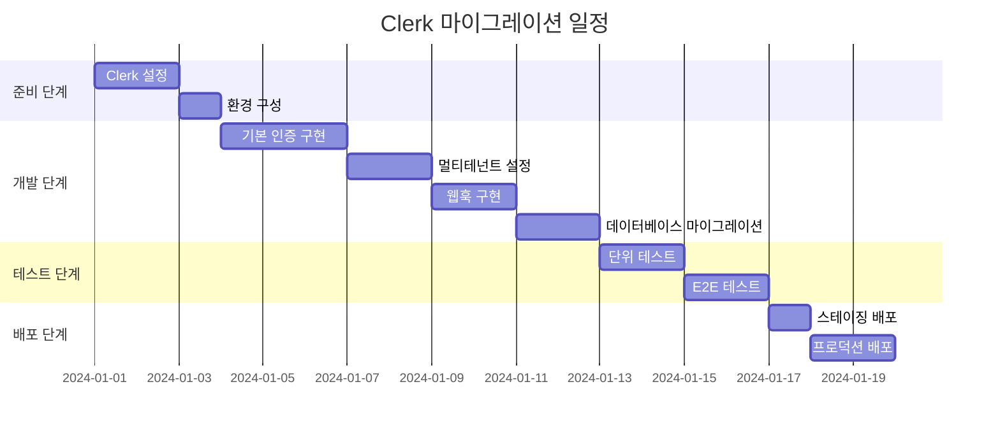

# Clerk 마이그레이션 실행 계획서

## 📅 마이그레이션 일정

### 전체 일정: 2-3주 (15-20 작업일)



## 🎯 Phase 1: 준비 단계 (3일)

### Day 1: Clerk 계정 설정 및 기본 구성

#### 오전 (4시간)

1. **Clerk 계정 생성 및 애플리케이션 설정**

   ```bash
   # 1. Clerk 대시보드 접속
   # https://dashboard.clerk.com

   # 2. 새 애플리케이션 생성
   # - 애플리케이션 이름: CashUp Multi-Service
   # - 지역: Asia Pacific (ap-southeast-1)
   ```

2. **OAuth 제공자 설정**
   - Google OAuth 설정
   - 카카오 OAuth 설정 (커스텀 OAuth)
   - 테스트 계정 생성

#### 오후 (4시간)

3. **도메인 및 환경 설정**

   ```bash
   # 개발 환경 도메인
   localhost:5173  # CashUp
   localhost:5174  # Voosting
   localhost:5175  # Agency

   # 프로덕션 도메인
   cash-up.app
   voosting.app
   voo-st.app
   ```

4. **환경 변수 설정**

   ```bash
   # .env.local 파일 생성
   cp .env.example .env.local

   # Clerk 키 추가
   echo "VITE_CLERK_PUBLISHABLE_KEY=pk_test_..." >> .env.local
   echo "CLERK_SECRET_KEY=sk_test_..." >> .env.local
   ```

### Day 2: 패키지 설치 및 기본 설정

#### 오전 (4시간)

1. **필요한 패키지 설치**

   ```bash
   # Clerk 패키지 설치
   npm install @clerk/clerk-react @clerk/remix
   npm install svix  # 웹훅 처리용

   # 개발 도구
   npm install --save-dev @types/node
   ```

2. **기본 Clerk 설정**
   ```typescript
   // app/root.tsx 수정
   import { ClerkApp } from '@clerk/remix';
   import { rootAuthLoader } from '@clerk/remix/ssr.server';
   ```

#### 오후 (4시간)

3. **프로젝트 구조 준비**

   ```bash
   # 새 디렉토리 생성
   mkdir -p app/lib/auth/clerk
   mkdir -p app/routes/auth/clerk
   mkdir -p app/components/auth/clerk
   ```

4. **기존 코드 백업**
   ```bash
   # 기존 인증 코드 백업
   cp -r app/lib/auth app/lib/auth.backup
   cp -r app/components/auth app/components/auth.backup
   ```

### Day 3: 개발 환경 검증

#### 오전 (4시간)

1. **기본 Clerk 컴포넌트 테스트**

   ```typescript
   // 간단한 로그인 페이지 생성
   // app/routes/auth/test-clerk.tsx
   ```

2. **로컬 개발 서버 테스트**
   ```bash
   npm run dev
   # http://localhost:5173/auth/test-clerk 접속 테스트
   ```

#### 오후 (4시간)

3. **웹훅 로컬 테스트 환경 구성**

   ```bash
   # ngrok 설치 (웹훅 테스트용)
   brew install ngrok

   # 로컬 터널 생성
   ngrok http 5173
   ```

4. **기본 인증 플로우 검증**
   - 로그인/로그아웃 테스트
   - 사용자 정보 표시 테스트
   - 세션 관리 테스트

## 🔧 Phase 2: 핵심 개발 (9일)

### Day 4-6: 기본 인증 시스템 구현 (3일)

#### Day 4: 서버사이드 인증

```typescript
// 구현할 파일들
1. app/lib/auth/clerk.server.ts
2. app/lib/auth/service-detection.ts
3. app/lib/auth/middleware.ts
```

#### Day 5: 클라이언트사이드 인증

```typescript
// 구현할 파일들
1. app/hooks/useAuth.ts (Clerk 버전)
2. app/components/auth/ClerkProvider.tsx
3. app/components/auth/AuthGuard.tsx
```

#### Day 6: 인증 페이지 구현

```typescript
// 구현할 파일들
1. app/routes/auth/signin.tsx
2. app/routes/auth/signup.tsx
3. app/routes/settings/profile.tsx
```

### Day 7-8: 멀티테넌트 설정 (2일)

#### Day 7: 서비스 감지 로직

```typescript
// 구현 내용
1. 호스트명 기반 서비스 감지
2. 포트 기반 서비스 감지 (개발용)
3. 서비스별 기본 역할 설정
4. 서비스별 브랜딩 설정
```

#### Day 8: 사용자 메타데이터 관리

```typescript
// 구현 내용
1. 회원가입 시 메타데이터 설정
2. 사용자 역할 관리
3. 서비스별 권한 확인
```

### Day 9-10: 웹훅 및 사용자 동기화 (2일)

#### Day 9: 웹훅 엔드포인트 구현

```typescript
// app/routes/api/webhooks/clerk.tsx
1. 사용자 생성 이벤트 처리
2. 사용자 업데이트 이벤트 처리
3. 사용자 삭제 이벤트 처리
4. 세션 이벤트 처리
```

#### Day 10: Supabase 동기화

```typescript
// app/lib/auth/user-sync.ts
1. 사용자 데이터 동기화
2. 메타데이터 업데이트
3. 오류 처리 및 재시도 로직
```

### Day 11-12: 데이터베이스 마이그레이션 (2일)

#### Day 11: 스키마 업데이트

```sql
-- supabase/migrations/clerk_migration.sql
1. users 테이블 구조 변경
2. 인덱스 추가
3. 함수 생성
```

#### Day 12: RLS 정책 업데이트

```sql
1. Clerk JWT 토큰 기반 정책
2. 서비스별 데이터 격리
3. 권한 기반 접근 제어
```

## 🧪 Phase 3: 테스트 (4일)

### Day 13-14: 단위 테스트 (2일)

#### Day 13: 인증 로직 테스트

```typescript
// tests/auth/clerk-auth.test.ts
1. 서비스 감지 테스트
2. 권한 확인 테스트
3. 사용자 동기화 테스트
```

#### Day 14: 컴포넌트 테스트

```typescript
// tests/components/auth/
1. 로그인 컴포넌트 테스트
2. 회원가입 컴포넌트 테스트
3. 인증 가드 테스트
```

### Day 15-16: E2E 테스트 (2일)

#### Day 15: 기본 인증 플로우

```typescript
// tests/e2e/clerk-auth.spec.ts
1. 로그인/로그아웃 플로우
2. 회원가입 플로우
3. 프로필 관리 플로우
```

#### Day 16: 멀티테넌트 테스트

```typescript
// tests/e2e/multi-tenant.spec.ts
1. 서비스별 회원가입
2. 서비스별 권한 확인
3. 크로스 서비스 접근 테스트
```

## 🚀 Phase 4: 배포 (3일)

### Day 17: 스테이징 배포

#### 오전 (4시간)

1. **스테이징 환경 Clerk 설정**

   ```bash
   # 스테이징 애플리케이션 생성
   # 스테이징 도메인 설정
   # 웹훅 엔드포인트 설정
   ```

2. **스테이징 배포**
   ```bash
   # 환경 변수 설정
   # 데이터베이스 마이그레이션
   # 애플리케이션 배포
   ```

#### 오후 (4시간)

3. **스테이징 테스트**
   - 전체 기능 테스트
   - 성능 테스트
   - 보안 테스트

### Day 18-19: 프로덕션 배포 (2일)

#### Day 18: 프로덕션 준비

1. **프로덕션 Clerk 설정**
2. **DNS 설정 확인**
3. **SSL 인증서 확인**
4. **모니터링 설정**

#### Day 19: 프로덕션 배포

1. **점진적 배포**
   - 카나리 배포 (5% 트래픽)
   - 모니터링 및 검증
   - 전체 배포 (100% 트래픽)

2. **배포 후 검증**
   - 기능 테스트
   - 성능 모니터링
   - 오류 추적

## 📋 일일 체크리스트

### 매일 시작 전

- [ ] 이전 날 작업 결과 검토
- [ ] 당일 목표 확인
- [ ] 개발 환경 상태 점검
- [ ] 백업 상태 확인

### 매일 종료 전

- [ ] 작업 내용 커밋
- [ ] 진행 상황 문서 업데이트
- [ ] 다음 날 작업 계획 수립
- [ ] 이슈 및 블로커 기록

## 🚨 위험 요소 및 대응 방안

### 기술적 위험

#### 1. Clerk-Supabase 통합 문제

**위험**: JWT 토큰 호환성 문제
**대응**:

- 사전 PoC 진행
- Clerk 공식 문서 참조
- 커뮤니티 사례 조사

#### 2. 데이터 마이그레이션 오류

**위험**: 기존 사용자 데이터 손실
**대응**:

- 전체 데이터 백업
- 단계적 마이그레이션
- 롤백 계획 수립

#### 3. 성능 저하

**위험**: 인증 처리 속도 저하
**대응**:

- 캐싱 전략 수립
- 성능 테스트 진행
- 모니터링 강화

### 일정 위험

#### 1. 예상보다 복잡한 구현

**위험**: 개발 일정 지연
**대응**:

- 버퍼 시간 확보 (20%)
- 우선순위 기반 개발
- 단계적 배포

#### 2. 테스트 시간 부족

**위험**: 품질 저하
**대응**:

- 개발과 병행 테스트
- 자동화 테스트 우선
- 핵심 기능 집중 테스트

## 📊 성공 지표

### 기능적 지표

- [ ] 모든 인증 플로우 정상 작동
- [ ] 멀티테넌트 기능 정상 작동
- [ ] 기존 사용자 데이터 100% 보존
- [ ] 모든 E2E 테스트 통과

### 성능 지표

- [ ] 로그인 응답 시간 < 2초
- [ ] 페이지 로드 시간 < 3초
- [ ] 99.9% 가용성 유지
- [ ] 오류율 < 0.1%

### 사용자 경험 지표

- [ ] 로그인 성공률 > 98%
- [ ] 사용자 불만 사항 0건
- [ ] UI/UX 개선 확인
- [ ] 모바일 호환성 확인

## 🔄 롤백 계획

### 롤백 트리거

- 치명적 버그 발견
- 성능 저하 (50% 이상)
- 사용자 데이터 손실
- 보안 취약점 발견

### 롤백 절차

1. **즉시 조치** (5분 이내)
   - 트래픽 이전 버전으로 라우팅
   - 모니터링 알림 확인

2. **데이터 복구** (30분 이내)
   - 백업 데이터 복원
   - 데이터 일관성 확인

3. **서비스 복구** (1시간 이내)
   - 이전 버전 배포
   - 전체 기능 테스트

4. **사후 분석** (24시간 이내)
   - 원인 분석
   - 개선 방안 수립
   - 재배포 계획 수립

---

**담당자**: 개발팀  
**검토자**: 시니어 개발자  
**승인자**: 프로젝트 매니저  
**최종 업데이트**: 2024-01-01
